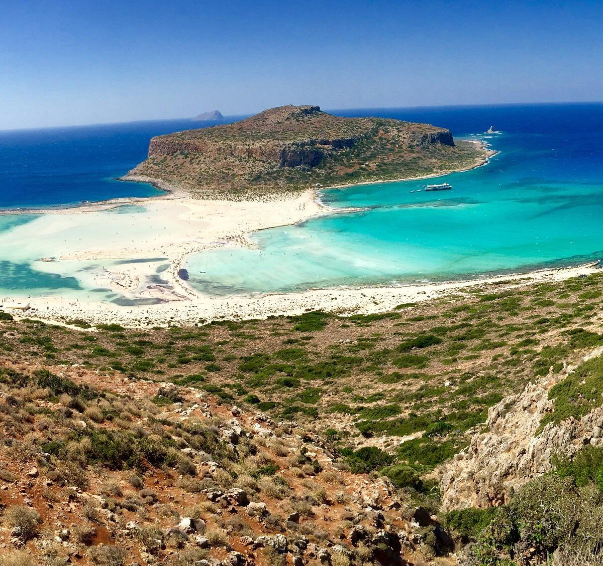
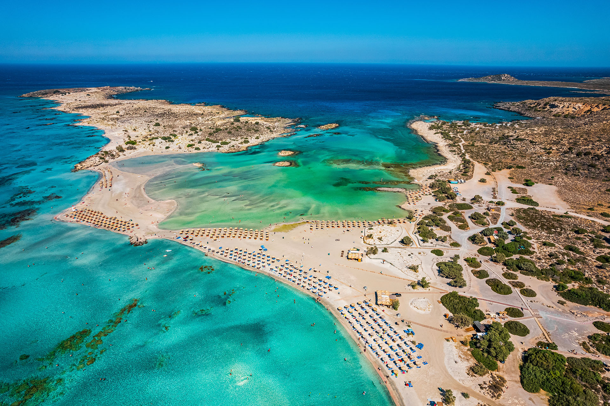
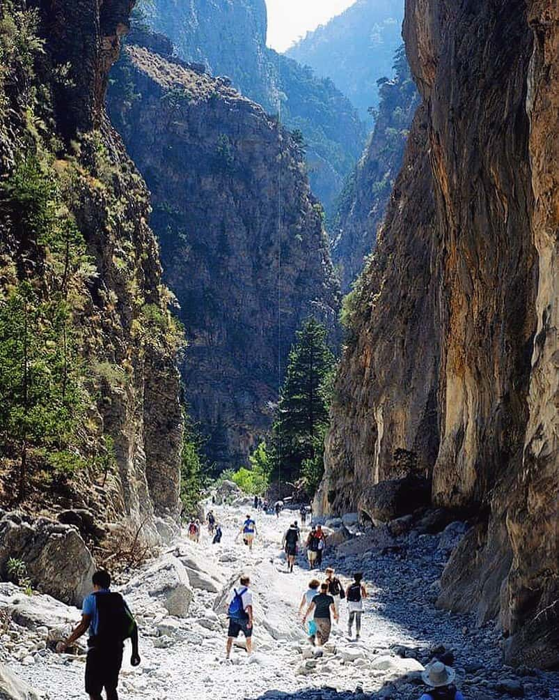
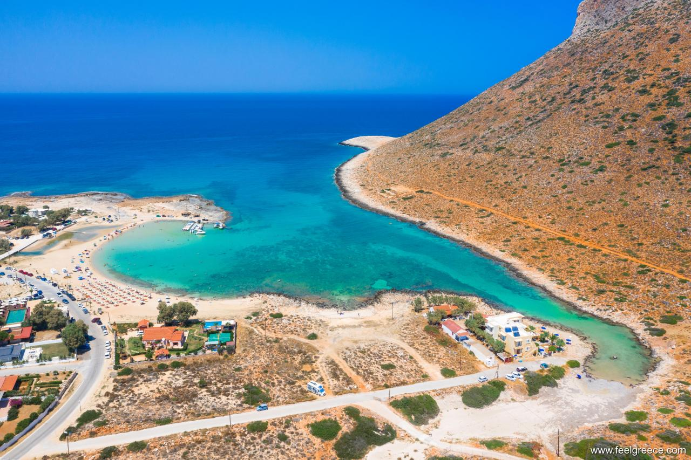

# Hefajstos na dwóch kółkach - majowa wycieczka rowerowa po zachodniej Krecie z elementami trekkingu


# Opis wydarzenia
Wyobraź sobie siebie pedałującego wzdłuż zalanego słońcem wybrzeża, z hipnotyzującymi lazurowymi wodami zatoczek Morza Śródziemnego mieniącymi się obok ciebie. Witaj na urzekającej greckiej wyspie Krecie, raju dla rowerzystów, gdzie łączy się starożytna historia, zapierające dech w piersiach krajobrazy i ciepła gościnność. Pozwól, że namaluję żywy obraz rowerowej przygody, która na Ciebie czeka:

Wyruszając w swoją dwukołową odyseję, przygotuj się na oczarowanie zróżnicowanym terenem wyspy. Od falistych wzgórz porośniętych gajami oliwnymi po strome klify z widokiem na ukryte zatoczki. Drogi wijące się przez malownicze wioski wyspy zachęcają do odkrywania ich ponadczasowego uroku. Po drodze nawiążemy również kontakt z przyjaznymi mieszkańcami, których ciepłe uśmiechy i autentyczna gościnność sprawią, że poczujesz się częścią ich tętniącej życiem społeczności. Zanurzymy się w tradycyjnej greckiej kuchni, delektując się smakami świeżo złowionych ryb, dojrzałych w słońcu oliwek i pysznych lokalnych serów.

Oprócz urzekających krajobrazów, nad którymi juz w starożytności Homer zachwycał w swoich dziełach, grecka wyspa oferuje niezliczone możliwości relaksu. Zafundujemy sobie zasłużone kąpiele w krystalicznie turkusowych wodach, poddając się objęciom Morza Śródziemnego.

I nie zapominajmy o samej radości z jazdy na rowerze. Rytmiczny ruch nóg, szum kół i radosne uczucie prędkości podczas pokonywania krętych nadmorskich dróg będą nam towarzyszyć przez całą podróż. Poczujemy pieczenie w mięśniach podczas pokonywania stromych podjazdów, wiedząc, że każde wzniesienie prowadzi do zapierającego dech w piersiach panoramicznego widoku, który pozostawi Cię w zachwycie.

Tak więc, dzielny poszukiwaczu przygód, nadszedł czas, aby wyruszyć na rowerową wycieczkę po greckiej wyspie. Niech szepty starożytnej historii, piękno krajobrazów i ciepły uścisk mieszkańców urzekną twoje serce. Twoja grecka przygoda rowerowa czeka!

## Termin
26.04 - 3.05 2024, 8 dni

## Liczba uczestników
Od 4 do 8 osób. W przypadku większej liczby uczestników, podczas jazdy grupa będzie podzielona na dwie mniejsze.

# Cel wycieczki
* poznanie piękna przyrody kreteńskiego krajobrazu
* zdrowe spędzenie czasu wymagającego wysiłku fizycznego
* integracja środowiska miłośników turystyki rowerowej

# Opis regionu
Megalonissos, czyli Wielka Wyspa – tak Grecy nazywają Kretę, największą spośród tysięcy wysp greckich i piątą co do wielkości w basenie Morza Śródziemnego. Kreta rozciąga się z zachodu na wschód na długości 260 km. Jest długa, ale za to bardzo wąska (w najszerszym miejscu ma zaledwie 60 km). Jej zdecydowaną część zajmują wysokie góry, których wierzchołki latem bielą się wapiennymi skałami, a zimą przykryte są śniegiem. Pasma górskie nadają Krecie groźnego charakteru i dzielą wyspę na dwie części. Północ jest łagodna, delikatna i miła. Piaszczyste plaże, które ciągną się tu kilometrami, doskonale nadają się do kąpieli oraz długich spacerów. Południe z kolei jest surowe, dzikie i niedostępne, ze zboczami schodzącymi wprost do morza i wioskami przylepionymi gdzieniegdzie do skał. Nad Kretą dominują dwa największe miasta - Heraklion i Chania, kryjąc w swoich starożytnych uliczkach wiele legend i tajemniczych historii.

# Pogoda
Klimat ma cechy umiarkowane, jak i subtropikalne. Lato jest gorące i suche, w zimie jest chłodniej. Maj na Krecie nie jest jeszcze upalny i jest doskonałym miesiącem na wyprawy rowerowe. Średnia temperatura w tym okresie wynosi 25 stopni, natomiast możliwe są chłodniejsze dni w trakcie pochmurnej i deszczowej pogody, podczas których temperatura może spaść do 15 stopni. Średnie opady w tym okresie wynoszą 10mm (w Polsce 40 mm), a dzienna szansa na deszcz 8% (w Polsce 25%). W górach na wysokości 1200 m należy być przygotowanym na chwilowe porywiste wiatry i na temperaturę 10 stopni.

# Atrakcje
* Poznanie piękna przyrody kreteńskiego krajobrazu


* Plaża Seitan Limania

  Ta idealna plaża jest obowiązkowym punktem na północno-zachodniej Krecie, znanym z czystych wód i skalistych krajobrazów, które ją otaczają. Można tu zrelaksować się przy brzegu i podziwiać malownicze widoki, popływać w turkusowych wodach, zejść wąwozem w dół klifów, a nawet popływać po okolicy podczas wycieczki łodzią, aby odkryć inne wspaniałe plaże.


* Laguna Balos

  Ta laguna jest jednym z najczęściej fotografowanych miejsc na Krecie, z hipnotyzującymi turkusowymi wodami i panoramicznym krajobrazem.


* Plaża Elafonisi

  Elafonisi to jedna z najbardziej zapierających dech w piersiach plaż na Krecie. Jej czyste, błękitne wody, różowy piasek i wyjątkowy krajobraz przyciągają tysiące turystów każdego roku. Została uznana za jedną z najpiękniejszych plaż na świecie.


* Treking wąwozem Samaria

  Uważany za jeden z najbardziej malowniczych parków narodowych w Europie, wąwóz ten rozciąga się na ponad 18 km w kierunku południowego wybrzeża i oferuje wiele szlaków turystycznych.


* Plaża w Stavros

  Stavros to wymarzona piaszczysta zatoczka i doskonałe miejsce na relaksujące wakacje. Okrągłe wybrzeże jest zaopatrzone w parasole i leżaki. Plaża znajduje się w odległości 20 km od miasta Chania.


* Miasto Chania

  Chania (pisana również jako Hania) jest stolicą, miejscem, w którym na przestrzeni wieków kwitły różne cywilizacje. Spacer po przypominających labirynt uliczkach Starego Miasta z pięknymi weneckimi rezydencjami, fontannami i kościołami poprowadzi Cię przez dobrze zachowane zabytki.


* Poznanie historii miejsca i zwyczajów regionalnych

# Charakter wycieczki
Wycieczka jest skierowana do osób, które są doświadczone w wielogodzinnych wycieczkach rowerowych i pieszych i mają odpowiednią wytrzymałość i siłę do pokonywania stromych górskich podjazdów. Dzienne dystanse wycieczek rowerowych oscylują w granicach 50-70 km i mają charakter górski. Poruszamy się wyłącznie drogami asfaltowymi o niskim natężeniu ruchu, na których najlepiej spisze się rower o gładkich oponach. Należy spodziewać się wielokilometrowych stromych podjazdów, niekiedy nawet o nachyleniu 15%. W czasie wycieczki planowane są dwie piesze wędrówki o długości około 20 km.
Wycieczka ma charakter turystyczny, a nie sportowy. Poruszamy się tempem rekreacyjnym z wieloma przystankami na podziwianie widoków, robienie zdjęć i korzystanie z lokalnej gastronomii. Tempo jazdy jest dostosowane do możliwości fizycznych najsłabszego uczestnika wycieczki. Jedziemy w grupie, nie zostawiamy nikogo daleko w tyle. W czasie jazy Organizator wyznacza osobę prowadzącą i zamykającą grupę.

Na Kretę w okolice miasta Chania zamierzamy wybrać się samolotem zabierając ze sobą swoje rowery. Wycieczka ma charakter objazdowy, czyli cały bagaż wozimy ze sobą. Śpimy w hotelach i pensjonatach, codziennie w innym miejscu. Na noc rowery zostawiamy w pokoju lub w miejscu wyznaczonym przez obsługę. Noclegi rezerwujemy przed przyjazdem na Kretę. Wstajemy wcześnie rano i wyruszamy tuż po śniadaniu, tak aby jak najdłużej korzystać z jasnej części dnia. Wieczory planujemy tak aby być wypoczętym i gotowym do jazdy następnego dnia.

# Praktyczne informacje
* Transport na Kretę
  * linie lotnicze: Ryanair
  * czas przelotu Gdańsk - Chania: 3 godziny
  * potrzebne dokumenty: dowód osobisty
  * Maksymalna masa bagażu z rowerem: 30 kg. Za bagaż o wadze powyżej 20 kg zostanie pobrana opłata za nadbagaż według obowiązującej stawki za kilogram.
* Podróż po Krecie
  * łączny dystans do pokonania na rowerze: 300 km z możliwością skrócenia do 260 km
  * łączny dystans do pokonania pieszo: 40 km z możliwością rezygnacji z wędrówek wg potrzeby
  * każdego dnia w porze popołudniowej będziemy zatrzymywać się w restauracji lub barze na obiad
  * codziennie na naszej drodze będą dostępne sklepy spożywcze, natomiast 1 maja i w niedziele sklepy są nieczynne
* O Krecie
  * waluta: euro
  * bez problemu można się porozumieć z mieszkańcami Krety po angielsku
  * ruch prawostronny
  * strefa czasowa: GMT+3, czas polski plus 1 godz.
  * standard gniazdek elektrycznych: tak jak w Polsce, czyli C, E, F, napięcie 230V
  * ceny w sklepach są podobne do cen w Polsce
  * brak zwierząt zagrażających życiu

# Przygotowanie do wyjazdu
Każdy z uczestników powinien mieć sprawny i gotowy do jazdy rower, z wyregulowanymi przerzutkami i hamulcami. Zalecany jest rower o gładkich oponach, gdyż będziemy się poruszać wyłącznie po drogach asfaltowych. W przypadku rowerów szosowych, standardowy napęd szosowy montowany w rowerze nie będzie dobrym rozwiązaniem na strome podjazdy. Należy dobrać górskie przednie i tylne zębaki napędu, tak aby uzyskać najmniejsze przełożenie zbliżone do wartości 1. Przewóz roweru elektrycznego nie jest możliwy liniami Ryanair.
Rower powinien być wyposażony w sakwy mogące pomieścić cały ekwipunek. Każdy uczestnik powinien zabrać swój zestaw naprawczy i umieć go używać, tak aby samodzielnie móc dokonać napraw takich jak: regulacja hamulców i przerzutek, dopompowanie koła, wymiana dętki, uszczelnienie dętki, założenie łańcucha. Należy wziąć ze sobą zapasowy hak przerzutki pasujący do naszego roweru, na wypadek gdyby hak wygiął się podczas transportu. Organizator oferuje pomoc w jego wymianie, natomiast uczestnik również powinien umieć samodzielnie dokonać naprawy.

Przed wyjazdem należy zaopatrzyć się w karton po rowerze mogący pomieścić nasz rower. Można taki dostać w wielu sklepach rowerowych. Kartony rowerowe występują w różnych rozmiarach i należy się upewnić że posiadamy taki który pomieści nasz rower. Karton i swoje umiejętności pakowania roweru należy wcześniej zweryfikować poprzez złożenie roweru, zapakowanie go do kartonu razem z sakwami, pamiętając o zabezpieczeniu delikatnych elementów, takich jak przerzutka i jej hak. W trakcie transportu są one szczególnie narażone na uszkodzenie w przypadku nieodpowiedniego obchodzenia się obsługi lotniska z naszym bagażem. Należy też zaopatrzyć się w pokrowiec na rower z tkaniny na wypadek utraty kartonu na rower na drogę powrotną. Przed podróżą samolotem należy spuścić powietrze z opon i amortyzatorów. 

# Potrzebny sprzęt i wyposażenie
* Rower, sprawny i przygotowany do jazdy po drogach o górskim charakterze, posiadający dwa sprawne hamulce. Rower nieelektryczny - w Ryanair nie można przewozić rowerów elektrycznych.

Wyposażenie roweru
* sakwy rowerowe
* oświetlenie rowerowe
* zapięcie rowerowe
* kask

Serwis roweru
* pompka
* zapasowa dętka lub dwie pasujące do naszych kół
* łatki do dętek
* łyżki do zdejmowania opon
* rozkuwacz do łańcucha
* spinka do łańcucha
* zapasowy hak przerzutki
* potrzebne klucze lub śrubokręty pasujące do śrub w rowerze
* ew. olej do łańcucha

Odzież
* wygodne ubranie na rower
* spodnie niesportowe
* krótkie spodnie
* ciepła odzież
* odzież przeciwdeszczowa
* komplet bielizny
* piżama
* ręcznik
* buty, najlepiej nadające się jednocześnie na rower i trekking
* strój kąpielowy
* klapki

Higiena
* ręcznik
* mydło
* szampon
* szczoteczka i pasta do zębów
* papier toaletowy

Elektronika
* telefon komórkowy z wgranymi mapami offline i z działającym internetem w roamingu
* powerbank
* ładowarka i potrzebne kable

Inne
* Karton na rower, potrzebny na czas transportu lotniczego
* Zapasowy pokrowiec na rower z tkaniny
* zapasowe mapy papierowe
* krem do opalania
* okulary przeciwsłoneczne
* dowód osobisty
* gotówka (euro)
* apteczka
* jedzenie

# Koszty
* Noclegi 15-25 euro za osobę za dzień. Im więcej osób w pokoju, tym taniej za osobę.
* Loty 500-1000 zł + 2x 288 zł za przewóz roweru
* Śniadania we własnym zakresie lub wykupione w miejscu noclegu. Obiad od 10 euro.
* Wycieczka do wąwozu Samaria 25,5 euro
* Rezerwa finansowa

# Harmonogram wycieczki

### **Dzień 1, piątek**
* dojazd na lotnisko w Gdańsku
* przelot na Kretę w okolice Chanii
* plaża Seitan Limania
* przejazd do Chanii

Na lotnisko w Gdańsku mamy możliwość dostać się następującymi środkami transportu: autobus, PKM, taksówka bagażowa, podwiezienie samochodem przez inną osobę lub dojazd własnym samochodem i pozostawienie go na parkingu. W przypadku dojazdu autobusem, regulamin ZTM zastrzega, że suma wymiarów pojedynczej sztuki bagażu nie może przekroczyć 200 cm, co teoretycznie wyklucza możliwość dojazdu autobusem. W praktyce jednak kierowcy nie są aż tak restrykcyjni, natomiast bezpiecznie jest wybrać wcześniejszy autobus, tak aby mieć czas na skorzystanie z planu awaryjnego dostania się na lotnisko. Bagaż w ZTM przewozimy bezpłatnie (stan na maj 2023). W PKM nie ma ograniczenia wielkości w przewozie bagażu.

Zbiórka na lotnisku w Gdańsku jest przy stanowisku do odprawy bagażów ponadgabarytowych 2 godziny przed odlotem.

Z Gdańska wylatujemy o godz. 10:40 i lądujemy na Krecie niedaleko Chanii o godz. 15. Po przylocie zbieramy się w miejscu odbioru bagażu, odbieramy bagaże i przygotowujemy rowery do podróży. Lotnisko nie oferuje usługi przechowania kartonu po rowerze, dlatego zostawiamy je za budynkiem technicznym należącym do lotniska zlokalizowanym w tym miejscu: https://www.bing.com/maps?cp=35.540422%7E24.141367&lvl=21.3&style=x&pi=-8.7&dir=71.2, licząc na to że będą tam tydzień później.

Naszym pierwszym celem wycieczki jest oddalona o 10 km na wschód od lotniska plaża Seitan Limania, jedna z najpiękniejszych plaż Grecji. Dojeżdżając do plaży rowery można zostawić przypięte do barierki tuż przed początkiem bardzo stromego zjazdu prowadzącego serpentyną do samej plaży i kontynuować dalszą podróż pieszo. Po plaży kierujemy się w stronę Chanii na nocleg, zatrzymując się pod drodze na posiłek.

Orientacyjny godzinowy plan dnia:
* 8:40 zbiórka na lotnisku w Gdańsku
* 10:40 wylot z Gdańska
* 15:00 przylot na Kretę w okolice Chanii
* 15:30 - 16:30 odebranie bagażów, składanie rowerów i zostawienie kartonów na lotnisku
* 17:00 wyjazd w stronę Seitan Limania
* 18:00 dojazd do Seitan Limania
* 18:30 wyjazd z Seitan Limania
* 21:00 przyjazd do Chanii wliczając przerwą na posiłek po drodze i zakupy

Przykładowy Nocleg:
* Gregory Comfort Hotel

Całkowity dystans do pokonania: 35 km, całkowity wznios: 600 m, całkowity spadek: 690 m.

```geojson
{
  "type": "FeatureCollection",
  "features": [
    {
      "type": "Feature",
      "properties": {
        "stroke": "#ff1800"
      },
      "geometry": {
        "type": "LineString",
        "coordinates": [[24.1405846, 35.5401741],[24.14, 35.54037],[24.13925, 35.54061],[24.13881, 35.54076],[24.13812, 35.54099],[24.13741, 35.54121],[24.13723, 35.54121],[24.13674, 35.54117],[24.13589, 35.5411],[24.13519, 35.54104],[24.13431, 35.54096],[24.13343, 35.54088],[24.13276, 35.54081],[24.13188, 35.54073],[24.131, 35.54065],[24.13046, 35.5406],[24.1301236, 35.5405543],[24.13004, 35.54065],[24.12966, 35.54082],[24.12911, 35.54112],[24.12882, 35.54139],[24.12858, 35.5417],[24.12838, 35.54216],[24.12801, 35.54266],[24.1277, 35.54303],[24.12742, 35.54337],[24.12776, 35.54366],[24.12821, 35.54403],[24.12848, 35.54413],[24.12899, 35.54423],[24.12974, 35.54435],[24.1306, 35.54449],[24.13147, 35.54463],[24.13234, 35.54476],[24.13291, 35.54485],[24.13328, 35.54485],[24.13393, 35.54475],[24.13432, 35.54471],[24.13476, 35.54471],[24.13553, 35.54475],[24.13641, 35.54481],[24.13722, 35.54486],[24.1381, 35.54492],[24.13898, 35.54498],[24.13986, 35.54504],[24.14077, 35.54511],[24.14166, 35.54517],[24.14232, 35.54521],[24.1432, 35.54526],[24.14393, 35.54529],[24.14447, 35.54526],[24.1449, 35.54518],[24.14532, 35.54499],[24.14565, 35.54491],[24.14611, 35.54497],[24.14677, 35.54505],[24.14718, 35.54493],[24.14773, 35.54464],[24.14816, 35.54453],[24.14853, 35.54468],[24.14864, 35.545],[24.14857, 35.54539],[24.14818, 35.54599],[24.14789, 35.54652],[24.14758, 35.54689],[24.14735, 35.54723],[24.1473, 35.54742],[24.14731, 35.54767],[24.14746, 35.54793],[24.14783, 35.54838],[24.14833, 35.54897],[24.1487, 35.54939],[24.14892, 35.54952],[24.14948, 35.54967],[24.14997, 35.54972],[24.1507, 35.54976],[24.15158, 35.54979],[24.15242, 35.54981],[24.15311, 35.5499],[24.15375, 35.55003],[24.1546, 35.55022],[24.15515, 35.55032],[24.15547, 35.55033],[24.15613, 35.5503],[24.15701, 35.55024],[24.1576, 35.55018],[24.15803, 35.5501],[24.15883, 35.54979],[24.15923, 35.54965],[24.15972, 35.54954],[24.16015, 35.54951],[24.16064, 35.54963],[24.16104, 35.54965],[24.16192, 35.54963],[24.1628, 35.54961],[24.16306, 35.54966],[24.16325, 35.54994],[24.16348, 35.55043],[24.1636009, 35.5505354],[24.16377, 35.55039],[24.16421, 35.54976],[24.16453, 35.5493],[24.16478, 35.549],[24.16531, 35.54859],[24.16575, 35.5483],[24.16624, 35.54811],[24.16691, 35.54789],[24.16746, 35.54771],[24.16785, 35.54747],[24.16847, 35.54709],[24.16901, 35.54678],[24.16958, 35.54651],[24.17035, 35.54615],[24.17094, 35.5459],[24.17137, 35.54586],[24.17203, 35.54581],[24.17269, 35.54577],[24.17305, 35.54568],[24.17343, 35.5455],[24.1738, 35.54542],[24.17418, 35.54541],[24.17452, 35.54569],[24.17478, 35.54598],[24.17498, 35.54606],[24.17526, 35.54614],[24.17586, 35.54647],[24.17638, 35.54668],[24.17683, 35.54693],[24.17721, 35.54717],[24.17808, 35.5473],[24.1785, 35.54739],[24.17926, 35.54766],[24.17966, 35.54792],[24.18004, 35.54808],[24.1804, 35.54827],[24.18064, 35.54857],[24.18093, 35.54892],[24.18135, 35.54926],[24.1816, 35.54955],[24.1819, 35.5498],[24.18236, 35.55006],[24.18266, 35.55017],[24.18314, 35.55044],[24.18344, 35.55056],[24.18369, 35.55069],[24.18393, 35.5509],[24.18437, 35.55092],[24.18458, 35.5509],[24.18491, 35.55098],[24.18535, 35.55103],[24.18579, 35.55107],[24.18644, 35.55124],[24.18677, 35.5512],[24.18749, 35.55111],[24.18784, 35.55102],[24.18789, 35.55087],[24.18782, 35.55055],[24.18786, 35.55049],[24.18792, 35.55051],[24.18815, 35.55099],[24.18836, 35.55131],[24.18869, 35.55168],[24.18879, 35.55172],[24.18879, 35.55158],[24.18863, 35.55124],[24.18855, 35.55089],[24.18849, 35.55042],[24.18836, 35.55018],[24.18842, 35.55008],[24.18857, 35.55025],[24.18878, 35.55056],[24.1893, 35.55109],[24.18942, 35.55123],[24.18949, 35.55118],[24.18935, 35.5507],[24.18926, 35.55034],[24.1892, 35.54987],[24.1891, 35.54964],[24.18915, 35.54954],[24.18943, 35.5497],[24.18982, 35.55004],[24.19012, 35.5503],[24.19062, 35.55065],[24.19106, 35.55106],[24.19148, 35.55146],[24.19161, 35.55153],[24.19187, 35.55149],[24.19232, 35.55136],[24.1924, 35.55137],[24.19235, 35.55149],[24.1924, 35.5514],[24.19237, 35.55135],[24.19209, 35.55143],[24.19169, 35.55153],[24.19152, 35.55149],[24.19135, 35.55133],[24.19077, 35.55079],[24.19046, 35.55053],[24.18996, 35.55018],[24.18962, 35.54986],[24.18928, 35.54959],[24.18909, 35.54954],[24.18914, 35.54975],[24.18921, 35.54999],[24.18928, 35.55047],[24.18946, 35.55104],[24.18947, 35.55121],[24.18934, 35.55116],[24.18906, 35.55083],[24.18866, 35.55041],[24.18847, 35.5501],[24.18837, 35.55009],[24.18846, 35.55036],[24.18853, 35.55062],[24.18858, 35.55107],[24.1887, 35.55141],[24.18884, 35.55167],[24.18875, 35.55172],[24.18853, 35.55152],[24.18822, 35.55115],[24.188, 35.55065],[24.18789, 35.55049],[24.18783, 35.55051],[24.18788, 35.55079],[24.18788, 35.55097],[24.18771, 35.55107],[24.18706, 35.55116],[24.18654, 35.55124],[24.18621, 35.55117],[24.18561, 35.55103],[24.18513, 35.55102],[24.1847, 35.55093],[24.18448, 35.5509],[24.18404, 35.55092],[24.18385, 35.55084],[24.18359, 35.55065],[24.18332, 35.5505],[24.18283, 35.55028],[24.18251, 35.5501],[24.18209, 35.54991],[24.18173, 35.54969],[24.18151, 35.54939],[24.18118, 35.54914],[24.1808, 35.54878],[24.18052, 35.54842],[24.18024, 35.54815],[24.17983, 35.54801],[24.17947, 35.5478],[24.17892, 35.54751],[24.17829, 35.54734],[24.17764, 35.54723],[24.177, 35.54705],[24.17646, 35.54672],[24.17593, 35.54649],[24.17537, 35.5462],[24.17501, 35.54607],[24.17479, 35.54599],[24.17466, 35.54583],[24.17427, 35.54542],[24.17392, 35.54541],[24.17349, 35.54548],[24.1731, 35.54565],[24.17288, 35.54576],[24.17218, 35.5458],[24.17159, 35.54585],[24.171, 35.54588],[24.17054, 35.54606],[24.16978, 35.54642],[24.1692, 35.54669],[24.16864, 35.54698],[24.16794, 35.54742],[24.16759, 35.54763],[24.16712, 35.54782],[24.16644, 35.54804],[24.16578, 35.54828],[24.16533, 35.54858],[24.16494, 35.54887],[24.16466, 35.54911],[24.16438, 35.54952],[24.16399, 35.55008],[24.16368, 35.55051],[24.16357, 35.55052],[24.16338, 35.55021],[24.16314, 35.54972],[24.16296, 35.54962],[24.16236, 35.54962],[24.16148, 35.54964],[24.16082, 35.54965],[24.16058, 35.54961],[24.15993, 35.54951],[24.15944, 35.54959],[24.15919, 35.54966],[24.15863, 35.54987],[24.158, 35.55011],[24.15738, 35.5502],[24.15657, 35.55027],[24.15591, 35.55031],[24.15529, 35.55034],[24.15482, 35.55026],[24.15418, 35.55012],[24.15353, 35.54998],[24.15268, 35.54983],[24.15202, 35.5498],[24.15115, 35.54977],[24.15041, 35.54974],[24.14975, 35.5497],[24.14926, 35.54963],[24.14881, 35.54947],[24.14847, 35.54914],[24.14808, 35.54868],[24.1477, 35.54823],[24.14735, 35.54777],[24.14729, 35.54758],[24.14732, 35.54732],[24.14742, 35.54708],[24.14773, 35.54674],[24.148, 35.54632],[24.14838, 35.54568],[24.14862, 35.54518],[24.14863, 35.54481],[24.14838, 35.54457],[24.14793, 35.54457],[24.14754, 35.54473],[24.14699, 35.54502],[24.14655, 35.54504],[24.1459, 35.54494],[24.14559, 35.54492],[24.1451, 35.5451],[24.14469, 35.54523],[24.14422, 35.54529],[24.14364, 35.54528],[24.14276, 35.54524],[24.1421, 35.5452],[24.14121, 35.54514],[24.14032, 35.54507],[24.13942, 35.54501],[24.13854, 35.54495],[24.13766, 35.54489],[24.13678, 35.54483],[24.13597, 35.54478],[24.1352, 35.54473],[24.13454, 35.5447],[24.13412, 35.54473],[24.13357, 35.54481],[24.13313, 35.54486],[24.13269, 35.54482],[24.13191, 35.5447],[24.13104, 35.54456],[24.13017, 35.54442],[24.1293, 35.54428],[24.12885, 35.5442132],[24.12842, 35.54412],[24.12809, 35.54394],[24.12761, 35.54353],[24.12721, 35.54322],[24.12653, 35.54276],[24.12586, 35.54229],[24.12518, 35.54183],[24.12452, 35.54135],[24.12417, 35.54114],[24.12374, 35.54104],[24.12324, 35.54097],[24.12269, 35.54092],[24.12213, 35.54089],[24.12171, 35.5408],[24.1211, 35.54058],[24.12031, 35.54031],[24.11974, 35.54011],[24.11909, 35.5399],[24.11872, 35.5398],[24.11822, 35.53983],[24.11746, 35.53991],[24.11695, 35.53992],[24.11629, 35.5399],[24.1154, 35.53987],[24.11452, 35.53984],[24.11401, 35.53982],[24.11334, 35.53979],[24.11291, 35.53972],[24.11252, 35.53956],[24.1124, 35.53938],[24.11216, 35.53874],[24.11201, 35.53843],[24.11178, 35.53836],[24.11139, 35.53838],[24.11091, 35.5384],[24.11077, 35.53853],[24.11057, 35.53877],[24.11027, 35.5388],[24.10912, 35.53873],[24.10861, 35.53869],[24.10801, 35.53873],[24.1073, 35.53876],[24.10664, 35.53878],[24.10597, 35.53877],[24.10532, 35.5387],[24.10491, 35.53865],[24.10464, 35.53858],[24.10438, 35.53829],[24.10404, 35.53799],[24.10377, 35.53801],[24.10345, 35.53811],[24.10289, 35.53836],[24.10249, 35.53853],[24.10223, 35.53858],[24.10179, 35.53856],[24.10135, 35.53857],[24.1011, 35.53863],[24.101, 35.53894],[24.10091, 35.53929],[24.10075, 35.53933],[24.10065, 35.53923],[24.10058, 35.53887],[24.10048, 35.5386],[24.10028, 35.53835],[24.10011, 35.53835],[24.09992, 35.53847],[24.09964, 35.53875],[24.09941, 35.53892],[24.09907, 35.53897],[24.09874, 35.53893],[24.09829, 35.53886],[24.09799, 35.5389],[24.09761, 35.53906],[24.09721, 35.53921],[24.09659, 35.5394],[24.09624, 35.53947],[24.09596, 35.53935],[24.09559, 35.53914],[24.09531, 35.5391],[24.09476, 35.53905],[24.09438, 35.53902],[24.09409, 35.53891],[24.0939, 35.53882],[24.09366, 35.53883],[24.09312, 35.53888],[24.0927, 35.53893],[24.09223, 35.53906],[24.09179, 35.5392],[24.09115, 35.53933],[24.0908, 35.53933],[24.09065, 35.53923],[24.0905, 35.53899],[24.0904, 35.53873],[24.09017, 35.53848],[24.09001, 35.53842],[24.0899, 35.53857],[24.08984, 35.53881],[24.0897, 35.53888],[24.08949, 35.53887],[24.08884, 35.53873],[24.08852, 35.53862],[24.08827, 35.53841],[24.08805, 35.53827],[24.0877, 35.53817],[24.08743, 35.53792],[24.08717, 35.53761],[24.08713, 35.53732],[24.08713, 35.53699],[24.08704, 35.53658],[24.0869, 35.53604],[24.08672, 35.53573],[24.08626, 35.53535],[24.08592, 35.53511],[24.08538, 35.53486],[24.084983, 35.5346774],[24.08498, 35.53453],[24.08479, 35.53418],[24.08458, 35.53387],[24.08426, 35.5335],[24.08377, 35.53303],[24.08329, 35.53272],[24.08295, 35.53251],[24.08241, 35.5322],[24.08197, 35.53202],[24.08152, 35.53172],[24.08106, 35.53133],[24.08051, 35.53089],[24.08021, 35.53062],[24.07996, 35.53045],[24.0793, 35.53021],[24.07864, 35.52996],[24.07812, 35.52973],[24.07755, 35.52946],[24.07697, 35.52919],[24.07715, 35.52892],[24.07709, 35.5287],[24.07627, 35.52844],[24.07575, 35.5284],[24.07556, 35.52832],[24.07522, 35.52814],[24.07544, 35.52767],[24.07496, 35.52753],[24.07433, 35.52735],[24.07405, 35.52749],[24.07372, 35.52768],[24.0734, 35.52769],[24.07299, 35.52714],[24.07266, 35.52686],[24.07229, 35.52667],[24.07174, 35.52645],[24.07094, 35.52613],[24.07014, 35.52582],[24.06962, 35.52564],[24.06901, 35.52543],[24.06842, 35.52527],[24.06796, 35.52514],[24.06712, 35.52489],[24.06637, 35.52466],[24.06554, 35.52441],[24.06476, 35.52418],[24.06392, 35.52394],[24.06313, 35.52371],[24.06268, 35.52356],[24.06229, 35.5234],[24.06154, 35.52306],[24.06119, 35.52284],[24.06073, 35.52245],[24.06009, 35.52192],[24.05971, 35.5218],[24.05952, 35.52163],[24.0594758, 35.5214362],[24.0592, 35.52141],[24.05862, 35.52127],[24.05829, 35.52114],[24.05791, 35.52096],[24.0576, 35.52071],[24.05751, 35.52041],[24.05762, 35.52006],[24.05776, 35.51965],[24.05758, 35.51944],[24.05733, 35.51939],[24.05709, 35.51948],[24.05698, 35.51964],[24.05691, 35.51994],[24.05682, 35.52016],[24.05647, 35.52055],[24.05615, 35.52074],[24.05576, 35.52083],[24.0554, 35.52081],[24.05504, 35.52066],[24.05445, 35.52037],[24.05372, 35.51997],[24.05337, 35.51975],[24.05295, 35.51942],[24.0527, 35.51905],[24.05236, 35.51849],[24.052, 35.51793],[24.05173, 35.51756],[24.05156, 35.51733],[24.05116, 35.51676],[24.05098, 35.51646],[24.05072, 35.51601],[24.05042, 35.51536],[24.0502, 35.51486],[24.05002, 35.51434],[24.04988, 35.51395],[24.0497, 35.51362],[24.04948, 35.51343],[24.04893, 35.51324],[24.04861, 35.51325],[24.04815, 35.51338],[24.04767, 35.51354],[24.04692, 35.51379],[24.0463, 35.51402],[24.04576, 35.51428],[24.04539, 35.51444],[24.04487, 35.51458],[24.0443, 35.51468],[24.04365, 35.51478],[24.0431, 35.51486],[24.04262, 35.51493],[24.04209, 35.51489],[24.04148, 35.51491],[24.04096, 35.51494],[24.04012, 35.51497],[24.03946, 35.51494],[24.03885, 35.51489],[24.03855, 35.51496],[24.0381569, 35.5151214],[24.03741, 35.51538],[24.0371, 35.51549],[24.03665, 35.51564],[24.03605, 35.51585],[24.03552, 35.51603],[24.03497, 35.51622],[24.03443, 35.51642],[24.03381, 35.51663],[24.03339, 35.51673],[24.03282, 35.5168],[24.03253, 35.51664],[24.03219, 35.51631],[24.03177, 35.516],[24.03127, 35.51565],[24.03082, 35.51539],[24.03026, 35.51522],[24.02956, 35.515],[24.02896, 35.51482],[24.02809, 35.5147],[24.0276, 35.51463],[24.02691, 35.51454],[24.0262, 35.51445],[24.02575, 35.51439],[24.0252, 35.51438],[24.02438, 35.51439],[24.02373, 35.51441],[24.02299, 35.51444],[24.02237, 35.51446],[24.02208, 35.51448],[24.02141, 35.51421],[24.02086, 35.51395],[24.02048, 35.51379],[24.01993, 35.51379],[24.01933, 35.51383],[24.01868, 35.51391],[24.01796, 35.51386],[24.01747, 35.51378],[24.01682, 35.51362],[24.01629, 35.51348],[24.0155, 35.51331],[24.01516, 35.51325],[24.01456, 35.51317],[24.01409, 35.51312],[24.0138, 35.51322],[24.01362, 35.51326],[24.01336, 35.51327],[24.01292, 35.51333],[24.01255, 35.51338],[24.01202, 35.51333],[24.01141, 35.51322],[24.0106, 35.51308],[24.01016, 35.51301],[24.00955, 35.51292],[24.00883, 35.51282],[24.00813, 35.51273],[24.00739, 35.51264],[24.00654, 35.51254],[24.00593, 35.51246],[24.00524, 35.51237],[24.00468, 35.51232],[24.00414, 35.51225],[24.00338, 35.51214],[24.00256, 35.51206],[24.00192, 35.512],[24.00151, 35.51192],[24.00102, 35.51185],[24.00055, 35.51176],[24.00019, 35.51167],[24.00002, 35.51156],[23.99975, 35.51131],[23.99955, 35.51124],[23.99907, 35.51115],[23.99867, 35.5111],[23.99822, 35.51106],[23.99803, 35.51101],[23.99747, 35.5109],[23.99716, 35.51091],[23.99687, 35.51089],[23.99651, 35.51089],[23.99612, 35.51092],[23.9957, 35.51081],[23.99534, 35.51075],[23.9948, 35.51075],[23.99482, 35.51039],[23.99482, 35.51019],[23.99469, 35.50994],[23.99448, 35.50977],[23.99434, 35.50958],[23.99414, 35.50916],[23.99396, 35.50875],[23.99381, 35.50822],[23.99371, 35.50785],[23.99357, 35.50751],[23.99342, 35.50728],[23.99298, 35.5074],[23.99259, 35.50763],[23.99203, 35.5079],[23.99179, 35.50793],[23.99156, 35.50791],[23.99081, 35.5078],[23.99026, 35.50776],[23.98965, 35.50769],[23.98909, 35.5075],[23.98869, 35.50736],[23.9882, 35.50726],[23.98733, 35.50711],[23.98678, 35.507],[23.98635, 35.50695],[23.98582, 35.50695],[23.98518, 35.50697],[23.98444, 35.50689],[23.98399, 35.50688],[23.98378, 35.50691],[23.98331, 35.50704],[23.9826, 35.50724],[23.982, 35.50733],[23.98123, 35.50742],[23.98068, 35.50752],[23.98007, 35.50765],[23.97952, 35.50779],[23.9791, 35.50797],[23.97869, 35.50818],[23.97817, 35.50851],[23.9776, 35.50882],[23.9771, 35.50908],[23.97657, 35.50936],[23.9761, 35.50964],[23.97581, 35.5099],[23.97537, 35.51027],[23.97504, 35.51043],[23.97465, 35.51045],[23.9741, 35.51044],[23.97342, 35.51046],[23.97304, 35.51049],[23.97264, 35.51058],[23.97222, 35.51083],[23.97176, 35.51119],[23.97125, 35.51156],[23.97059, 35.51205],[23.96994, 35.51256],[23.96966, 35.51246],[23.96947, 35.51195],[23.96931, 35.51139],[23.96911, 35.51074],[23.9689523, 35.5102142],[23.9693, 35.5103],[23.9698, 35.51033],[23.97009, 35.51031],[23.97018, 35.5102],[23.9702, 35.50982],[23.97024, 35.50944],[23.9703, 35.50903],[23.97034, 35.50867],[23.97042, 35.50821],[23.9704202, 35.5081885]]
      }
    }
  ]
}
```


### **Dzień 2, sobota**
Trasa Chania – Kaliviani 45 km (200 m przewyższeń). Tego dnia wybieramy się również na wycieczkę pieszą na lagunę Balos oddaloną o 10 km (łącznie 20 km w dwie strony, 200m przewyższeń)

Orientacyjny godzinowy plan dnia:
* pobudka o indywidualnej godzinie, tak aby być gotowym do jazdy przed rozpoczęciem śniadania
* 8:00 śniadanie
* 9:30 wyjazd
* 12:30 przyjazd do Kaliviani
* 12:30 - 13:00 zakwaterowanie 
* 13:00 - 14:00 obiad 
* 14:00 - wędrówka do Balos
* 16:00 - 17:00 wypoczynek na Balos
* 17:00 - 19:00 powrót na kwaterę, zakupy w sklepie

Przykładowy Nocleg:
* Agarathos Traditional Rooms with Pool

```geojson
{
  "type": "FeatureCollection",
  "features": [
    {
      "type": "Feature",
      "properties": {
        "stroke": "#ff1800"
      },
      "geometry": {
        "type": "LineString",
        "coordinates": [[23.9704, 35.50831],[23.97032, 35.50884],[23.97028, 35.5092],[23.97023, 35.50956],[23.97019, 35.50992],[23.97018, 35.51022],[23.97004, 35.51032],[23.96958, 35.51032],[23.96919, 35.51028],[23.9689523, 35.5102142],[23.96862, 35.51035],[23.96853, 35.5105],[23.96847, 35.51068],[23.96811, 35.51078],[23.96789, 35.5108],[23.9678, 35.51064],[23.96772, 35.51048],[23.96753, 35.51049],[23.9673, 35.51055],[23.96687, 35.51061],[23.96643, 35.51056],[23.96579, 35.51043],[23.96535, 35.51037],[23.96483, 35.51034],[23.9645258, 35.5103097],[23.96449, 35.51055],[23.96454, 35.51076],[23.96475, 35.51103],[23.96473, 35.51111],[23.96474, 35.51146],[23.96481, 35.51199],[23.96452, 35.51222],[23.96403, 35.5124],[23.96343, 35.51269],[23.96304, 35.5129],[23.9627, 35.51292],[23.96208, 35.51273],[23.96159, 35.51272],[23.96089, 35.51282],[23.96018, 35.51292],[23.95952, 35.51301],[23.95894, 35.5131],[23.95855, 35.51319],[23.95821, 35.51333],[23.95769, 35.51358],[23.95722, 35.51378],[23.95691, 35.51371],[23.95654, 35.51335],[23.95621, 35.51308],[23.95587, 35.5129],[23.95522, 35.51266],[23.95476, 35.51249],[23.95414, 35.51229],[23.95364, 35.51227],[23.95293, 35.51234],[23.95221, 35.51239],[23.95165, 35.51236],[23.95099, 35.51231],[23.95011, 35.51224],[23.94949, 35.51226],[23.94883, 35.51241],[23.9482, 35.5126],[23.9476, 35.51275],[23.94698, 35.51291],[23.94654, 35.51306],[23.94611, 35.51322],[23.94543, 35.51345],[23.94432, 35.5139],[23.94395, 35.51409],[23.94344, 35.5143],[23.94282, 35.51464],[23.94234, 35.51485],[23.94181, 35.51505],[23.94097, 35.51529],[23.94037, 35.51547],[23.93991, 35.51564],[23.93916, 35.51596],[23.9385, 35.51623],[23.93806, 35.51644],[23.93759, 35.51671],[23.9372, 35.51696],[23.93682, 35.51715],[23.93637, 35.51732],[23.93562, 35.51757],[23.93496, 35.51777],[23.93457, 35.51788],[23.93419, 35.51804],[23.93375, 35.5183],[23.93307, 35.51872],[23.93259, 35.51901],[23.93207, 35.5193],[23.93158, 35.51952],[23.93115, 35.51968],[23.93067, 35.51981],[23.93014, 35.5199],[23.92976, 35.51991],[23.9293, 35.51982],[23.9288, 35.51969],[23.92821, 35.51955],[23.92757, 35.51941],[23.92713, 35.51935],[23.92658, 35.51929],[23.9257, 35.51921],[23.92514, 35.51916],[23.92445, 35.51909],[23.92357, 35.519],[23.92282, 35.51894],[23.92208, 35.51886],[23.92155, 35.51879],[23.92109, 35.51868],[23.92063, 35.51854],[23.92001, 35.51831],[23.91953, 35.51806],[23.91903, 35.51785],[23.91834, 35.51767],[23.91764, 35.51759],[23.91717, 35.51753],[23.91656, 35.51745],[23.91605, 35.51742],[23.91557, 35.51739],[23.91516, 35.51741],[23.9145, 35.51743],[23.91384, 35.51746],[23.91325, 35.51746],[23.91292, 35.5175],[23.91246, 35.51759],[23.91205, 35.51756],[23.91155, 35.51746],[23.91111, 35.51736],[23.91041, 35.51723],[23.9095, 35.51705],[23.9091, 35.51697],[23.90873, 35.51695],[23.90794, 35.51697],[23.90725, 35.51704],[23.90641, 35.51724],[23.90601, 35.5173],[23.90574, 35.51732],[23.9049, 35.51733],[23.90424, 35.51735],[23.90385, 35.51737],[23.90319, 35.51744],[23.90264, 35.51749],[23.90204, 35.51756],[23.90125, 35.5176],[23.90074, 35.51762],[23.90005, 35.51764],[23.89944, 35.51771],[23.89881, 35.51779],[23.89834, 35.51785],[23.8978, 35.51791],[23.89692, 35.51803],[23.89644, 35.51809],[23.89598, 35.51815],[23.89552, 35.5182],[23.89493, 35.51826],[23.89431, 35.51828],[23.89369, 35.51829],[23.89298, 35.51829],[23.89226, 35.51829],[23.89147, 35.51829],[23.89066, 35.5183],[23.89012, 35.5183],[23.88968, 35.5183],[23.88907, 35.51822],[23.88822, 35.51806],[23.88736, 35.5179],[23.8865, 35.51774],[23.88564, 35.51757],[23.8849, 35.51742],[23.88436, 35.51732],[23.88376, 35.51722],[23.88319, 35.5171],[23.8827, 35.51701],[23.88193, 35.51687],[23.88107, 35.51671],[23.8804, 35.51659],[23.87993, 35.51649],[23.87951, 35.51649],[23.87908, 35.51657],[23.87845, 35.51673],[23.87798, 35.51685],[23.87731, 35.51703],[23.87668, 35.5172],[23.87604, 35.51732],[23.87546, 35.51743],[23.87504, 35.51749],[23.87425, 35.5175],[23.87375, 35.51747],[23.8731, 35.51746],[23.8724, 35.51744],[23.87181, 35.51742],[23.87142, 35.51742],[23.87108, 35.51746],[23.87064, 35.51764],[23.87006, 35.51789],[23.86967, 35.51805],[23.86924, 35.51815],[23.8687, 35.51825],[23.86785, 35.51842],[23.86719, 35.51856],[23.8666, 35.5186],[23.86623, 35.51855],[23.86566, 35.51845],[23.86507, 35.51842],[23.86465, 35.51846],[23.8643, 35.51851],[23.86367, 35.51863],[23.86304, 35.5188],[23.86247, 35.51897],[23.8618, 35.51916],[23.86118, 35.51936],[23.86051, 35.51955],[23.86004, 35.51968],[23.85958, 35.5197],[23.85869, 35.51967],[23.85817, 35.51965],[23.85729, 35.51962],[23.85671, 35.51961],[23.85641, 35.51965],[23.85588, 35.51982],[23.85526, 35.52002],[23.85465, 35.52023],[23.85399, 35.52046],[23.85334, 35.52067],[23.85261, 35.52093],[23.85201, 35.52114],[23.85133, 35.52138],[23.85052, 35.52166],[23.8497, 35.52193],[23.84907, 35.52215],[23.8483, 35.52242],[23.84774, 35.52261],[23.84721, 35.52279],[23.84667, 35.52298],[23.84581, 35.52317],[23.84495, 35.52336],[23.84429, 35.52351],[23.84344, 35.5237],[23.84266, 35.52387],[23.84181, 35.52407],[23.84144, 35.52417],[23.84085, 35.52441],[23.84034, 35.52461],[23.83989, 35.5248],[23.83928, 35.52505],[23.83849, 35.52537],[23.8377, 35.52569],[23.83694, 35.526],[23.83615, 35.52632],[23.83554, 35.52654],[23.83501, 35.52672],[23.83419, 35.52701],[23.83338, 35.52729],[23.83277, 35.52749],[23.83213, 35.52765],[23.8315, 35.5278],[23.83085, 35.52793],[23.83056, 35.52792],[23.8303, 35.52785],[23.82983, 35.52764],[23.82954, 35.52747],[23.82934, 35.52732],[23.82911, 35.52698],[23.82868, 35.52635],[23.82835, 35.52589],[23.828, 35.52543],[23.82767, 35.52534],[23.82717, 35.52547],[23.82683, 35.52558],[23.82643, 35.52573],[23.82583, 35.52596],[23.82523, 35.52619],[23.8248, 35.52635],[23.8244, 35.52649],[23.82372, 35.52674],[23.82311, 35.52697],[23.8223, 35.52724],[23.82166, 35.52739],[23.82094, 35.52752],[23.82034, 35.52763],[23.82002, 35.52774],[23.81943, 35.52809],[23.8189, 35.52842],[23.81853, 35.5286],[23.81794, 35.5288],[23.81711, 35.52909],[23.81671, 35.52923],[23.81605, 35.52943],[23.81541, 35.52967],[23.81478, 35.52989],[23.81456, 35.52994],[23.81425, 35.52995],[23.81346, 35.5299],[23.81257, 35.52984],[23.81191, 35.5298],[23.81147, 35.52983],[23.81119, 35.52993],[23.8105, 35.53021],[23.80974, 35.53052],[23.80913, 35.53076],[23.80845, 35.53091],[23.8076, 35.5311],[23.8068, 35.53127],[23.80612, 35.53141],[23.8054, 35.53157],[23.8048, 35.53171],[23.80413, 35.53186],[23.80346, 35.53199],[23.80282, 35.53213],[23.80233, 35.53224],[23.80165, 35.53246],[23.80106, 35.53268],[23.8005, 35.53287],[23.79982, 35.5331],[23.79915, 35.53335],[23.79835, 35.53367],[23.79769, 35.53393],[23.79689, 35.53424],[23.79609, 35.53455],[23.79549, 35.53477],[23.79468, 35.53506],[23.79414, 35.53524],[23.79348, 35.53548],[23.79285, 35.53573],[23.79232, 35.536],[23.79172, 35.53632],[23.79124, 35.53656],[23.79069, 35.53685],[23.79018, 35.53712],[23.78983, 35.53719],[23.7894, 35.53723],[23.78896, 35.53733],[23.78834, 35.5375],[23.78771, 35.53766],[23.78711, 35.53782],[23.78627, 35.53805],[23.78544, 35.53828],[23.7846, 35.53851],[23.78376, 35.53874],[23.78339, 35.53883],[23.78272, 35.53899],[23.78197, 35.53913],[23.78165, 35.53911],[23.78137, 35.53898],[23.78105, 35.53875],[23.78065, 35.53841],[23.78032, 35.53813],[23.77989, 35.53774],[23.77966, 35.5373],[23.77938, 35.53676],[23.77906, 35.53634],[23.77858, 35.53586],[23.77814, 35.53546],[23.7777, 35.53516],[23.77726, 35.53493],[23.77672, 35.53461],[23.77636, 35.53438],[23.77558, 35.53397],[23.77446, 35.53374],[23.77403, 35.53361],[23.77359, 35.53341],[23.77291, 35.53338],[23.77208, 35.53312],[23.77121, 35.53259],[23.77046, 35.5323],[23.76924, 35.53176],[23.76867, 35.53154],[23.76809, 35.53145],[23.76762, 35.5314],[23.76731, 35.53138],[23.76617, 35.5309],[23.76578, 35.53083],[23.76496, 35.53085],[23.7645, 35.5306],[23.76429, 35.53],[23.76401, 35.52985],[23.76371, 35.5297],[23.76329, 35.52954],[23.76286, 35.52945],[23.76253, 35.52925],[23.76223, 35.52898],[23.76169, 35.52839],[23.7614, 35.52797],[23.7611, 35.52734],[23.76094, 35.52699],[23.76074, 35.52686],[23.76051, 35.52672],[23.76017, 35.52632],[23.75989, 35.52612],[23.75984, 35.52627],[23.75988, 35.52656],[23.76003, 35.52682],[23.76021, 35.52714],[23.76032, 35.52754],[23.76031, 35.52768],[23.75983, 35.52789],[23.75961, 35.52793],[23.75936, 35.52798],[23.75887, 35.52797],[23.75817, 35.52799],[23.75762, 35.52801],[23.75709, 35.52804],[23.75637, 35.52807],[23.75549, 35.52811],[23.75479, 35.52815],[23.75404, 35.52818],[23.75333, 35.52822],[23.75259, 35.52825],[23.75176, 35.52829],[23.75138, 35.52829],[23.75083, 35.52825],[23.75045, 35.52818],[23.75003, 35.52805],[23.74965, 35.52787],[23.749, 35.52743],[23.74859, 35.52699],[23.74834, 35.52657],[23.74818, 35.52616],[23.74799, 35.52564],[23.74781, 35.52514],[23.74758, 35.52451],[23.74738, 35.52393],[23.74717, 35.52335],[23.74701, 35.52288],[23.74686, 35.52249],[23.74671, 35.52215],[23.74652, 35.52183],[23.74619, 35.52137],[23.74584, 35.52091],[23.74546, 35.52041],[23.74509, 35.51995],[23.74481, 35.51951],[23.74465, 35.51918],[23.74445, 35.51873],[23.74424, 35.51815],[23.74404, 35.5176],[23.74382, 35.51713],[23.74361, 35.51685],[23.74335, 35.51663],[23.74308, 35.51648],[23.7427, 35.5163],[23.74228, 35.51609],[23.74179, 35.51581],[23.74146, 35.51555],[23.74101, 35.51516],[23.7407, 35.5149],[23.74031, 35.51466],[23.73997, 35.51454],[23.73957, 35.51447],[23.73908, 35.51443],[23.73842, 35.51438],[23.73798, 35.51431],[23.73746, 35.51421],[23.73677, 35.51403],[23.73593, 35.51381],[23.73523, 35.51362],[23.73439, 35.5134],[23.73384, 35.51323],[23.73356, 35.51311],[23.73325, 35.51292],[23.73293, 35.51264],[23.73278, 35.51244],[23.73252, 35.51195],[23.73227, 35.51146],[23.73208, 35.51113],[23.7319, 35.51091],[23.7317, 35.51069],[23.7314, 35.51042],[23.73094, 35.51003],[23.73071, 35.50979],[23.73061, 35.50966],[23.73032, 35.50929],[23.72999, 35.50888],[23.72962, 35.50862],[23.72912, 35.50842],[23.72862, 35.50833],[23.72828, 35.5083],[23.72761, 35.50829],[23.72673, 35.50827],[23.72584, 35.50825],[23.72508, 35.50824],[23.72432, 35.50822],[23.7239, 35.5082],[23.72348, 35.50816],[23.72308, 35.50807],[23.72273, 35.50796],[23.72241, 35.50781],[23.72197, 35.50753],[23.72167, 35.50725],[23.72146, 35.50702],[23.72106, 35.5065],[23.72067, 35.50603],[23.72026, 35.50552],[23.71982, 35.50505],[23.7195, 35.50477],[23.71914, 35.50449],[23.71866, 35.5042],[23.71826, 35.50399],[23.71787, 35.50383],[23.71726, 35.5036],[23.71644, 35.5033],[23.7160087, 35.5031391],[23.71558, 35.50302],[23.71492, 35.50277],[23.71438, 35.50258],[23.7137, 35.50234],[23.71299, 35.50209],[23.71222, 35.5018],[23.71153, 35.50154],[23.71095, 35.50131],[23.71031, 35.50107],[23.7097, 35.50085],[23.7091, 35.50063],[23.70834, 35.50035],[23.70754, 35.50006],[23.70673, 35.49976],[23.70593, 35.49947],[23.70532, 35.49925],[23.7046, 35.49898],[23.70395, 35.49875],[23.70348, 35.49859],[23.70289, 35.49844],[23.70234, 35.49833],[23.70157, 35.49821],[23.70079, 35.4981],[23.69974, 35.49797],[23.6989, 35.49785],[23.69817, 35.49774],[23.69656, 35.49747],[23.69585, 35.49737],[23.69521, 35.49727],[23.69467, 35.49719],[23.69391, 35.49708],[23.69317, 35.49697],[23.69252, 35.49687],[23.69165, 35.49674],[23.69084, 35.49663],[23.69037, 35.49655],[23.6895, 35.49642],[23.68863, 35.49629],[23.68817, 35.49623],[23.6873, 35.4961],[23.68663, 35.496],[23.68598, 35.4959],[23.68535, 35.49581],[23.68473, 35.49571],[23.68386, 35.49558],[23.68299, 35.49546],[23.68212, 35.49533],[23.68131, 35.49521],[23.68073, 35.49512],[23.67996, 35.49501],[23.67918, 35.49489],[23.67854, 35.49479],[23.67788, 35.4947],[23.67707, 35.49458],[23.67636, 35.49447],[23.67558, 35.49436],[23.67519, 35.4943],[23.67432, 35.49417],[23.67367, 35.49407],[23.67293, 35.49395],[23.67223, 35.49385],[23.6717756, 35.4937866],[23.67124, 35.49373],[23.67076, 35.49359],[23.67038, 35.49345],[23.66991, 35.49319],[23.66937, 35.49285],[23.66882, 35.49251],[23.66834, 35.49226],[23.66774, 35.49205],[23.66721, 35.49187],[23.66655, 35.49172],[23.66601, 35.4916],[23.66562, 35.49142],[23.66531, 35.49119],[23.66499, 35.4911],[23.66427, 35.49117],[23.66383, 35.49147],[23.6635, 35.49204],[23.66334, 35.49224],[23.66302, 35.49243],[23.66266, 35.49258],[23.66241, 35.49265],[23.66197, 35.49269],[23.66154, 35.49277],[23.66075, 35.49295],[23.66027, 35.49307],[23.65961, 35.49322],[23.6591, 35.49333],[23.65823, 35.4935],[23.65752, 35.49364],[23.65684, 35.49377],[23.65605, 35.49392],[23.65543, 35.49404],[23.65478, 35.49417],[23.65403, 35.49432],[23.65322, 35.49448],[23.65261, 35.4946],[23.65206, 35.49473],[23.65166, 35.49488],[23.65117, 35.49515],[23.65051, 35.49559],[23.64984, 35.49605],[23.64931, 35.4964],[23.64864, 35.49687],[23.64797, 35.49733],[23.64738, 35.49774],[23.64679, 35.49815],[23.64613, 35.49861],[23.64546, 35.49908],[23.64495, 35.49943],[23.64449, 35.49978],[23.64415, 35.50013],[23.644, 35.50035],[23.64366, 35.5009],[23.64337, 35.50138],[23.64306, 35.5019],[23.64269, 35.50249],[23.6423, 35.50292],[23.64201, 35.50319],[23.6414, 35.50371],[23.64089, 35.50416],[23.6404, 35.50457],[23.63982, 35.50506],[23.63924, 35.50557],[23.63895, 35.50591],[23.63861, 35.50645],[23.63827, 35.50699],[23.638, 35.50741],[23.63789, 35.50768],[23.63791, 35.50811],[23.63798, 35.50865],[23.638, 35.50906],[23.63803, 35.50925],[23.6381, 35.50958],[23.63808, 35.50984],[23.63801, 35.51007],[23.63777, 35.51058],[23.63751, 35.51114],[23.63736, 35.51151],[23.63733, 35.51177],[23.63742, 35.51205],[23.63758, 35.51233],[23.63765, 35.51263],[23.63761, 35.51298],[23.63751, 35.51333],[23.63729, 35.51364],[23.63704, 35.5138],[23.63655, 35.51403],[23.63611, 35.51415],[23.6357, 35.51415],[23.63522, 35.51397],[23.63482, 35.5139],[23.6345, 35.51393],[23.63389, 35.51377],[23.6335, 35.5136],[23.63302, 35.51354],[23.63224, 35.51354],[23.63149, 35.51361],[23.63112, 35.51361],[23.63079, 35.51341],[23.63032, 35.51303],[23.62983, 35.51266],[23.62936, 35.51228],[23.62918, 35.51219],[23.62904, 35.51193],[23.62867, 35.51178],[23.62821, 35.51152],[23.62799, 35.51141],[23.62764, 35.51126],[23.62723, 35.51114],[23.6268, 35.51106],[23.62639, 35.51093],[23.62565, 35.5106],[23.62538, 35.51047],[23.625, 35.51042],[23.62457, 35.51032],[23.62408, 35.5102],[23.62366, 35.50999],[23.62345, 35.50986],[23.62279, 35.50988],[23.62213, 35.50994],[23.62147, 35.51001],[23.62083, 35.51022],[23.62052, 35.51028],[23.61979, 35.5103],[23.61951, 35.51036],[23.61909, 35.51047],[23.61866, 35.51054],[23.61822, 35.5106],[23.61782, 35.51074],[23.61752, 35.51091],[23.61711, 35.51101],[23.61665, 35.51109],[23.61616, 35.51111],[23.61557, 35.51104],[23.61511, 35.51094],[23.61464, 35.511],[23.6142, 35.51104],[23.61354, 35.51106],[23.61285, 35.51114],[23.61246, 35.51106],[23.61217, 35.51127],[23.61198, 35.51146],[23.61171, 35.51157],[23.61143, 35.51188],[23.61097, 35.51218],[23.6106, 35.51238],[23.61017, 35.51243],[23.60983, 35.5125],[23.60952, 35.51252],[23.60924, 35.51257],[23.60894, 35.51252],[23.6086, 35.51257],[23.60839, 35.51275],[23.60832, 35.51298],[23.6082586, 35.5131162]]
      }
    }
  ]
}
```


Trasa piesza Kaliviani - Balos

```geojson
{
  "type": "FeatureCollection",
  "features": [
    {
      "type": "Feature",
      "properties": {
        "stroke": "#ff1800"
      },
      "geometry": {
        "type": "LineString",
        "coordinates": [
        [23.6082586, 35.5131162],[23.60813, 35.51338],[23.60809, 35.51355],[23.60812, 35.51373],[23.60818, 35.5139],[23.60827, 35.51412],[23.60833, 35.51429],[23.60838, 35.51446],[23.6084, 35.51464],[23.60843, 35.51488],[23.6085, 35.51518],[23.60855, 35.51535],[23.60861, 35.51557],[23.60871, 35.5158],[23.60878, 35.51593],[23.60879, 35.51622],[23.60879, 35.51658],[23.60879, 35.51694],[23.60878, 35.51714],[23.60879, 35.51735],[23.60884, 35.51765],[23.60895, 35.518],[23.60903, 35.51825],[23.60909, 35.51842],[23.60923, 35.51875],[23.60929, 35.51894],[23.60936, 35.51916],[23.60943, 35.51946],[23.60946, 35.51964],[23.60949, 35.52],[23.6095, 35.52018],[23.60954, 35.52054],[23.60957, 35.52072],[23.60963, 35.52107],[23.60966, 35.52125],[23.60972, 35.52142],[23.60981, 35.52159],[23.61001, 35.52191],[23.61021, 35.52223],[23.61035, 35.52245],[23.6104, 35.52257],[23.6104, 35.52273],[23.61035, 35.52291],[23.61031, 35.52306],[23.61034, 35.52315],[23.61042, 35.52324],[23.61056, 35.5234],[23.61072, 35.52359],[23.61087, 35.52385],[23.61089, 35.52394],[23.61082, 35.52412],[23.61061, 35.52432],[23.61044, 35.52448],[23.61031, 35.52465],[23.61022, 35.52495],[23.61025, 35.52513],[23.61032, 35.5253],[23.6104, 35.52547],[23.61047, 35.52564],[23.6105, 35.52581],[23.61053, 35.52599],[23.61061, 35.52616],[23.61068, 35.52633],[23.61069, 35.52651],[23.61064, 35.52668],[23.61055, 35.52684],[23.61034, 35.52711],[23.61025, 35.52721],[23.61022, 35.52733],[23.61022, 35.52749],[23.61026, 35.52766],[23.61034, 35.52783],[23.61047, 35.52797],[23.61059, 35.52803],[23.61074, 35.52805],[23.61086, 35.52809],[23.61091, 35.52817],[23.61092, 35.5283],[23.61087, 35.52859],[23.61089, 35.52879],[23.61089, 35.52896],[23.61086, 35.52914],[23.61079, 35.5295],[23.61072, 35.52985],[23.61071, 35.52997],[23.61072, 35.53007],[23.61077, 35.53026],[23.61081, 35.53057],[23.61084, 35.53074],[23.61089, 35.53087],[23.61101, 35.53108],[23.61109, 35.53124],[23.61115, 35.53142],[23.6112, 35.5316],[23.61123, 35.53181],[23.61128, 35.53195],[23.61135, 35.53211],[23.61153, 35.53234],[23.6116, 35.5326],[23.61163, 35.53278],[23.6117, 35.53313],[23.61178, 35.53349],[23.61185, 35.53384],[23.61191, 35.53415],[23.61195, 35.53438],[23.61199, 35.53455],[23.61204, 35.53473],[23.61211, 35.53495],[23.61223, 35.53524],[23.61238, 35.53558],[23.61241, 35.5357],[23.6124, 35.53577],[23.61238, 35.53597],[23.61242, 35.53611],[23.61249, 35.53623],[23.61251, 35.53632],[23.61245, 35.5364],[23.61225, 35.53655],[23.61214, 35.53671],[23.61207, 35.53688],[23.61206, 35.53704],[23.61211, 35.53723],[23.6122, 35.53758],[23.61221, 35.53768],[23.61222, 35.53785],[23.61221, 35.53795],[23.61213, 35.53811],[23.61192, 35.53842],[23.61179, 35.53857],[23.61157, 35.53878],[23.61152, 35.53885],[23.6115, 35.53903],[23.61148, 35.53916],[23.61139, 35.53938],[23.61127, 35.53972],[23.61114, 35.54007],[23.61102, 35.54039],[23.61096, 35.54059],[23.61091, 35.54076],[23.61088, 35.54094],[23.61092, 35.54126],[23.61097, 35.54147],[23.611, 35.54165],[23.61102, 35.54201],[23.61103, 35.54237],[23.61105, 35.54273],[23.61106, 35.54309],[23.61108, 35.54345],[23.6111, 35.54381],[23.61111, 35.54414],[23.61113, 35.54435],[23.61113, 35.54453],[23.6111, 35.54489],[23.61096, 35.54523],[23.61091, 35.5454],[23.61088, 35.54558],[23.61089, 35.54576],[23.61094, 35.54596],[23.61095, 35.54611],[23.61093, 35.54629],[23.6109, 35.54647],[23.61086, 35.54665],[23.61077, 35.547],[23.61068, 35.54716],[23.6106, 35.54727],[23.61047, 35.54748],[23.61038, 35.54764],[23.61028, 35.5478],[23.61018, 35.54796],[23.6101, 35.54813],[23.61001, 35.5483],[23.60988, 35.54864],[23.6098, 35.54881],[23.6097, 35.54898],[23.60948, 35.54928],[23.60936, 35.54943],[23.60926, 35.54959],[23.60923, 35.54975],[23.60923, 35.54995],[23.60922, 35.55005],[23.60917, 35.55015],[23.60896, 35.55043],[23.60891, 35.55053],[23.60888, 35.55068],[23.60879, 35.55093],[23.60862, 35.55108],[23.60858, 35.55114],[23.60858, 35.55124],[23.60864, 35.55131],[23.60876, 35.55143],[23.60881, 35.55149],[23.60884, 35.55161],[23.60881, 35.55179],[23.60878, 35.55197],[23.60874, 35.55215],[23.6087, 35.55232],[23.60863, 35.55268],[23.60855, 35.55284],[23.60843, 35.55299],[23.60818, 35.55326],[23.60805, 35.55343],[23.6078, 35.55373],[23.60769, 35.55389],[23.60758, 35.55404],[23.60749, 35.55421],[23.60731, 35.55454],[23.60714, 35.55487],[23.60705, 35.55503],[23.60689, 35.55537],[23.60681, 35.55553],[23.60663, 35.55585],[23.60652, 35.55602],[23.60637, 35.55627],[23.60626, 35.55651],[23.60617, 35.55668],[23.606, 35.55693],[23.60586, 35.55709],[23.60569, 35.55723],[23.60547, 35.55736],[23.60528, 35.55745],[23.60509, 35.55753],[23.60492, 35.55765],[23.60481, 35.5578],[23.6048, 35.5579],[23.60489, 35.558],[23.60502, 35.55814],[23.60509, 35.55832],[23.60514, 35.55852],[23.60519, 35.55877],[23.60524, 35.55906],[23.60525, 35.5593],[23.60525, 35.5596],[23.60526, 35.55996],[23.60524, 35.56014],[23.60519, 35.56049],[23.60516, 35.56073],[23.60514, 35.56085],[23.60507, 35.56102],[23.6049, 35.56135],[23.60483, 35.56152],[23.60469, 35.56186],[23.60455, 35.56221],[23.60444, 35.56242],[23.60429, 35.56261],[23.60414, 35.5628],[23.60403, 35.563],[23.60386, 35.56333],[23.60378, 35.56349],[23.60364, 35.56383],[23.60352, 35.56399],[23.60337, 35.56418],[23.60331, 35.5643],[23.60328, 35.56448],[23.60326, 35.56466],[23.60322, 35.56484],[23.60309, 35.56511],[23.60296, 35.56533],[23.60285, 35.56549],[23.60274, 35.56564],[23.60264, 35.56581],[23.60253, 35.56615],[23.60246, 35.56632],[23.60235, 35.56648],[23.60217, 35.56658],[23.60197, 35.56667],[23.60178, 35.56676],[23.60142, 35.56696],[23.60126, 35.56706],[23.60117, 35.56714],[23.60112, 35.56727],[23.60108, 35.56754],[23.60104, 35.56764],[23.60095, 35.56786],[23.60094, 35.56796],[23.60096, 35.56814],[23.60098, 35.56828],[23.60095, 35.56846],[23.60087, 35.56881],[23.60082, 35.56906],[23.60074, 35.56934],[23.60069, 35.56952],[23.60063, 35.56969],[23.60051, 35.56993],[23.60035, 35.57018],[23.60014, 35.5705],[23.6, 35.57075],[23.59989, 35.57099],[23.5998, 35.57119],[23.59965, 35.57143],[23.59956, 35.57158],[23.59949, 35.57178],[23.59944, 35.572],[23.59936, 35.57236],[23.5993, 35.57263],[23.59928, 35.57286],[23.59931, 35.57307],[23.59936, 35.57324],[23.59942, 35.57342],[23.59953, 35.57363],[23.59969, 35.57382],[23.59985, 35.57404],[23.59996, 35.5742],[23.60008, 35.57439],[23.60014, 35.57457],[23.60016, 35.57475],[23.60016, 35.57489],[23.6001, 35.57506],[23.59997, 35.5752],[23.5998, 35.57532],[23.59965, 35.57545],[23.59941, 35.57567],[23.59923, 35.57586],[23.59896, 35.57614],[23.59887, 35.57631],[23.59881, 35.57649],[23.59879, 35.57666],[23.59882, 35.57684],[23.59886, 35.57702],[23.59895, 35.57737],[23.59896, 35.57755],[23.59894, 35.57773],[23.59889, 35.57799],[23.59884, 35.5782],[23.59875, 35.57843],[23.59859, 35.5787],[23.59849, 35.57892],[23.59841, 35.5791],[23.59834, 35.57937],[23.59832, 35.57958],[23.59834, 35.5798],[23.59837, 35.58],[23.59846, 35.58033],[23.59853, 35.58051],[23.59866, 35.58085],[23.59879, 35.58116],[23.59886, 35.58136],[23.59892, 35.58154],[23.59901, 35.58172],[23.59909, 35.58187],[23.59922, 35.58201],[23.59942, 35.58208],[23.59978, 35.58218],[23.60003, 35.58229],[23.60019, 35.58241],[23.6004, 35.5826],[23.60052, 35.58275],[23.60055, 35.58291],[23.60042, 35.58326],[23.60036, 35.58343],[23.60028, 35.58378],[23.6002, 35.58411],[23.60014, 35.58431],[23.60005, 35.58448],[23.59995, 35.58463],[23.59985, 35.58488],[23.59982, 35.58509],[23.59978, 35.5852],[23.59964, 35.58534],[23.59944, 35.5855],[23.59924, 35.58562],[23.59905, 35.5858],[23.59895, 35.58589],[23.59882, 35.58599],[23.598837, 35.5861289],[23.59864, 35.58619],[23.59843, 35.58623],[23.59831, 35.58629],[23.59814, 35.58627],[23.59805, 35.58623],[23.59778, 35.58617],[23.59757, 35.58611],[23.597488, 35.5860676],[23.59727, 35.58603],[23.5972, 35.58599],[23.59712, 35.58594],[23.59706, 35.58592],[23.59695, 35.58591],[23.59688, 35.58593],[23.59678, 35.58593],[23.59667, 35.58597],[23.59651, 35.58602],[23.59646, 35.58601],[23.59637, 35.58602],[23.59636, 35.586],[23.59627, 35.58574],[23.59625, 35.58561],[23.59621, 35.58549],[23.59622, 35.58532],[23.5962, 35.58521],[23.59613, 35.58505],[23.59608, 35.58491],[23.59603, 35.58462],[23.59605, 35.58448],[23.59602, 35.58442],[23.59597, 35.58429],[23.59592, 35.58428],[23.59578, 35.58422],[23.59567, 35.58419],[23.59555, 35.58413],[23.59541, 35.58401],[23.59527, 35.58391],[23.59521, 35.58384],[23.59514, 35.58373],[23.59511, 35.5837],[23.59509, 35.58364],[23.59507, 35.58363],[23.59502, 35.58363],[23.59498, 35.58362],[23.5949, 35.58357],[23.59484, 35.58352],[23.59479, 35.5834],[23.59473, 35.58335],[23.59468, 35.58322],[23.59463, 35.58316],[23.59455, 35.58309],[23.59451, 35.58305],[23.59438, 35.5829],[23.59431, 35.58279],[23.59433, 35.58272],[23.59439, 35.58266],[23.59439, 35.58261],[23.59433, 35.58249],[23.59423, 35.58244],[23.59404, 35.58237],[23.59386, 35.58234],[23.59378, 35.58232],[23.59367, 35.58226],[23.59361, 35.5822],[23.59349, 35.58218],[23.59329, 35.58209],[23.5932, 35.58204],[23.59301, 35.58193],[23.5929, 35.58185],[23.59283, 35.58178],[23.59272, 35.5817],[23.59262, 35.58163],[23.59251, 35.58153],[23.59244, 35.5815],[23.59239, 35.58143],[23.59229, 35.58136],[23.59224, 35.58132],[23.5922438, 35.5813225]
        ]
      }
    }
  ]
}
```

### **Dzień 3, niedziela**
Trasa Kaliviani – Elafonisi 45 km (850 m przewyższeń)

Orientacyjny godzinowy plan dnia:
* pobudka o indywidualnej godzinie, tak aby być gotowym do jazdy przed rozpoczęciem śniadania
* 8:00 śniadanie
* 9:30 wyjazd do Elafonisi
* 15:30 przyjazd do Elafonisi, obiad po drodze
* 15:30 - 16:00 zakwaterowanie
* 16:00 plaża Elafonisi, zakupy w sklepie, czas wolny

Przykładowy Nocleg:
* Lafo Rooms

```geojson
{
  "type": "FeatureCollection",
  "features": [
    {
      "type": "Feature",
      "properties": {
        "stroke": "#ff1800"
      },
      "geometry": {
        "type": "LineString",
        "coordinates": [
        [23.60839, 35.51275],[23.60871, 35.51213],[23.60888, 35.51193],[23.60904, 35.51167],[23.60921, 35.51132],[23.6095, 35.51104],[23.60995, 35.51067],[23.61033, 35.51037],[23.61072, 35.51025],[23.61109, 35.51003],[23.61169, 35.50962],[23.61212, 35.50917],[23.61238, 35.50885],[23.61265, 35.5086],[23.613, 35.50838],[23.61334, 35.50807],[23.61361, 35.50779],[23.61384, 35.50767],[23.61397, 35.50753],[23.61404, 35.50718],[23.61414, 35.50678],[23.6142, 35.50624],[23.61417, 35.50584],[23.61419, 35.50539],[23.614259, 35.5051795],[23.61418, 35.50498],[23.61411, 35.50483],[23.61383, 35.50457],[23.61337, 35.50425],[23.61346, 35.50395],[23.61348, 35.50369],[23.61355, 35.50346],[23.61346, 35.50328],[23.6135, 35.5032],[23.61369, 35.50297],[23.61393, 35.5024],[23.61403, 35.50206],[23.61395, 35.50178],[23.61382, 35.50165],[23.61362, 35.50159],[23.61329, 35.50125],[23.61368, 35.50108],[23.61421, 35.50076],[23.61424, 35.50062],[23.61419, 35.50036],[23.61425, 35.50007],[23.61397, 35.49977],[23.61344, 35.49952],[23.61307, 35.49925],[23.61288, 35.49898],[23.61278, 35.49863],[23.61269, 35.4981],[23.6126, 35.49751],[23.61249, 35.49686],[23.6124043, 35.4963148],[23.61194, 35.49641],[23.61184, 35.49639],[23.61183, 35.4961],[23.61149, 35.49566],[23.6114, 35.49547],[23.61124, 35.49498],[23.61105, 35.49492],[23.61084, 35.49486],[23.6107, 35.49472],[23.61054, 35.49439],[23.61049, 35.49413],[23.61039, 35.49368],[23.61031, 35.4934],[23.61018, 35.49327],[23.60988, 35.4931],[23.60977, 35.49311],[23.60967, 35.49307],[23.60957, 35.49296],[23.60934, 35.49281],[23.60937, 35.49271],[23.60947, 35.49275],[23.60957, 35.49273],[23.60972, 35.49258],[23.60984, 35.49231],[23.60988, 35.49206],[23.61001, 35.4919],[23.61013, 35.49158],[23.61032, 35.49122],[23.6105, 35.49092],[23.61056, 35.49073],[23.61056, 35.49044],[23.6104, 35.49002],[23.61009, 35.48943],[23.60976, 35.48877],[23.60942, 35.4881],[23.60916, 35.48761],[23.60883, 35.48715],[23.60841, 35.48673],[23.60793, 35.48636],[23.60743, 35.48589],[23.60685, 35.48537],[23.60637, 35.485],[23.60587, 35.48464],[23.60551, 35.48435],[23.60522, 35.48407],[23.60497, 35.48378],[23.60483, 35.48344],[23.60477, 35.48301],[23.60486, 35.48247],[23.60495, 35.48194],[23.60501, 35.48147],[23.60501, 35.48111],[23.60495, 35.48073],[23.60481, 35.48018],[23.6047, 35.47964],[23.60465, 35.47916],[23.60463, 35.47877],[23.60463, 35.47826],[23.60464, 35.47786],[23.60462, 35.47736],[23.60456, 35.47697],[23.60442, 35.47662],[23.60424, 35.47638],[23.604, 35.47611],[23.60348, 35.4756],[23.60319, 35.47527],[23.60292, 35.47491],[23.60273, 35.47458],[23.60255, 35.47415],[23.60225, 35.47348],[23.60202, 35.47294],[23.60175, 35.47226],[23.60148, 35.47168],[23.6012, 35.4712],[23.60085, 35.47076],[23.60036, 35.47016],[23.60011, 35.46986],[23.59989, 35.46955],[23.59982, 35.46916],[23.59977, 35.46881],[23.5997, 35.4684],[23.59972, 35.46809],[23.59976, 35.46782],[23.59982, 35.46765],[23.60004, 35.46746],[23.60019, 35.4673],[23.60031, 35.46698],[23.60022, 35.46679],[23.59996, 35.4665],[23.59955, 35.46608],[23.59915, 35.46568],[23.59901, 35.46544],[23.59904, 35.46521],[23.5991, 35.46493],[23.59906, 35.46455],[23.59923, 35.46423],[23.59931, 35.46405],[23.59932, 35.46368],[23.59932, 35.46334],[23.59943, 35.46311],[23.5999, 35.46265],[23.60007, 35.46241],[23.60031, 35.46216],[23.60069, 35.46172],[23.60077, 35.46147],[23.60063, 35.46134],[23.60038, 35.46128],[23.60008, 35.46128],[23.59978, 35.46121],[23.59941, 35.46116],[23.59912, 35.46104],[23.59838, 35.46085],[23.59808, 35.46074],[23.5979, 35.46036],[23.59777, 35.45989],[23.59771, 35.45953],[23.5978, 35.45918],[23.59787, 35.4589],[23.5978, 35.45882],[23.59744, 35.45867],[23.59703, 35.45854],[23.59649, 35.45845],[23.59613, 35.45828],[23.59574, 35.45812],[23.59538, 35.45775],[23.59519, 35.45757],[23.59489, 35.45743],[23.59488, 35.45707],[23.59472, 35.45687],[23.59467, 35.45669],[23.59469, 35.45633],[23.59481, 35.45596],[23.59511, 35.45551],[23.5954, 35.45503],[23.59563, 35.45468],[23.596, 35.45436],[23.59601, 35.45416],[23.5957, 35.45404],[23.59531, 35.45402],[23.59497, 35.45394],[23.59475, 35.45392],[23.59452, 35.45421],[23.59425, 35.45448],[23.59382, 35.45454],[23.5936, 35.45461],[23.5931, 35.45486],[23.59282, 35.45493],[23.59222, 35.45496],[23.59181, 35.45492],[23.59149, 35.45478],[23.59124, 35.45454],[23.59087, 35.45435],[23.59066, 35.45434],[23.5901, 35.45463],[23.5897, 35.45478],[23.58926, 35.45479],[23.58865, 35.4546],[23.58827, 35.45441],[23.58788, 35.45411],[23.58763, 35.45379],[23.58761, 35.45349],[23.58772, 35.45319],[23.58803, 35.45293],[23.58837, 35.4527],[23.58842, 35.45254],[23.58828, 35.4524],[23.58792, 35.4522],[23.58765, 35.452],[23.58743, 35.45201],[23.58715, 35.45205],[23.58692, 35.45197],[23.58639, 35.45167],[23.58603, 35.4516],[23.58568, 35.45158],[23.58532, 35.45151],[23.58509, 35.45149],[23.58483, 35.45157],[23.58456, 35.45158],[23.58435, 35.45154],[23.58403, 35.45153],[23.58376, 35.45146],[23.58319, 35.45127],[23.58298, 35.45111],[23.58297, 35.4509],[23.58312, 35.45067],[23.58318, 35.45041],[23.58312, 35.4499],[23.58313, 35.44962],[23.58326, 35.44909],[23.58328, 35.44885],[23.58325, 35.44853],[23.58334, 35.44824],[23.58319, 35.44809],[23.58297, 35.44814],[23.58237, 35.44837],[23.58193, 35.44857],[23.58141, 35.44881],[23.58103, 35.44899],[23.58079, 35.44903],[23.58038, 35.44898],[23.58001, 35.44876],[23.57952, 35.44855],[23.57936, 35.44834],[23.57919, 35.44781],[23.57922, 35.44734],[23.57945, 35.44697],[23.5796, 35.44664],[23.57982, 35.44635],[23.58023, 35.44616],[23.58038, 35.44604],[23.58059, 35.44575],[23.5808, 35.44565],[23.58093, 35.44551],[23.58091, 35.44526],[23.5808, 35.44498],[23.58058, 35.44468],[23.5804, 35.44438],[23.58042, 35.44423],[23.58065, 35.4441],[23.58108, 35.44401],[23.58123, 35.44389],[23.58126, 35.44353],[23.58122, 35.44318],[23.58088, 35.44308],[23.58056, 35.44284],[23.58045, 35.4425],[23.5801, 35.44227],[23.57972, 35.44199],[23.57943, 35.44167],[23.57947, 35.44146],[23.57968, 35.44134],[23.5801, 35.44125],[23.58053, 35.44121],[23.58075, 35.44106],[23.58082, 35.44079],[23.58087, 35.44058],[23.58082, 35.44026],[23.58095, 35.44004],[23.58107, 35.43985],[23.58113, 35.4395],[23.58114, 35.43926],[23.58111, 35.43894],[23.58087, 35.43878],[23.58052, 35.43856],[23.58009, 35.4385],[23.57931, 35.43845],[23.5788, 35.43839],[23.57834, 35.43829],[23.57817, 35.43818],[23.57805, 35.438],[23.57796, 35.4376],[23.57786, 35.43718],[23.5777, 35.43675],[23.5776, 35.43624],[23.5775, 35.43589],[23.57733, 35.43556],[23.57712, 35.43525],[23.57696, 35.43491],[23.57682, 35.43447],[23.57672, 35.43403],[23.57664, 35.43381],[23.57642, 35.43341],[23.57621, 35.43304],[23.576, 35.43273],[23.57562, 35.43228],[23.57532, 35.43195],[23.57493, 35.43158],[23.57475, 35.43126],[23.5747, 35.43102],[23.57475, 35.43077],[23.57488, 35.43065],[23.57522, 35.4306],[23.57549, 35.43057],[23.57581, 35.43046],[23.57599, 35.4303],[23.57617, 35.42998],[23.57611, 35.42975],[23.57586, 35.42966],[23.57552, 35.42933],[23.57498, 35.42876],[23.57443, 35.4282],[23.5742, 35.42789],[23.57386, 35.42735],[23.57362, 35.42693],[23.57327, 35.42626],[23.57299, 35.42572],[23.57267, 35.42513],[23.57245, 35.42477],[23.57237, 35.42446],[23.57222, 35.42394],[23.57202, 35.42337],[23.57189, 35.42289],[23.57175, 35.42255],[23.57149, 35.42205],[23.57125, 35.42157],[23.57139, 35.4213],[23.57138, 35.42117],[23.57123, 35.42113],[23.57098, 35.42112],[23.57074, 35.42096],[23.57046, 35.42064],[23.57014, 35.42034],[23.56992, 35.42027],[23.56967, 35.42026],[23.56947, 35.42013],[23.56921, 35.41983],[23.56895, 35.41957],[23.56856, 35.4192],[23.56831, 35.4189],[23.56829, 35.41872],[23.56869, 35.41831],[23.56901, 35.41806],[23.56928, 35.41779],[23.57023, 35.41698],[23.57114, 35.41576],[23.5716, 35.41514],[23.57172, 35.41472],[23.57194, 35.41442],[23.57273, 35.41437],[23.57339, 35.41437],[23.57382, 35.41442],[23.57409, 35.41446],[23.57424, 35.41439],[23.57421, 35.41423],[23.57404, 35.41411],[23.57374, 35.41396],[23.57338, 35.41368],[23.57339, 35.41348],[23.57359, 35.41319],[23.57399, 35.41273],[23.57439, 35.41227],[23.57466, 35.41197],[23.57506, 35.41138],[23.57539, 35.41024],[23.57568, 35.40988],[23.57609, 35.40951],[23.57636, 35.40929],[23.57687, 35.40893],[23.57732, 35.40898],[23.5786, 35.40925],[23.57891, 35.40928],[23.57903, 35.40922],[23.5791, 35.40903],[23.57886, 35.40879],[23.57843, 35.40847],[23.57838, 35.40823],[23.57862, 35.40802],[23.57889, 35.40792],[23.57955, 35.40785],[23.57997, 35.40776],[23.58016, 35.40766],[23.58065, 35.4073],[23.581, 35.40708],[23.58171, 35.40672],[23.5819, 35.40665],[23.58238, 35.40653],[23.58291, 35.40638],[23.58345, 35.40611],[23.58375, 35.40595],[23.58407, 35.40586],[23.58439, 35.40585],[23.58497, 35.40589],[23.58527, 35.40588],[23.58566, 35.40572],[23.58603, 35.40552],[23.58633, 35.40538],[23.58649, 35.40527],[23.58658, 35.40512],[23.58665, 35.40481],[23.58693, 35.40435],[23.58715, 35.40414],[23.58758, 35.40388],[23.58791, 35.40369],[23.58809, 35.40354],[23.58806, 35.4034],[23.58787, 35.40337],[23.58748, 35.40349],[23.58708, 35.40355],[23.58667, 35.40368],[23.58623, 35.4039],[23.58594, 35.40409],[23.58558, 35.40428],[23.58526, 35.40447],[23.58498, 35.40452],[23.58456, 35.40443],[23.58415, 35.40429],[23.58369, 35.40407],[23.58335, 35.40403],[23.5827, 35.40405],[23.58223, 35.4041],[23.58155, 35.40417],[23.58104, 35.40413],[23.58068, 35.40406],[23.58032, 35.40411],[23.57991, 35.40424],[23.57955, 35.4043],[23.57935, 35.40415],[23.57943, 35.40397],[23.57973, 35.40374],[23.58006, 35.40351],[23.58019, 35.40335],[23.58027, 35.40312],[23.58013, 35.40299],[23.57995, 35.403],[23.57947, 35.40308],[23.57916, 35.40308],[23.57896, 35.40298],[23.57868, 35.40289],[23.57815, 35.40303],[23.57775, 35.40318],[23.57714, 35.40334],[23.57669, 35.40339],[23.57626, 35.40343],[23.57581, 35.40343],[23.57513, 35.40342],[23.57457, 35.40338],[23.57435, 35.40346],[23.57405, 35.40376],[23.57377, 35.40406],[23.5734, 35.40442],[23.5731, 35.40472],[23.57269, 35.40508],[23.57247, 35.40521],[23.57215, 35.40522],[23.57196, 35.40503],[23.57176, 35.40465],[23.57167, 35.40433],[23.57164, 35.40395],[23.57162, 35.40342],[23.57176, 35.40312],[23.572, 35.40282],[23.57229, 35.40255],[23.57259, 35.40237],[23.57311, 35.4021],[23.5736, 35.40147],[23.57434, 35.40087],[23.57456, 35.40067],[23.57483, 35.40038],[23.57513, 35.40019],[23.57554, 35.39998],[23.5757, 35.39985],[23.57571, 35.39967],[23.57527, 35.39938],[23.57491, 35.39916],[23.57452, 35.39875],[23.57444, 35.39857],[23.57425, 35.39805],[23.5742, 35.3977],[23.57427, 35.39738],[23.57453, 35.39697],[23.57484, 35.3968],[23.57513, 35.39665],[23.57519, 35.39653],[23.57513, 35.39635],[23.57482, 35.39599],[23.57446, 35.39557],[23.57442, 35.39531],[23.57453, 35.39496],[23.57474, 35.39466],[23.57498, 35.39436],[23.57507, 35.39401],[23.57515, 35.39367],[23.57532, 35.39331],[23.57561, 35.39309],[23.57572, 35.39278],[23.5758, 35.39255],[23.57614, 35.39239],[23.57663, 35.39227],[23.57717, 35.3921],[23.57729, 35.39188],[23.57722, 35.39175],[23.57696, 35.39155],[23.57692, 35.39121],[23.57708, 35.39101],[23.57732, 35.39081],[23.57762, 35.39048],[23.57796, 35.39015],[23.57823, 35.38983],[23.5784, 35.38966],[23.57871, 35.38948],[23.57907, 35.38941],[23.57934, 35.38936],[23.57981, 35.3893],[23.58028, 35.38919],[23.58062, 35.38899],[23.5811, 35.38864],[23.5813, 35.38843],[23.58132, 35.38824],[23.58124, 35.38807],[23.58104, 35.388],[23.58072, 35.38804],[23.58032, 35.3881],[23.57981, 35.38815],[23.57924, 35.3882],[23.57876, 35.38826],[23.57838, 35.38838],[23.57804, 35.38853],[23.57736, 35.38884],[23.57687, 35.38905],[23.5763, 35.38934],[23.57595, 35.38956],[23.57576, 35.38966],[23.57517, 35.38992],[23.5748, 35.39016],[23.57436, 35.39054],[23.5739, 35.39071],[23.57343, 35.39073],[23.57292, 35.39079],[23.57231, 35.39087],[23.57202, 35.39084],[23.57156, 35.39084],[23.57127, 35.39083],[23.57105, 35.39075],[23.57084, 35.39065],[23.57053, 35.39057],[23.57033, 35.39055],[23.57028, 35.39045],[23.5704, 35.39043],[23.57066, 35.39045],[23.57103, 35.39047],[23.57156, 35.39043],[23.57205, 35.39038],[23.57237, 35.39035],[23.57265, 35.39026],[23.57296, 35.39007],[23.57313, 35.38994],[23.57326, 35.38978],[23.57339, 35.38947],[23.57346, 35.38915],[23.57345, 35.38883],[23.57341, 35.38844],[23.57335, 35.38832],[23.57318, 35.38836],[23.57302, 35.3885],[23.57283, 35.38857],[23.57254, 35.38841],[23.57219, 35.38824],[23.5718, 35.38816],[23.57123, 35.38813],[23.57096, 35.38813],[23.57057, 35.38806],[23.56996, 35.38793],[23.56954, 35.3879],[23.56923, 35.38778],[23.56893, 35.38764],[23.56867, 35.38746],[23.56843, 35.38735],[23.56821, 35.38735],[23.56796, 35.38737],[23.56751, 35.38728],[23.56727, 35.38727],[23.56679, 35.38738],[23.56627, 35.38742],[23.56576, 35.38746],[23.56545, 35.38742],[23.56511, 35.38734],[23.56464, 35.38721],[23.56425, 35.38714],[23.56381, 35.38732],[23.56355, 35.38736],[23.56321, 35.38715],[23.56313, 35.38691],[23.56331, 35.38662],[23.56333, 35.38622],[23.56347, 35.38603],[23.56396, 35.38549],[23.56442, 35.38488],[23.56453, 35.38469],[23.56455, 35.38446],[23.56454, 35.38412],[23.56463, 35.38385],[23.56478, 35.38348],[23.56491, 35.38326],[23.56498, 35.38304],[23.5647, 35.383],[23.56427, 35.38306],[23.56383, 35.38317],[23.56326, 35.38332],[23.56282, 35.38345],[23.56241, 35.38357],[23.56177, 35.38366],[23.56134, 35.38371],[23.56104, 35.38369],[23.56056, 35.38361],[23.56028, 35.38367],[23.55982, 35.38392],[23.55953, 35.38402],[23.55918, 35.38408],[23.55899, 35.38404],[23.55889, 35.3838],[23.55882, 35.38335],[23.55876, 35.38296],[23.55854, 35.38259],[23.55839, 35.38225],[23.5582, 35.38194],[23.55789, 35.38167],[23.55757, 35.38142],[23.55728, 35.38109],[23.5569, 35.38109],[23.55661, 35.38115],[23.55619, 35.38147],[23.55584, 35.38169],[23.55547, 35.3818],[23.55519, 35.38175],[23.55507, 35.38155],[23.55504, 35.38097],[23.55494, 35.38071],[23.5547, 35.3803],[23.55449, 35.37999],[23.55427, 35.37968],[23.55398, 35.37941],[23.5539, 35.37917],[23.5533, 35.37864],[23.55293, 35.37845],[23.5522, 35.37782],[23.55192, 35.37723],[23.55201, 35.377],[23.55218, 35.3767],[23.5524, 35.3764],[23.55274, 35.37617],[23.55317, 35.37618],[23.5535, 35.37615],[23.55385, 35.37606],[23.55433, 35.37595],[23.55467, 35.37604],[23.55509, 35.37616],[23.55532, 35.37619],[23.55556, 35.3761],[23.55575, 35.37592],[23.55605, 35.37584],[23.55619, 35.37571],[23.55616, 35.37553],[23.556, 35.37527],[23.55596, 35.37498],[23.55605, 35.3747],[23.55634, 35.37443],[23.55658, 35.37405],[23.55673, 35.37382],[23.55712, 35.37366],[23.55756, 35.37362],[23.55793, 35.3736],[23.55826, 35.37341],[23.55841, 35.37322],[23.55861, 35.37306],[23.55902, 35.37292],[23.55943, 35.37298],[23.55981, 35.373],[23.56031, 35.37295],[23.56075, 35.37294],[23.56104, 35.37296],[23.56123, 35.37312],[23.56144, 35.3731],[23.5618, 35.37287],[23.56221, 35.3727],[23.56246, 35.37267],[23.56288, 35.37268],[23.56319, 35.37272],[23.56331, 35.37264],[23.56332, 35.37252],[23.56315, 35.37225],[23.56305, 35.37189],[23.56307, 35.37167],[23.56311, 35.37139],[23.56292, 35.37127],[23.56269, 35.37113],[23.56279, 35.37098],[23.56299, 35.37082],[23.56295, 35.37062],[23.56266, 35.37041],[23.56234, 35.37017],[23.56207, 35.37004],[23.56167, 35.36998],[23.56125, 35.36995],[23.56103, 35.36989],[23.56077, 35.36974],[23.56051, 35.36957],[23.56001, 35.36927],[23.55981, 35.36908],[23.55958, 35.36876],[23.5595164, 35.3685675],[23.55937, 35.36884],[23.55946, 35.36902],[23.55927, 35.369],[23.55905, 35.36884],[23.55886, 35.36867],[23.55871, 35.36866],[23.55843, 35.36886],[23.55803, 35.36905],[23.55759, 35.36915],[23.55747, 35.36948],[23.55732, 35.36981],[23.55692, 35.36994],[23.55662, 35.36974],[23.55661, 35.36938],[23.55653, 35.36914],[23.55636, 35.36936],[23.55625, 35.36941],[23.5563, 35.36903],[23.55634, 35.36873],[23.55627, 35.36872],[23.55612, 35.369],[23.55583, 35.36927],[23.55559, 35.36952],[23.55547, 35.36935],[23.55553, 35.369],[23.5557, 35.36856],[23.55585, 35.36817],[23.55587, 35.36794],[23.55555, 35.36773],[23.55527, 35.36764],[23.55477, 35.36753],[23.55428, 35.36745],[23.5541, 35.36731],[23.55441, 35.36717],[23.5547, 35.36676],[23.55476, 35.36641],[23.5546, 35.3661],[23.55444, 35.36589],[23.55439, 35.36558],[23.55432, 35.36528],[23.55435, 35.36511],[23.55408, 35.36507],[23.55372, 35.36504],[23.55326, 35.36508],[23.55298, 35.3651],[23.55254, 35.36508],[23.55227, 35.36489],[23.55224, 35.36463],[23.55242, 35.36427],[23.55272, 35.36411],[23.55311, 35.36394],[23.553401, 35.3636803],[23.55333, 35.36348],[23.55344, 35.36314],[23.5536, 35.36299],[23.55345, 35.36274],[23.55305, 35.36252],[23.5528, 35.36227],[23.55274, 35.36189],[23.55266, 35.36153],[23.55258, 35.36118],[23.55261, 35.36083],[23.55292, 35.36058],[23.5533, 35.3604],[23.55386, 35.3601],[23.55429, 35.35992],[23.55457, 35.35977],[23.55415, 35.35983],[23.55351, 35.35997],[23.55291, 35.3601],[23.55221, 35.36013],[23.55177, 35.36015],[23.55118, 35.36018],[23.5509, 35.36028],[23.55057, 35.36051],[23.5505, 35.36037],[23.55064, 35.35993],[23.55051, 35.35987],[23.55031, 35.36013],[23.55015, 35.36052],[23.55001, 35.36053],[23.54986, 35.36019],[23.54983, 35.35985],[23.54977, 35.3596],[23.54958, 35.35961],[23.54948, 35.35985],[23.54935, 35.36003],[23.54906, 35.36028],[23.54895, 35.36052],[23.54894, 35.36078],[23.54878, 35.36084],[23.5486, 35.36074],[23.54844, 35.36051],[23.54837, 35.36027],[23.54837, 35.35999],[23.54793, 35.3598],[23.54765, 35.35952],[23.54757, 35.35922],[23.54738, 35.35904],[23.54709, 35.35913],[23.5466, 35.35949],[23.5464, 35.35976],[23.54626, 35.35965],[23.54618, 35.3593],[23.54589, 35.35904],[23.54525, 35.35899],[23.54487, 35.35917],[23.54474, 35.35931],[23.54449, 35.35939],[23.5443, 35.3592],[23.54441, 35.35895],[23.5447, 35.35853],[23.54488, 35.35824],[23.54516, 35.35795],[23.54535, 35.3579],[23.54574, 35.35796],[23.546, 35.35798],[23.54621, 35.35808],[23.5464, 35.35804],[23.54652, 35.35771],[23.54658, 35.35749],[23.54681, 35.3573],[23.54692, 35.3571],[23.5469, 35.35689],[23.54701, 35.35683],[23.5474, 35.35683],[23.54789, 35.35688],[23.54837, 35.35693],[23.54871, 35.35681],[23.54886, 35.35667],[23.5489, 35.35649],[23.54896, 35.35625],[23.54925, 35.35584],[23.54958, 35.35539],[23.5499, 35.35523],[23.55028, 35.35494],[23.55048, 35.35459],[23.55048, 35.35434],[23.55042, 35.35407],[23.55045, 35.35374],[23.55054, 35.35342],[23.55079, 35.35317],[23.55101, 35.35302],[23.55127, 35.35307],[23.55135, 35.35301],[23.5509, 35.35267],[23.5507, 35.35236],[23.55043, 35.3517],[23.55027, 35.35116],[23.55009, 35.35082],[23.54958, 35.35023],[23.54963, 35.34971],[23.5497, 35.349],[23.54972, 35.34846],[23.54973, 35.34774],[23.54972, 35.3472],[23.54961, 35.34685],[23.54939, 35.34615],[23.54917, 35.34546],[23.54896, 35.34495],[23.5486, 35.34429],[23.54835, 35.34379],[23.54802, 35.34312],[23.54772, 35.34255],[23.54752, 35.34214],[23.54756, 35.34163],[23.54759, 35.34091],[23.54762, 35.34019],[23.54764, 35.33947],[23.54765, 35.33875],[23.54769, 35.33821],[23.54777, 35.33749],[23.54783, 35.33696],[23.54775, 35.33658],[23.54781, 35.33632],[23.54759, 35.33617],[23.5472291, 35.3361477],[23.54773, 35.33578],[23.5482212, 35.3354289],[23.54806, 35.33512],[23.54815, 35.33473],[23.54825, 35.33441],[23.54838, 35.33408],[23.54842, 35.33372],[23.54844, 35.33336],[23.54857, 35.33285],[23.54861, 35.33254],[23.54862, 35.33213],[23.54869, 35.33178],[23.54856, 35.33145],[23.54847, 35.33114],[23.54867, 35.33076],[23.54875, 35.33039],[23.54864, 35.32994],[23.54865, 35.32974],[23.54872, 35.32934],[23.5488, 35.32899],[23.54894, 35.32864],[23.54895, 35.32829],[23.54897, 35.32793],[23.54908, 35.32758],[23.54927, 35.32701],[23.5494, 35.32667],[23.54969, 35.3263],[23.54995, 35.32592],[23.54987, 35.32573],[23.5497, 35.32493],[23.54948, 35.3243],[23.54947, 35.32404],[23.54977, 35.32304],[23.54974, 35.32264],[23.54948, 35.32157],[23.54951, 35.32116],[23.54894, 35.32058],[23.54886, 35.31996],[23.54905, 35.31973],[23.54903, 35.31947],[23.54902, 35.31911],[23.54908, 35.31876],[23.5492, 35.31827],[23.54912, 35.31795],[23.54908, 35.31775],[23.54919, 35.31761],[23.54906, 35.3174],[23.54871, 35.31702],[23.54846, 35.31676],[23.54839, 35.31656],[23.54846, 35.31621],[23.54848, 35.31583],[23.54857, 35.3155],[23.54883, 35.31481],[23.54886, 35.31446],[23.54871, 35.31388],[23.54855, 35.31366],[23.54823, 35.31356],[23.54766, 35.31344],[23.5473, 35.31323],[23.54683, 35.31286],[23.54667, 35.31267],[23.54641, 35.31214],[23.54607, 35.31156],[23.54579, 35.31107],[23.54553, 35.31064],[23.5454, 35.3103],[23.54532, 35.30976],[23.54527, 35.30949],[23.54518, 35.30943],[23.54473, 35.30935],[23.54434, 35.30922],[23.54412, 35.30889],[23.54413, 35.30842],[23.54417, 35.30811],[23.54426, 35.30768],[23.54437, 35.30731],[23.5446, 35.30682],[23.54491, 35.30623],[23.54513, 35.30584],[23.54543, 35.30527],[23.54567, 35.30486],[23.54562, 35.3046],[23.54537, 35.30442],[23.54528, 35.30426],[23.54536, 35.30394],[23.54553, 35.30373],[23.54554, 35.30361],[23.54535, 35.30332],[23.54537, 35.30308],[23.54562, 35.30281],[23.54569, 35.30262],[23.54588, 35.30221],[23.54604, 35.302],[23.54646, 35.30188],[23.54683, 35.30169],[23.54716, 35.30145],[23.54738, 35.30115],[23.5475, 35.301],[23.54758, 35.30079],[23.54753, 35.30048],[23.54752, 35.30012],[23.54749, 35.29977],[23.54734, 35.29943],[23.54717, 35.2991],[23.54715, 35.29881],[23.54717, 35.29857],[23.54716, 35.29825],[23.54711, 35.29798],[23.54717, 35.29769],[23.5472, 35.29749],[23.54707, 35.29734],[23.54698, 35.29709],[23.54707, 35.29688],[23.54694, 35.29664],[23.54694, 35.29637],[23.54706, 35.29603],[23.54724, 35.29551],[23.54733, 35.29524],[23.54743, 35.29481],[23.54748, 35.29442],[23.54748, 35.29391],[23.54746, 35.29371],[23.54748, 35.29335],[23.54747, 35.29315],[23.54764, 35.29287],[23.54777, 35.29253],[23.54797, 35.29201],[23.54815, 35.29157],[23.54833, 35.2913],[23.54866, 35.2909],[23.54889, 35.29055],[23.54909, 35.29032],[23.54941, 35.28999],[23.54956, 35.28974],[23.54946, 35.28953],[23.54931, 35.2894],[23.54885, 35.28921],[23.54844, 35.28903],[23.5488, 35.28818],[23.54918, 35.28762],[23.5493, 35.28738],[23.54935, 35.28714],[23.54928, 35.28688],[23.54906, 35.28658],[23.54875, 35.28623],[23.54847, 35.28584],[23.54831, 35.28551],[23.54812, 35.28483],[23.54799, 35.28431],[23.54782, 35.28362],[23.54764, 35.28299],[23.5474, 35.2823],[23.54722, 35.28178],[23.54699, 35.28127],[23.54668, 35.2806],[23.54645, 35.2801],[23.54618, 35.27941],[23.5459, 35.2788],[23.5457, 35.27829],[23.54553, 35.27767],[23.54547, 35.27734],[23.54529, 35.27699],[23.54507, 35.27658],[23.54481, 35.2764],[23.54469, 35.27614],[23.54451, 35.27555],[23.54432, 35.27511],[23.54409, 35.27481],[23.54389, 35.27472],[23.54353, 35.27478],[23.54326, 35.27473],[23.54311, 35.27455],[23.54346, 35.27418],[23.54379, 35.27371],[23.54415, 35.27326],[23.54418, 35.2731],[23.54383, 35.27289],[23.54342, 35.27269],[23.54299, 35.2725],[23.54262, 35.27239],[23.54249, 35.27225],[23.5424942, 35.2722544]
        ]
      }
    }
  ]
}
```


### **Dzień 4, poniedziałek**
Trasa Elafonisi – Palaiochora 50 km (850 m przewyższeń)

Orientacyjny godzinowy plan dnia:
* pobudka o indywidualnej godzinie, tak aby być gotowym do jazdy przed rozpoczęciem śniadania
* 8:00 śniadanie
* 9:30 wyjazd do Palaiochora, obiad po drodze
* 17:30 przyjazd do Palaiochora, zakupy, czas wolny

Przykładowy Nocleg:
* Georgia

```geojson
{
  "type": "FeatureCollection",
  "features": [
    {
      "type": "Feature",
      "properties": {
        "stroke": "#ff1800"
      },
      "geometry": {
        "type": "LineString",
        "coordinates": [[23.54262, 35.27239],[23.54299, 35.2725],[23.54342, 35.27269],[23.54383, 35.27289],[23.54418, 35.2731],[23.54415, 35.27326],[23.54379, 35.27371],[23.54346, 35.27418],[23.54311, 35.27455],[23.54326, 35.27473],[23.54353, 35.27478],[23.54389, 35.27472],[23.54409, 35.27481],[23.54432, 35.27511],[23.5444402, 35.2753781],[23.54465, 35.27597],[23.54475, 35.27632],[23.545, 35.27653],[23.54522, 35.27684],[23.54545, 35.27728],[23.5455, 35.27756],[23.54565, 35.27811],[23.54582, 35.27864],[23.54614, 35.27931],[23.54638, 35.27993],[23.54664, 35.28051],[23.54692, 35.28111],[23.54715, 35.28161],[23.54735, 35.28213],[23.54758, 35.28282],[23.54778, 35.28345],[23.54794, 35.28414],[23.54808, 35.28465],[23.54826, 35.28534],[23.54844, 35.2858],[23.54869, 35.28614],[23.54896, 35.28646],[23.54926, 35.28686],[23.54935, 35.28705],[23.54932, 35.28734],[23.54921, 35.28756],[23.5489, 35.28802],[23.5482983, 35.2888998],[23.54883, 35.28921],[23.54924, 35.28937],[23.54942, 35.28948],[23.54956, 35.28969],[23.54946, 35.28988],[23.54913, 35.29028],[23.54894, 35.29047],[23.54877, 35.29075],[23.54841, 35.2912],[23.54818, 35.2915],[23.54803, 35.29184],[23.54778, 35.29249],[23.54766, 35.29284],[23.54749, 35.29311],[23.54747, 35.29327],[23.54746, 35.29361],[23.54748, 35.29385],[23.54748, 35.29427],[23.54746, 35.29465],[23.54736, 35.29516],[23.54726, 35.29545],[23.54713, 35.29585],[23.54694, 35.29636],[23.54691, 35.29659],[23.54704, 35.29678],[23.54697, 35.29709],[23.54705, 35.29725],[23.54714, 35.29746],[23.54721, 35.29761],[23.54711, 35.29788],[23.54715, 35.29821],[23.54717, 35.29854],[23.54717, 35.29875],[23.54715, 35.29905],[23.5473, 35.29934],[23.54746, 35.29967],[23.54753, 35.30005],[23.54751, 35.30032],[23.54755, 35.30067],[23.54758, 35.30089],[23.5474, 35.30112],[23.54725, 35.30137],[23.54698, 35.30161],[23.54648, 35.30187],[23.54616, 35.30197],[23.54591, 35.30214],[23.5457, 35.30257],[23.54563, 35.3028],[23.54553, 35.30296],[23.54534, 35.30314],[23.54552, 35.30359],[23.54556, 35.30368],[23.54538, 35.30392],[23.54528, 35.30425],[23.54533, 35.30439],[23.54558, 35.30457],[23.54568, 35.30483],[23.54549, 35.30518],[23.54522, 35.30567],[23.54495, 35.30616],[23.54469, 35.30666],[23.54444, 35.30716],[23.54427, 35.30762],[23.54419, 35.30803],[23.54413, 35.30839],[23.54411, 35.30875],[23.54421, 35.30909],[23.54455, 35.3093],[23.54502, 35.3094],[23.54526, 35.30947],[23.5453, 35.30958],[23.54536, 35.31012],[23.54549, 35.31048],[23.54572, 35.31096],[23.54597, 35.3114],[23.54635, 35.31205],[23.54661, 35.31255],[23.5468, 35.31283],[23.54714, 35.31311],[23.54761, 35.31343],[23.54809, 35.31353],[23.5485, 35.31364],[23.54868, 35.31378],[23.54881, 35.31428],[23.54888, 35.31467],[23.54863, 35.31532],[23.54849, 35.3157],[23.54847, 35.31617],[23.5484, 35.31649],[23.54844, 35.31673],[23.54864, 35.31693],[23.54899, 35.31733],[23.54919, 35.31756],[23.5491, 35.31771],[23.5491, 35.31788],[23.5492, 35.31823],[23.54914, 35.31858],[23.54903, 35.31904],[23.54902, 35.31941],[23.54905, 35.31967],[23.54886, 35.31996],[23.5489, 35.32051],[23.54947, 35.32109],[23.54951, 35.32143],[23.54954, 35.32198],[23.5498, 35.32293],[23.54949, 35.32398],[23.54947, 35.32424],[23.54966, 35.3248],[23.54985, 35.32564],[23.54995, 35.32592],[23.55083, 35.32669],[23.5517, 35.32694],[23.55287, 35.32707],[23.5546, 35.32774],[23.55804, 35.32951],[23.55907, 35.33015],[23.55923, 35.33066],[23.55946, 35.33093],[23.55976, 35.33119],[23.56029, 35.33159],[23.56085, 35.33205],[23.56132, 35.33244],[23.56179, 35.33277],[23.56252, 35.3332],[23.56294, 35.33354],[23.56356, 35.33383],[23.56439, 35.33417],[23.56488, 35.33449],[23.56529, 35.3348],[23.5658, 35.33496],[23.56815, 35.33539],[23.56858, 35.33542],[23.56901, 35.33541],[23.56926, 35.33542],[23.57005, 35.33571],[23.57084, 35.33603],[23.57212, 35.33673],[23.57261, 35.3369],[23.57366, 35.33695],[23.57405, 35.33707],[23.57451, 35.33738],[23.57485, 35.33784],[23.57524, 35.33849],[23.5756, 35.33902],[23.57605, 35.33933],[23.5772, 35.33981],[23.57764, 35.33991],[23.57848, 35.34008],[23.57909, 35.34041],[23.57938, 35.34061],[23.57978, 35.34103],[23.58001, 35.34134],[23.58023, 35.34166],[23.58042, 35.34197],[23.58067, 35.34272],[23.581, 35.34333],[23.58122, 35.34374],[23.58129, 35.34419],[23.5813, 35.34458],[23.58138, 35.34508],[23.5815, 35.34561],[23.58164, 35.3462],[23.58169, 35.34667],[23.58172, 35.34718],[23.58182, 35.34735],[23.582, 35.34746],[23.58313, 35.34792],[23.58377, 35.34806],[23.58411, 35.34817],[23.58447, 35.34848],[23.5851, 35.34883],[23.58566, 35.34912],[23.58648, 35.34937],[23.58699, 35.34971],[23.58739, 35.35013],[23.58774, 35.35069],[23.58799, 35.35117],[23.58823, 35.35119],[23.58862, 35.35127],[23.58893, 35.35147],[23.58927, 35.35177],[23.58964, 35.35241],[23.58993, 35.35298],[23.59019, 35.35329],[23.59037, 35.35363],[23.59062, 35.35414],[23.59065, 35.35433],[23.59055, 35.35463],[23.59052, 35.35479],[23.59057, 35.35491],[23.59074, 35.35498],[23.59105, 35.3551],[23.59122, 35.35532],[23.59129, 35.35556],[23.59142, 35.35607],[23.59155, 35.35655],[23.5918, 35.35701],[23.59213, 35.35725],[23.59265, 35.35735],[23.59286, 35.35743],[23.59319, 35.35772],[23.59331, 35.35798],[23.59331, 35.35842],[23.59339, 35.35866],[23.59347, 35.35875],[23.59364, 35.3588],[23.59382, 35.35884],[23.59413, 35.35909],[23.59445, 35.35936],[23.59496, 35.35966],[23.59526, 35.35974],[23.59553, 35.3599],[23.59561, 35.35997],[23.59576, 35.36021],[23.59593, 35.36055],[23.596, 35.36078],[23.59603, 35.36108],[23.59621, 35.36126],[23.59642, 35.36113],[23.59671, 35.36092],[23.59693, 35.36087],[23.59717, 35.36092],[23.59756, 35.3611],[23.59795, 35.36127],[23.59856, 35.36147],[23.59899, 35.36148],[23.59936, 35.36162],[23.59963, 35.3618],[23.5998, 35.36193],[23.59988, 35.36194],[23.59996, 35.36187],[23.60023, 35.36161],[23.60067, 35.36149],[23.60109, 35.36138],[23.60133, 35.36134],[23.60183, 35.36124],[23.60205, 35.36116],[23.60235, 35.36111],[23.60264, 35.36114],[23.60302, 35.36114],[23.60323, 35.36108],[23.60363, 35.36108],[23.60399, 35.36116],[23.60471, 35.36135],[23.60502, 35.36147],[23.60543, 35.36161],[23.60606, 35.36178],[23.60647, 35.36189],[23.60671, 35.3619],[23.60707, 35.36199],[23.60736, 35.36202],[23.60761, 35.36199],[23.60811, 35.36176],[23.60848, 35.36152],[23.6088, 35.36133],[23.60904, 35.36125],[23.60926, 35.36127],[23.60959, 35.3615],[23.60979, 35.36164],[23.61016, 35.36175],[23.61045, 35.36189],[23.61065, 35.36203],[23.61078, 35.3622],[23.61088, 35.36224],[23.61106, 35.36218],[23.6115, 35.36212],[23.61167, 35.36208],[23.61177, 35.36211],[23.612, 35.36197],[23.6122, 35.36176],[23.6123, 35.36166],[23.61246, 35.36163],[23.61262, 35.36155],[23.61306, 35.36122],[23.61368, 35.3612],[23.61393, 35.36118],[23.61427, 35.3612],[23.61449, 35.36114],[23.61482, 35.36095],[23.61504, 35.36086],[23.6154, 35.36089],[23.61576, 35.36099],[23.6163, 35.36115],[23.61662, 35.36126],[23.61698, 35.36144],[23.6173, 35.36155],[23.61799, 35.36175],[23.61837, 35.36184],[23.61894, 35.362],[23.61934, 35.36216],[23.6197, 35.36232],[23.61994, 35.36242],[23.62034, 35.3625],[23.62085, 35.36277],[23.62129, 35.36295],[23.62171, 35.36305],[23.62215, 35.36308],[23.62259, 35.36308],[23.62288, 35.36302],[23.62321, 35.36296],[23.62359, 35.36293],[23.62389, 35.36293],[23.62416, 35.36292],[23.62438, 35.36296],[23.62459, 35.36287],[23.62474, 35.36289],[23.62482, 35.36294],[23.62535, 35.36279],[23.62549, 35.36268],[23.62545, 35.36252],[23.62513, 35.36243],[23.625, 35.3623],[23.62509, 35.36215],[23.6254, 35.362],[23.62569, 35.36198],[23.62604, 35.36209],[23.62622, 35.36229],[23.62664, 35.36254],[23.62694, 35.36275],[23.62737, 35.36316],[23.6276, 35.36335],[23.62793, 35.36354],[23.62822, 35.36366],[23.62863, 35.36381],[23.62888, 35.36403],[23.62918, 35.36447],[23.62937, 35.36469],[23.62966, 35.3648],[23.62993, 35.36477],[23.63014, 35.36467],[23.63033, 35.36434],[23.63026, 35.36405],[23.63021, 35.3638],[23.63021, 35.36362],[23.63041, 35.36335],[23.63065, 35.36326],[23.631, 35.36324],[23.63131, 35.36326],[23.63179, 35.36331],[23.63241, 35.36334],[23.63284, 35.36332],[23.63326, 35.3632],[23.63378, 35.36301],[23.6342, 35.36286],[23.63468, 35.3627],[23.63546, 35.36247],[23.63597, 35.36249],[23.63681, 35.36271],[23.63718, 35.36287],[23.63738, 35.36303],[23.63754, 35.36332],[23.63758, 35.36363],[23.63749, 35.36399],[23.6373, 35.36469],[23.63718, 35.36511],[23.63708, 35.36546],[23.63698, 35.36588],[23.63703, 35.36617],[23.63712, 35.36633],[23.63739, 35.36653],[23.63762, 35.36677],[23.63772, 35.36705],[23.63773, 35.36726],[23.63776, 35.36749],[23.63793, 35.36773],[23.63815, 35.36784],[23.63857, 35.36792],[23.63909, 35.36794],[23.6394, 35.368],[23.6397, 35.36817],[23.63991, 35.36835],[23.64026, 35.36857],[23.64066, 35.36869],[23.64097, 35.36886],[23.64132, 35.36913],[23.64159, 35.36925],[23.64187, 35.36928],[23.64227, 35.36918],[23.64268, 35.36927],[23.64312, 35.36941],[23.64351, 35.36945],[23.64407, 35.36942],[23.64439, 35.36946],[23.64479, 35.36962],[23.64512, 35.36984],[23.64513, 35.37001],[23.64496, 35.37019],[23.64492, 35.37036],[23.64509, 35.37046],[23.64535, 35.37037],[23.64558, 35.37016],[23.64584, 35.37021],[23.64587, 35.37046],[23.64596, 35.37062],[23.64625, 35.37058],[23.64659, 35.37045],[23.64698, 35.37051],[23.64734, 35.37072],[23.64769, 35.37091],[23.64796, 35.37095],[23.64828, 35.37108],[23.64843, 35.37126],[23.64867, 35.37139],[23.64898, 35.37153],[23.64922, 35.37183],[23.64949, 35.37211],[23.64977, 35.37224],[23.65025, 35.3724],[23.65072, 35.37256],[23.65108, 35.37269],[23.65148, 35.37278],[23.65192, 35.37283],[23.65246, 35.3729],[23.65277, 35.37295],[23.65314, 35.37283],[23.6531, 35.37272],[23.6531, 35.37255],[23.65308, 35.37237],[23.65319, 35.37207],[23.6535, 35.3718],[23.65379, 35.37186],[23.65416, 35.37185],[23.65429, 35.37198],[23.65443, 35.37212],[23.65463, 35.37219],[23.65495, 35.37242],[23.65534, 35.37276],[23.65581, 35.37297],[23.65593, 35.37311],[23.65612, 35.37321],[23.65652, 35.37335],[23.65663, 35.3735],[23.65669, 35.37392],[23.65681, 35.37428],[23.65706, 35.37448],[23.65735, 35.37474],[23.65766, 35.37494],[23.65787, 35.37498],[23.65794, 35.37517],[23.65823, 35.37546],[23.65854, 35.37575],[23.65877, 35.37577],[23.6591, 35.37595],[23.65944, 35.37617],[23.6597, 35.37629],[23.66004, 35.37641],[23.66025, 35.37641],[23.66051, 35.37614],[23.66054, 35.37579],[23.66065, 35.37563],[23.66089, 35.37548],[23.66114, 35.37538],[23.66136, 35.37528],[23.66153, 35.37528],[23.66162, 35.37523],[23.66168, 35.37505],[23.66184, 35.37506],[23.66208, 35.37526],[23.66234, 35.37549],[23.66242, 35.37538],[23.66258, 35.37515],[23.66276, 35.37515],[23.66287, 35.3748],[23.663, 35.37446],[23.66322, 35.37417],[23.66353, 35.37389],[23.66398, 35.3735],[23.66439, 35.37323],[23.66486, 35.37295],[23.66511, 35.37266],[23.66533, 35.37246],[23.66573, 35.37236],[23.66606, 35.37224],[23.66639, 35.37203],[23.66687, 35.37165],[23.66714, 35.37137],[23.66731, 35.37104],[23.6675, 35.37063],[23.66765, 35.37028],[23.66787, 35.37002],[23.66829, 35.36968],[23.66858, 35.36948],[23.66901, 35.36927],[23.66927, 35.36905],[23.66942, 35.36861],[23.66932, 35.36824],[23.66932, 35.36794],[23.66953, 35.36763],[23.6699, 35.36717],[23.67004, 35.3669],[23.66992, 35.36671],[23.66965, 35.36674],[23.66929, 35.36683],[23.66923, 35.36667],[23.66959, 35.36651],[23.67, 35.36639],[23.67044, 35.36615],[23.67094, 35.36594],[23.67143, 35.36584],[23.67176, 35.3657],[23.67206, 35.36535],[23.6722, 35.36508],[23.67226, 35.36483],[23.6722, 35.36448],[23.67201, 35.36413],[23.67177, 35.36386],[23.67177, 35.36366],[23.67216, 35.36366],[23.67249, 35.36373],[23.6726, 35.36358],[23.67252, 35.36335],[23.67259, 35.36302],[23.67293, 35.36295],[23.67338, 35.36307],[23.6736, 35.36325],[23.67378, 35.36325],[23.67393, 35.36292],[23.67432, 35.36249],[23.6748, 35.36212],[23.67518, 35.36177],[23.67537, 35.36147],[23.67537, 35.36112],[23.6753, 35.36067],[23.67542, 35.36052],[23.67584, 35.36062],[23.67654, 35.36092],[23.67684, 35.36095],[23.6772, 35.36076],[23.67745, 35.36054],[23.67735, 35.36016],[23.67753, 35.35998],[23.67809, 35.35943],[23.67851, 35.35901],[23.67887, 35.35856],[23.67907, 35.35824],[23.67924, 35.35802],[23.67957, 35.35794],[23.68, 35.35789],[23.6806, 35.35783],[23.68109, 35.35789],[23.68172, 35.358],[23.68193, 35.35796],[23.68229, 35.35773],[23.68268, 35.35743],[23.68312, 35.35721],[23.68338, 35.3571],[23.68364, 35.35685],[23.68381, 35.35651],[23.68401, 35.35627],[23.68425, 35.35613],[23.6848, 35.35589],[23.68517, 35.35584],[23.68556, 35.35585],[23.6859, 35.35597],[23.68623, 35.35607],[23.68653, 35.35602],[23.68674, 35.356],[23.68726, 35.35605],[23.68804, 35.3562],[23.68868, 35.35623],[23.68918, 35.35615],[23.68949, 35.356],[23.6899, 35.35558],[23.69031, 35.35516],[23.69067, 35.35487],[23.69103, 35.35461],[23.69149, 35.35443],[23.69189, 35.35437],[23.69199, 35.35417],[23.69181, 35.35396],[23.69168, 35.35379],[23.69183, 35.35368],[23.69208, 35.35356],[23.69228, 35.35327],[23.69235, 35.35295],[23.69247, 35.35257],[23.69263, 35.35242],[23.69321, 35.35222],[23.69378, 35.35204],[23.69399, 35.35193],[23.69423, 35.35173],[23.69464, 35.35161],[23.695, 35.3516],[23.69551, 35.3517],[23.69606, 35.35161],[23.69662, 35.3515],[23.69691, 35.35136],[23.69686, 35.35104],[23.69683, 35.35069],[23.69699, 35.3503],[23.69725, 35.35004],[23.69776, 35.34984],[23.69806, 35.34998],[23.69843, 35.35024],[23.69891, 35.35026],[23.69939, 35.35019],[23.69982, 35.35012],[23.70037, 35.34983],[23.70072, 35.34961],[23.70111, 35.34942],[23.70161, 35.34923],[23.70205, 35.34883],[23.70239, 35.3486],[23.70281, 35.34853],[23.70345, 35.34848],[23.70377, 35.34845],[23.70393, 35.34834],[23.70416, 35.34803],[23.70429, 35.34772],[23.7045, 35.34721],[23.7044, 35.34668],[23.70423, 35.34616],[23.7042, 35.3458],[23.70429, 35.34545],[23.70453, 35.34515],[23.7048, 35.34487],[23.70497, 35.34454],[23.70485, 35.34387],[23.70495, 35.34353],[23.70521, 35.34328],[23.70545, 35.34321],[23.70589, 35.34321],[23.70652, 35.34313],[23.70697, 35.34302],[23.7074, 35.34285],[23.708, 35.34275],[23.70843, 35.34255],[23.70848, 35.34232],[23.70835, 35.34215],[23.70807, 35.34187],[23.70803, 35.34159],[23.708, 35.34131],[23.70781, 35.3409],[23.70754, 35.34041],[23.7073, 35.33991],[23.70698, 35.33937],[23.70679, 35.33892],[23.70673, 35.33856],[23.70675, 35.33831],[23.70701, 35.33793],[23.7073, 35.33775],[23.70763, 35.33766],[23.70794, 35.33748],[23.70824, 35.33728],[23.70868, 35.33715],[23.70924, 35.33717],[23.70968, 35.33713],[23.71031, 35.33699],[23.71099, 35.33692],[23.71146, 35.33695],[23.7119, 35.33702],[23.71224, 35.33699],[23.71234, 35.33676],[23.71224, 35.33641],[23.71207, 35.33609],[23.71181, 35.33575],[23.71163, 35.33544],[23.71123, 35.33528],[23.7109, 35.33516],[23.71077, 35.335],[23.71082, 35.3346],[23.71086, 35.33424],[23.71091, 35.33389],[23.71111, 35.33357],[23.71123, 35.33323],[23.71133, 35.33269],[23.71156, 35.3324],[23.71191, 35.33221],[23.7122, 35.33226],[23.71256, 35.33228],[23.71271, 35.33212],[23.71266, 35.3318],[23.7126, 35.33138],[23.71254, 35.33101],[23.7126, 35.33078],[23.71287, 35.33089],[23.7133, 35.3313],[23.7136, 35.33142],[23.71379, 35.33135],[23.71388, 35.33092],[23.7139, 35.33056],[23.71383, 35.33023],[23.71351, 35.33004],[23.7134, 35.32983],[23.71339, 35.32955],[23.71357, 35.32943],[23.71391, 35.32943],[23.71429, 35.32943],[23.71435, 35.32927],[23.71416, 35.32902],[23.71402, 35.32881],[23.71417, 35.32853],[23.71449, 35.32852],[23.71486, 35.32845],[23.71495, 35.32825],[23.71487, 35.32809],[23.71411, 35.3278],[23.7135, 35.3276],[23.71325, 35.32749],[23.71307, 35.32722],[23.712852, 35.327068],[23.71264, 35.32725],[23.71244, 35.32732],[23.71229, 35.3272],[23.71221, 35.32696],[23.71197, 35.32696],[23.71175, 35.32694],[23.71148, 35.32675],[23.71113, 35.32671],[23.71094, 35.32683],[23.71078, 35.32696],[23.71038, 35.32694],[23.70996, 35.3269],[23.70968, 35.32702],[23.70949, 35.32739],[23.70934, 35.32754],[23.70911, 35.32747],[23.70895, 35.32727],[23.70893, 35.3268],[23.709, 35.32645],[23.70894, 35.32623],[23.70866, 35.3258],[23.70826, 35.32516],[23.70813, 35.32483],[23.70809, 35.32461],[23.70802, 35.32412],[23.7081, 35.32395],[23.70816, 35.32375],[23.70798, 35.32347],[23.70767, 35.32332],[23.70751, 35.3233],[23.70769, 35.32309],[23.7082, 35.32281],[23.70827, 35.32263],[23.70826, 35.32239],[23.70802, 35.32217],[23.70802, 35.32197],[23.70806, 35.32161],[23.70779, 35.32133],[23.70746, 35.3211],[23.70734, 35.3208],[23.70718, 35.32059],[23.7068, 35.32064],[23.70641, 35.32065],[23.70624, 35.32056],[23.70636, 35.32043],[23.70647, 35.32023],[23.70664, 35.31992],[23.70692, 35.31967],[23.70703, 35.31931],[23.70713, 35.31859],[23.70708, 35.31824],[23.70687, 35.31763],[23.70668, 35.31751],[23.70638, 35.31748],[23.70577, 35.31729],[23.70539, 35.31709],[23.70492, 35.31684],[23.70467, 35.31668],[23.7049, 35.31647],[23.70501, 35.31628],[23.7049, 35.31593],[23.70493, 35.31547],[23.70489, 35.31512],[23.70477, 35.31497],[23.70442, 35.315],[23.70402, 35.31514],[23.70375, 35.31526],[23.70348, 35.3153],[23.70324, 35.31526],[23.70321, 35.31515],[23.70334, 35.31503],[23.70332, 35.31485],[23.70304, 35.31461],[23.70284, 35.31435],[23.70269, 35.314],[23.70254, 35.31381],[23.70226, 35.31364],[23.70227, 35.31347],[23.70232, 35.31324],[23.70225, 35.31292],[23.70213, 35.31261],[23.7018, 35.31258],[23.70137, 35.31255],[23.70116, 35.31248],[23.70117, 35.31234],[23.70152, 35.31215],[23.70182, 35.31185],[23.70195, 35.31164],[23.70174, 35.31134],[23.70138, 35.31099],[23.70111, 35.31085],[23.70097, 35.31062],[23.70102, 35.31022],[23.70126, 35.30972],[23.70161, 35.30944],[23.7019, 35.30931],[23.70221, 35.30912],[23.7023, 35.30893],[23.70222, 35.3087],[23.70189, 35.30847],[23.70172, 35.30815],[23.70178, 35.30779],[23.7017, 35.30761],[23.70163, 35.30733],[23.7014, 35.30696],[23.70119, 35.3067],[23.70089, 35.30651],[23.70037, 35.30659],[23.70004, 35.30665],[23.69984, 35.30658],[23.69991, 35.30639],[23.69993, 35.30615],[23.69982, 35.3058],[23.69949, 35.30558],[23.69918, 35.30534],[23.69902, 35.30499],[23.69888, 35.30488],[23.69859, 35.30494],[23.69839, 35.30499],[23.69826, 35.30491],[23.69824, 35.30462],[23.69818, 35.30429],[23.69807, 35.30417],[23.69755, 35.30403],[23.69723, 35.30398],[23.69662, 35.30392],[23.69624, 35.30369],[23.69616, 35.30353],[23.69597, 35.30334],[23.69562, 35.30319],[23.69517, 35.30296],[23.69492, 35.30283],[23.69475, 35.30272],[23.69501, 35.30265],[23.69532, 35.30254],[23.69542, 35.3022],[23.69549, 35.30184],[23.69564, 35.3015],[23.69582, 35.30118],[23.69585, 35.30082],[23.69589, 35.30055],[23.69584, 35.30041],[23.69562, 35.30033],[23.69531, 35.30014],[23.6953, 35.30002],[23.6957, 35.29986],[23.69651, 35.29959],[23.69689, 35.29941],[23.69739, 35.29915],[23.6978, 35.2989],[23.6983, 35.29862],[23.69859, 35.29829],[23.69885, 35.298],[23.69906, 35.29769],[23.69927, 35.29737],[23.69939, 35.29703],[23.6996, 35.29672],[23.69987, 35.29643],[23.70009, 35.29613],[23.7002, 35.29578],[23.70024, 35.29537],[23.70029, 35.29508],[23.69999, 35.29483],[23.69966, 35.29459],[23.69936, 35.29427],[23.69927, 35.29397],[23.69931, 35.29361],[23.69952, 35.29316],[23.69957, 35.29293],[23.69951, 35.29276],[23.69922, 35.29249],[23.69878, 35.29209],[23.69854, 35.29187],[23.69819, 35.29172],[23.69772, 35.29147],[23.69741, 35.29128],[23.69738, 35.29116],[23.69766, 35.29124],[23.69809, 35.29137],[23.6984, 35.29151],[23.69848, 35.29142],[23.69813, 35.29118],[23.69784, 35.29103],[23.69745, 35.29089],[23.69731, 35.29064],[23.69694, 35.2905],[23.69643, 35.29021],[23.696, 35.29004],[23.69567, 35.28985],[23.69547, 35.28973],[23.69516, 35.28961],[23.69493, 35.28938],[23.69463, 35.28895],[23.69453, 35.2886],[23.69451, 35.28824],[23.69451, 35.2879],[23.69437, 35.28775],[23.6941, 35.28764],[23.69385, 35.2873],[23.69356, 35.28716],[23.69329, 35.2871],[23.69297, 35.28676],[23.69269, 35.28648],[23.6922, 35.28612],[23.69186, 35.2859],[23.69154, 35.28565],[23.69135, 35.28536],[23.69114, 35.28508],[23.69086, 35.28482],[23.69068, 35.28461],[23.69045, 35.28417],[23.6903, 35.28381],[23.69032, 35.28354],[23.69029, 35.28324],[23.69013, 35.28297],[23.68992, 35.28265],[23.68978, 35.28241],[23.68992, 35.28195],[23.6899, 35.28168],[23.68961, 35.28147],[23.68946, 35.28124],[23.68944, 35.28088],[23.68935, 35.28061],[23.68952, 35.28037],[23.68972, 35.27996],[23.68983, 35.27963],[23.68979, 35.27944],[23.68962, 35.27926],[23.68909, 35.27905],[23.68854, 35.27884],[23.68832, 35.27862],[23.68814, 35.27827],[23.68799, 35.27782],[23.68774, 35.27725],[23.68745, 35.27697],[23.68713, 35.27659],[23.68709, 35.27631],[23.68723, 35.27604],[23.68741, 35.27586],[23.68789, 35.27554],[23.68831, 35.27526],[23.68846, 35.27501],[23.68855, 35.27448],[23.6886, 35.27412],[23.6887, 35.2734],[23.68878, 35.27301],[23.68886, 35.27241],[23.68901, 35.27221],[23.68946, 35.27187],[23.68981, 35.27161],[23.68994, 35.27141],[23.6899, 35.27098],[23.68976, 35.27045],[23.68964, 35.27019],[23.6895, 35.26996],[23.68938, 35.26977],[23.68945, 35.26949],[23.68964, 35.26928],[23.68977, 35.26911],[23.68982, 35.26891],[23.68975, 35.26865],[23.68961, 35.26848],[23.68937, 35.26833],[23.68865, 35.26792],[23.68839, 35.26773],[23.68816, 35.26741],[23.68811, 35.26719],[23.68812, 35.26689],[23.68816, 35.26617],[23.68818, 35.26545],[23.68814, 35.26491],[23.6881, 35.26443],[23.68818, 35.26408],[23.68836, 35.26379],[23.68886, 35.26344],[23.68942, 35.26309],[23.68995, 35.26277],[23.69029, 35.26254],[23.69039, 35.26237],[23.69038, 35.26203],[23.69008, 35.26135],[23.68975, 35.26078],[23.68955, 35.26047],[23.68946, 35.26026],[23.6895, 35.25994],[23.68977, 35.25945],[23.69004, 35.25895],[23.69022, 35.25863],[23.6903, 35.2584],[23.69026, 35.2581],[23.69007, 35.25777],[23.68974, 35.25731],[23.68935, 35.25687],[23.68892, 35.25642],[23.68863, 35.25601],[23.68849, 35.25564],[23.68843, 35.25528],[23.68836, 35.25456],[23.68828, 35.25385],[23.68826, 35.25331],[23.68849, 35.25284],[23.68933, 35.25211],[23.69, 35.25193],[23.69078, 35.25112],[23.69156, 35.25037],[23.69179, 35.24978],[23.69142, 35.24944],[23.6909, 35.24913],[23.69063, 35.24855],[23.6905, 35.24802],[23.69044, 35.24697],[23.69023, 35.24633],[23.69003, 35.24601],[23.68974, 35.24561],[23.68968, 35.24546],[23.68967, 35.2452],[23.6897, 35.2449],[23.68963, 35.24466],[23.68925, 35.24423],[23.68908, 35.24393],[23.68897, 35.24361],[23.68885, 35.24339],[23.68855, 35.24305],[23.68831, 35.24255],[23.68808, 35.24204],[23.68784, 35.24158],[23.68776, 35.24137],[23.68768, 35.24084],[23.68761, 35.24039],[23.68761, 35.24007],[23.68771, 35.23986],[23.68799, 35.23947],[23.68806, 35.23926],[23.68793, 35.23907],[23.68769, 35.23888],[23.68739, 35.23877],[23.68679, 35.23864],[23.68634, 35.23855],[23.68611, 35.23848],[23.68585, 35.23829],[23.68569, 35.23809],[23.68547, 35.23778],[23.68531, 35.23751],[23.68517, 35.23711],[23.68504, 35.23675],[23.68483, 35.2362],[23.68459, 35.23555],[23.68431, 35.23493],[23.68411, 35.23439],[23.68389, 35.23385],[23.68368, 35.23334],[23.6835494, 35.2329981],[23.68332, 35.23241],[23.68312, 35.23195],[23.68282, 35.23153],[23.68251, 35.23114],[23.6823, 35.23076],[23.68207, 35.23024],[23.68183, 35.2298],[23.68171, 35.22953],[23.6817114, 35.2295266]
        ]
      }
    }
  ]
}
```


### **Dzień 5, wtorek**
Trasa Palaiochora – Omalos (całkowity wznios 1800 m, całkowity spadek 800 m)

Orientacyjny godzinowy plan dnia:
* pobudka o indywidualnej godzinie, tak aby być gotowym do jazdy przed rozpoczęciem śniadania
* 8:00 śniadanie
* 9:30 wyjazd do Omalos, obiad po drodze
* 16:30 przyjazd do Omalos, zakupy, czas wolny

Przykładowy Nocleg:
* To Exari

```geojson
{
  "type": "FeatureCollection",
  "features": [
    {
      "type": "Feature",
      "properties": {
        "stroke": "#ff1800"
      },
      "geometry": {
        "type": "LineString",
        "coordinates": [[23.68191, 35.22996],[23.68217, 35.23041],[23.6823, 35.23076],[23.68251, 35.23114],[23.68282, 35.23153],[23.68312, 35.23195],[23.68332, 35.23241],[23.68355, 35.233],[23.68374, 35.23347],[23.68396, 35.23402],[23.68417, 35.23457],[23.68439, 35.2351],[23.68465, 35.23572],[23.6849, 35.23638],[23.68504, 35.23676],[23.68523, 35.23728],[23.68536, 35.2376],[23.68554, 35.2379],[23.68573, 35.23815],[23.68594, 35.23838],[23.68613, 35.23848],[23.68637, 35.23855],[23.68697, 35.23868],[23.68743, 35.23878],[23.68778, 35.23894],[23.68798, 35.23912],[23.68806, 35.2393],[23.68793, 35.23955],[23.68768, 35.2399],[23.6876, 35.24015],[23.68762, 35.24043],[23.6877, 35.24102],[23.68776, 35.24138],[23.68791, 35.24171],[23.68814, 35.24217],[23.68838, 35.24272],[23.68856, 35.24307],[23.6889, 35.24346],[23.689, 35.24372],[23.68915, 35.24406],[23.68938, 35.24436],[23.68966, 35.24472],[23.6897, 35.24501],[23.68966, 35.24533],[23.68969, 35.24549],[23.6898, 35.2457],[23.69004, 35.24603],[23.69026, 35.24638],[23.69039, 35.2474],[23.69057, 35.24817],[23.69067, 35.24874],[23.69099, 35.24921],[23.69159, 35.24954],[23.69182, 35.24994],[23.69134, 35.25052],[23.69052, 35.25151],[23.68999, 35.25194],[23.68923, 35.25217],[23.6884857, 35.2528387],[23.68875, 35.25285],[23.6903, 35.25255],[23.69052, 35.25257],[23.69094, 35.25259],[23.69119, 35.25252],[23.69142, 35.25232],[23.69151, 35.2521],[23.69169, 35.25177],[23.69187, 35.25153],[23.69205, 35.2514],[23.69233, 35.25133],[23.69256, 35.25131],[23.69291, 35.2514],[23.6931, 35.25156],[23.69326, 35.25173],[23.6934, 35.25178],[23.69351, 35.25176],[23.69357, 35.25167],[23.6936, 35.25149],[23.69365, 35.25117],[23.69378, 35.25106],[23.69396, 35.25101],[23.69429, 35.25098],[23.69456, 35.25087],[23.69497, 35.25055],[23.69534, 35.25036],[23.69559, 35.25035],[23.69608, 35.25042],[23.69633, 35.2504],[23.69664, 35.25038],[23.69694, 35.25055],[23.69706, 35.25075],[23.69716, 35.25103],[23.69723, 35.2512],[23.69719, 35.25154],[23.69723, 35.25164],[23.69746, 35.2516],[23.69767, 35.25134],[23.69784, 35.251],[23.698, 35.25078],[23.69834, 35.25062],[23.69861, 35.25063],[23.69884, 35.25082],[23.6991, 35.25113],[23.6994, 35.25134],[23.69975, 35.25145],[23.70011, 35.25146],[23.70044, 35.25156],[23.70061, 35.25182],[23.70081, 35.25212],[23.70113, 35.25227],[23.70173, 35.25241],[23.70218, 35.25253],[23.70245, 35.2527],[23.70246, 35.25278],[23.70232, 35.25282],[23.70199, 35.25271],[23.70171, 35.25264],[23.70143, 35.25264],[23.70121, 35.2527],[23.70095, 35.25297],[23.70091, 35.25313],[23.70108, 35.25314],[23.70124, 35.25298],[23.70153, 35.25295],[23.70204, 35.25317],[23.70239, 35.25338],[23.70262, 35.25367],[23.7027, 35.25392],[23.70257, 35.25419],[23.70247, 35.25435],[23.7025, 35.25453],[23.7029, 35.25494],[23.70301, 35.25517],[23.70293, 35.25555],[23.70291, 35.25581],[23.70297, 35.25615],[23.70298, 35.25646],[23.70312, 35.25668],[23.70325, 35.25701],[23.70339, 35.2575],[23.70343, 35.25786],[23.70346, 35.25822],[23.70361, 35.25853],[23.70381, 35.25863],[23.70404, 35.25864],[23.70436, 35.25865],[23.70462, 35.25882],[23.70495, 35.25911],[23.70525, 35.25932],[23.70578, 35.25949],[23.70599, 35.25964],[23.70607, 35.25986],[23.70626, 35.26022],[23.70646, 35.26047],[23.70687, 35.26066],[23.70715, 35.2609],[23.70744, 35.26123],[23.70774, 35.26148],[23.70837, 35.26192],[23.70888, 35.26227],[23.70955, 35.26273],[23.70991, 35.26294],[23.71029, 35.26312],[23.71072, 35.26338],[23.71102, 35.26358],[23.7114, 35.26368],[23.71162, 35.26379],[23.71181, 35.26407],[23.71197, 35.26424],[23.71227, 35.26437],[23.71249, 35.2645],[23.71272, 35.2648],[23.71287, 35.26498],[23.71314, 35.26518],[23.71312, 35.26537],[23.71301, 35.26567],[23.71304, 35.2659],[23.71329, 35.26619],[23.71365, 35.26664],[23.71375, 35.26689],[23.71379, 35.26717],[23.71377, 35.26736],[23.71401, 35.26754],[23.71429, 35.26765],[23.71454, 35.26767],[23.71493, 35.26776],[23.71528, 35.26795],[23.71542, 35.26824],[23.71552, 35.26855],[23.71589, 35.26889],[23.71641, 35.26917],[23.71665, 35.26932],[23.71678, 35.2695],[23.71685, 35.26975],[23.71701, 35.26997],[23.71737, 35.2702],[23.71764, 35.27049],[23.71769, 35.27083],[23.71765, 35.27111],[23.71782, 35.27128],[23.71831, 35.27136],[23.71862, 35.27144],[23.71881, 35.27155],[23.71891, 35.27172],[23.71892, 35.27191],[23.71902, 35.27207],[23.71931, 35.27219],[23.71985, 35.27237],[23.72028, 35.27249],[23.72062, 35.27258],[23.72102, 35.27261],[23.72132, 35.27258],[23.72156, 35.27249],[23.72202, 35.27226],[23.72225, 35.2722],[23.72252, 35.27229],[23.72288, 35.27259],[23.72294, 35.27286],[23.72281, 35.2732],[23.72254, 35.27359],[23.72242, 35.27378],[23.72248, 35.27401],[23.72276, 35.27448],[23.72293, 35.27466],[23.72334, 35.27491],[23.72364, 35.27504],[23.72385, 35.27509],[23.72401, 35.2752],[23.72426, 35.27547],[23.72436, 35.2755],[23.72464, 35.27564],[23.72495, 35.27589],[23.7251, 35.27605],[23.72555, 35.27629],[23.72584, 35.27655],[23.72594, 35.27672],[23.72607, 35.27689],[23.72626, 35.27718],[23.72643, 35.27751],[23.72666, 35.27782],[23.72677, 35.27798],[23.7268, 35.27827],[23.7268, 35.2785],[23.72701, 35.27881],[23.7271, 35.279],[23.72698, 35.27931],[23.72687, 35.27959],[23.72685, 35.27988],[23.72688, 35.28004],[23.72702, 35.28026],[23.72749, 35.28058],[23.72775, 35.2808],[23.72799, 35.28109],[23.72803, 35.28135],[23.72804, 35.28162],[23.72834, 35.28188],[23.72857, 35.28213],[23.72863, 35.28235],[23.72865, 35.28284],[23.72868, 35.28313],[23.72854, 35.28318],[23.7283, 35.28302],[23.72791, 35.28274],[23.72776, 35.2826],[23.72741, 35.28238],[23.72711, 35.28224],[23.72669, 35.28212],[23.72628, 35.28207],[23.72603, 35.282],[23.72581, 35.28179],[23.72567, 35.28157],[23.72551, 35.28145],[23.72511, 35.2813],[23.72491, 35.28123],[23.72474, 35.28104],[23.72475, 35.28085],[23.725, 35.28065],[23.72515, 35.28056],[23.72515, 35.28049],[23.72501, 35.28043],[23.72468, 35.2804],[23.72456, 35.28043],[23.72446, 35.28053],[23.72441, 35.28075],[23.72446, 35.28103],[23.72454, 35.28135],[23.72477, 35.28157],[23.72489, 35.28173],[23.72493, 35.28218],[23.72476, 35.28258],[23.7247, 35.28274],[23.72472, 35.28279],[23.72486, 35.28288],[23.72508, 35.28303],[23.72528, 35.28328],[23.72553, 35.28346],[23.72575, 35.28368],[23.72607, 35.2839],[23.72645, 35.28407],[23.72691, 35.2843],[23.72722, 35.28454],[23.72753, 35.28478],[23.72796, 35.28503],[23.72827, 35.28534],[23.72834, 35.28558],[23.7283, 35.28583],[23.72828, 35.28611],[23.72824, 35.28621],[23.72815, 35.28621],[23.72807, 35.28612],[23.72804, 35.28576],[23.72791, 35.28557],[23.72763, 35.28539],[23.72735, 35.28526],[23.72682, 35.2851],[23.72633, 35.28499],[23.72588, 35.28488],[23.72565, 35.28486],[23.72563, 35.28497],[23.72592, 35.28507],[23.72652, 35.28521],[23.7268, 35.28545],[23.72717, 35.2859],[23.72739, 35.28621],[23.7275, 35.28656],[23.7277, 35.28688],[23.72783, 35.28703],[23.72813, 35.2871],[23.72868, 35.28712],[23.72912, 35.28715],[23.72933, 35.2873],[23.72951, 35.2876],[23.72974, 35.28784],[23.7301, 35.28797],[23.73038, 35.28814],[23.7308, 35.28841],[23.73106, 35.28852],[23.73149, 35.28859],[23.73179, 35.28866],[23.73223, 35.28896],[23.73239, 35.2891],[23.7327, 35.28942],[23.73288, 35.28968],[23.73293, 35.28987],[23.73288, 35.29021],[23.73277, 35.29056],[23.7327, 35.29093],[23.73278, 35.29112],[23.73303, 35.29111],[23.73331, 35.29108],[23.73356, 35.29114],[23.73382, 35.29127],[23.73406, 35.29147],[23.73426, 35.29171],[23.73462, 35.29191],[23.73522, 35.29213],[23.73554, 35.29238],[23.73585, 35.29273],[23.73623, 35.29316],[23.73641, 35.29349],[23.73663, 35.29397],[23.73665, 35.29418],[23.73668, 35.29449],[23.73675, 35.29489],[23.73676, 35.29538],[23.73679, 35.29576],[23.7368, 35.29621],[23.73685, 35.29643],[23.73717, 35.29678],[23.73751, 35.29718],[23.73785, 35.29747],[23.73804, 35.29767],[23.73819, 35.29775],[23.73831, 35.29766],[23.73825, 35.29746],[23.738, 35.29716],[23.73778, 35.29678],[23.73781, 35.29649],[23.73809, 35.296],[23.73814, 35.29583],[23.73817, 35.29555],[23.73835, 35.29513],[23.73844, 35.29478],[23.73857, 35.29434],[23.73853, 35.29405],[23.73863, 35.2938],[23.73908, 35.29346],[23.73939, 35.29341],[23.73989, 35.2934],[23.74056, 35.2934],[23.7407334, 35.2933192],[23.74072, 35.293],[23.74063, 35.29277],[23.7402, 35.29239],[23.73997, 35.29212],[23.73978, 35.29177],[23.73968, 35.29142],[23.73958, 35.29108],[23.73955, 35.29079],[23.7395, 35.2904],[23.73952, 35.29015],[23.73949, 35.28991],[23.73928, 35.28964],[23.73908, 35.28941],[23.73905, 35.28921],[23.7391, 35.28885],[23.73905, 35.28865],[23.73885, 35.28836],[23.73862, 35.28824],[23.73833, 35.288],[23.73815, 35.2877],[23.73799, 35.28757],[23.7375, 35.28752],[23.7372, 35.28745],[23.73691, 35.2873],[23.73664, 35.28708],[23.73653, 35.28676],[23.7366, 35.28657],[23.7369, 35.28626],[23.73736, 35.28593],[23.73762, 35.28584],[23.73793, 35.28591],[23.73829, 35.28617],[23.73876, 35.28655],[23.73902, 35.28684],[23.73927, 35.28713],[23.73953, 35.28717],[23.73997, 35.28717],[23.74035, 35.28726],[23.74081, 35.2873],[23.74142, 35.28717],[23.74185, 35.28711],[23.74226, 35.28724],[23.74265, 35.2874],[23.74305, 35.28754],[23.74349, 35.28755],[23.74389, 35.2875],[23.74426, 35.28763],[23.74471, 35.28778],[23.74513, 35.28781],[23.74575, 35.28779],[23.74593, 35.28788],[23.74609, 35.28808],[23.74636, 35.28836],[23.74671, 35.28848],[23.74721, 35.2885],[23.74781, 35.28851],[23.74807, 35.2886],[23.74855, 35.28895],[23.74871, 35.28896],[23.74892, 35.28879],[23.74913, 35.28877],[23.74987, 35.28912],[23.75024, 35.28935],[23.75059, 35.28957],[23.75111, 35.28989],[23.75145, 35.29016],[23.75174, 35.29043],[23.75199, 35.29055],[23.7525, 35.29079],[23.7528, 35.29104],[23.75295, 35.29143],[23.75314, 35.2914],[23.75307, 35.29118],[23.75287, 35.29085],[23.75272, 35.29063],[23.75279, 35.29056],[23.75307, 35.29071],[23.75335, 35.29102],[23.75352, 35.29117],[23.75389, 35.29107],[23.75407, 35.29092],[23.75409, 35.2906],[23.75386, 35.29029],[23.75358, 35.29001],[23.75347, 35.28973],[23.75366, 35.28946],[23.75396, 35.28919],[23.75441, 35.28881],[23.75473, 35.28856],[23.75499, 35.28827],[23.75522, 35.28801],[23.75556, 35.28789],[23.7561, 35.28779],[23.75655, 35.2876],[23.75711, 35.28729],[23.75746, 35.28702],[23.75782, 35.2869],[23.75788, 35.2868],[23.75779, 35.28674],[23.75757, 35.28673],[23.75723, 35.28673],[23.75716, 35.28666],[23.75733, 35.2866],[23.75754, 35.28656],[23.75764, 35.28641],[23.75773, 35.28613],[23.75789, 35.28602],[23.75819, 35.28596],[23.75862, 35.28594],[23.75886, 35.28603],[23.75924, 35.2862],[23.75981, 35.28633],[23.76032, 35.28636],[23.76065, 35.28641],[23.76089, 35.28658],[23.76131, 35.28699],[23.76179, 35.28731],[23.76226, 35.28741],[23.76257, 35.28743],[23.76302, 35.28733],[23.76332, 35.28731],[23.76386, 35.28734],[23.76437, 35.28741],[23.76495, 35.28751],[23.76521, 35.28764],[23.76556, 35.28787],[23.76592, 35.28793],[23.7662, 35.28776],[23.76652, 35.28763],[23.7669, 35.2877],[23.76726, 35.28792],[23.76735, 35.28805],[23.76741, 35.28844],[23.7675, 35.28864],[23.76775, 35.28896],[23.76791, 35.28922],[23.76813, 35.28929],[23.76845, 35.2893],[23.76891, 35.28945],[23.76924, 35.28949],[23.76955, 35.28945],[23.76996, 35.28954],[23.77016, 35.2897],[23.77043, 35.28998],[23.77057, 35.29002],[23.77065, 35.28983],[23.77047, 35.2895],[23.7703, 35.28917],[23.77016, 35.28901],[23.77022, 35.2889],[23.77044, 35.28906],[23.77069, 35.28925],[23.77098, 35.28933],[23.77118, 35.2894],[23.7714, 35.28957],[23.77155, 35.28964],[23.77189, 35.28961],[23.77209, 35.28959],[23.77252, 35.28973],[23.77268, 35.28985],[23.77261, 35.29006],[23.77266, 35.29013],[23.77288, 35.28992],[23.77303, 35.28957],[23.77277, 35.28931],[23.77257, 35.2892],[23.77254, 35.28893],[23.77247, 35.28869],[23.77249, 35.28863],[23.7726, 35.28863],[23.77268, 35.28871],[23.77284, 35.28901],[23.77296, 35.28912],[23.77336, 35.28922],[23.7737, 35.28937],[23.77385, 35.28938],[23.77385, 35.28922],[23.77389, 35.28909],[23.77405, 35.28913],[23.77412, 35.28939],[23.77409, 35.28963],[23.77398, 35.29],[23.7737, 35.29037],[23.77357, 35.29071],[23.77346, 35.29099],[23.77352, 35.29112],[23.77373, 35.2911],[23.7742, 35.29104],[23.7746, 35.29105],[23.775, 35.2912],[23.7752, 35.29115],[23.77544, 35.29085],[23.77566, 35.29061],[23.77593, 35.29058],[23.77616, 35.29061],[23.77645, 35.29042],[23.77682, 35.29018],[23.77748, 35.28989],[23.77778, 35.28984],[23.77791, 35.28977],[23.77787, 35.2896],[23.77764, 35.2893],[23.77757, 35.28905],[23.77765, 35.2888],[23.77782, 35.28872],[23.77816, 35.28875],[23.77836, 35.2887],[23.77865, 35.28844],[23.77892, 35.28828],[23.77937, 35.28819],[23.77965, 35.28824],[23.77999, 35.28846],[23.78026, 35.28875],[23.78044, 35.28907],[23.78068, 35.28927],[23.78118, 35.28938],[23.78162, 35.28938],[23.78205, 35.28933],[23.78249, 35.28927],[23.78281, 35.28918],[23.78317, 35.28889],[23.78345, 35.28868],[23.78374, 35.28869],[23.78414, 35.28883],[23.78471, 35.28904],[23.78514, 35.2892],[23.78548, 35.28926],[23.78601, 35.28918],[23.7865, 35.2891],[23.78654, 35.28935],[23.78623, 35.28983],[23.78602, 35.28998],[23.78543, 35.29032],[23.78524, 35.29057],[23.7851, 35.29087],[23.78498, 35.29121],[23.78517, 35.29152],[23.78532, 35.29179],[23.7854, 35.29221],[23.78549, 35.29243],[23.78566, 35.29263],[23.7858, 35.2929],[23.78583, 35.2933],[23.78579, 35.29366],[23.78556, 35.29398],[23.7853, 35.29422],[23.78538, 35.29439],[23.7857, 35.29452],[23.78626, 35.2948],[23.78673, 35.29505],[23.78726, 35.29517],[23.78785, 35.29543],[23.78819, 35.29574],[23.78832, 35.29602],[23.78847, 35.29636],[23.78874, 35.29685],[23.78887, 35.29709],[23.78912, 35.2973],[23.78925, 35.29762],[23.78934, 35.29801],[23.78947, 35.29853],[23.78962, 35.29889],[23.78983, 35.29911],[23.79007, 35.2992],[23.79031, 35.2992],[23.79058, 35.29928],[23.79097, 35.29951],[23.79126, 35.29963],[23.7917, 35.29968],[23.79233, 35.29973],[23.79298, 35.29981],[23.79347, 35.29987],[23.79383, 35.29976],[23.79422, 35.29966],[23.79449, 35.29966],[23.7947, 35.29973],[23.79486, 35.29995],[23.79485, 35.30031],[23.79478, 35.30083],[23.79464, 35.301],[23.79437, 35.30106],[23.79393, 35.30109],[23.79369, 35.30117],[23.79343, 35.30141],[23.79322, 35.30177],[23.79283, 35.30216],[23.79256, 35.30232],[23.79225, 35.3024],[23.792, 35.3024],[23.79173, 35.30244],[23.79151, 35.30266],[23.79122, 35.30299],[23.79128, 35.30311],[23.79162, 35.30319],[23.79189, 35.30339],[23.79195, 35.3036],[23.79181, 35.30392],[23.79188, 35.30408],[23.79214, 35.30423],[23.79239, 35.30436],[23.79268, 35.30439],[23.79288, 35.30451],[23.79295, 35.30471],[23.79287, 35.30494],[23.79286, 35.30516],[23.79279, 35.30544],[23.79269, 35.30566],[23.79293, 35.30585],[23.79333, 35.30592],[23.79373, 35.30593],[23.79412, 35.3059],[23.79444, 35.30598],[23.79502, 35.30624],[23.7954, 35.30651],[23.79573, 35.30688],[23.79586, 35.30712],[23.79588, 35.30742],[23.79578, 35.30773],[23.79549, 35.30791],[23.79517, 35.30795],[23.79484, 35.30791],[23.79446, 35.30787],[23.79419, 35.30792],[23.79394, 35.30811],[23.7939, 35.30836],[23.794, 35.30859],[23.79424, 35.3089],[23.79437, 35.30915],[23.79436, 35.30941],[23.79428, 35.3099],[23.79429, 35.31005],[23.79452, 35.31026],[23.79464, 35.31049],[23.79468, 35.31075],[23.79463, 35.31094],[23.79432, 35.31139],[23.79407, 35.31175],[23.79374, 35.312],[23.79336, 35.31241],[23.79332, 35.31256],[23.79338, 35.31268],[23.79375, 35.31288],[23.79404, 35.31293],[23.7945, 35.31267],[23.79504, 35.31237],[23.7956, 35.31208],[23.79608, 35.31187],[23.79648, 35.31169],[23.79691, 35.31142],[23.79738, 35.31104],[23.79755, 35.31091],[23.79785, 35.31079],[23.79817, 35.31073],[23.7985, 35.31071],[23.79881, 35.31074],[23.79925, 35.31079],[23.79969, 35.3108],[23.8, 35.31076],[23.8003105, 35.3107075],[23.80083, 35.31067],[23.80117, 35.31059],[23.80142, 35.31044],[23.80175, 35.31022],[23.80212, 35.31002],[23.80221, 35.30986],[23.80224, 35.30969],[23.80226, 35.30941],[23.80241, 35.30918],[23.80273, 35.3089],[23.80307, 35.3086],[23.80336, 35.30845],[23.80375, 35.30801],[23.80403, 35.30776],[23.80427, 35.30765],[23.8044, 35.30754],[23.80442, 35.30719],[23.80455, 35.30695],[23.8046, 35.30679],[23.80449, 35.30654],[23.80444, 35.30635],[23.80452, 35.30617],[23.80474, 35.30588],[23.80493, 35.30554],[23.80522, 35.30526],[23.80561, 35.30512],[23.80591, 35.30514],[23.80626, 35.30519],[23.80648, 35.30512],[23.80666, 35.30495],[23.80675, 35.30465],[23.80676, 35.3043],[23.80675, 35.30408],[23.80689, 35.30389],[23.80711, 35.30379],[23.80781, 35.30361],[23.80824, 35.30356],[23.80866, 35.30367],[23.8088, 35.30383],[23.80879, 35.30399],[23.80858, 35.30425],[23.80817, 35.30453],[23.80802, 35.30468],[23.80801, 35.30484],[23.8082, 35.30506],[23.80851, 35.30534],[23.80859, 35.30575],[23.80877, 35.30614],[23.80887, 35.30643],[23.80888, 35.30677],[23.80876, 35.30736],[23.80866, 35.30794],[23.8085, 35.30846],[23.80836, 35.30899],[23.80822, 35.30943],[23.80827, 35.30974],[23.80841, 35.31017],[23.80864, 35.31047],[23.80902, 35.31064],[23.80935, 35.3108],[23.80966, 35.31104],[23.80991, 35.31116],[23.81041, 35.31127],[23.81097, 35.31141],[23.81147, 35.31153],[23.8121, 35.31179],[23.8124, 35.31199],[23.8127, 35.31235],[23.81285, 35.31261],[23.81284, 35.31288],[23.81274, 35.31315],[23.81248, 35.3135],[23.81204, 35.3139],[23.81186, 35.31403],[23.81129, 35.31427],[23.8107, 35.31452],[23.81033, 35.31472],[23.80981, 35.31505],[23.80925, 35.31533],[23.80892, 35.31557],[23.80868, 35.31586],[23.80844, 35.31633],[23.80831, 35.31664],[23.80834, 35.31676],[23.80847, 35.31681],[23.80888, 35.31684],[23.8093, 35.31699],[23.8095, 35.31712],[23.80955, 35.31725],[23.80952, 35.31743],[23.80938, 35.31769],[23.80932, 35.31787],[23.80938, 35.31803],[23.80953, 35.31815],[23.81002, 35.31836],[23.8102, 35.31854],[23.81045, 35.31883],[23.81069, 35.31895],[23.81098, 35.31902],[23.81123, 35.319],[23.81169, 35.31887],[23.81212, 35.31885],[23.81238, 35.31891],[23.81269, 35.3191],[23.81308, 35.31967],[23.81321, 35.32001],[23.8134, 35.32033],[23.81341, 35.32054],[23.81351, 35.32066],[23.81372, 35.32071],[23.81416, 35.32076],[23.8146, 35.32075],[23.81492, 35.32079],[23.81532, 35.32094],[23.81586, 35.32117],[23.81611, 35.3213],[23.81628, 35.32143],[23.81638, 35.32162],[23.81639, 35.32194],[23.8163, 35.32211],[23.81618, 35.32245],[23.81594, 35.32294],[23.8157, 35.32325],[23.8155, 35.32358],[23.81541, 35.32376],[23.81548, 35.32396],[23.81572, 35.32411],[23.816, 35.32408],[23.81644, 35.32404],[23.81699, 35.32389],[23.8176, 35.32369],[23.81814, 35.32343],[23.81834, 35.32348],[23.81851, 35.32362],[23.81891, 35.32406],[23.81931, 35.32449],[23.81979, 35.32502],[23.81998, 35.3252],[23.82015, 35.32522],[23.82022, 35.32517],[23.82023, 35.32489],[23.82023, 35.32464],[23.82029, 35.32441],[23.82047, 35.32427],[23.82075, 35.32418],[23.82104, 35.32419],[23.82126, 35.32428],[23.82131, 35.32454],[23.82116, 35.32499],[23.82116, 35.32523],[23.82123, 35.32551],[23.82145, 35.32591],[23.82164, 35.32611],[23.82179, 35.32616],[23.82196, 35.32612],[23.82213, 35.32601],[23.82234, 35.32596],[23.82266, 35.32601],[23.82318, 35.32618],[23.82363, 35.32636],[23.82392, 35.32637],[23.82401, 35.32627],[23.82412, 35.32598],[23.82437, 35.32581],[23.82483, 35.32562],[23.82526, 35.32553],[23.82552, 35.32556],[23.82583, 35.32572],[23.82612, 35.32583],[23.82676, 35.32598],[23.82715, 35.32606],[23.82749, 35.32608],[23.82803, 35.32598],[23.82837, 35.32595],[23.82905, 35.326],[23.82939, 35.32601],[23.83005, 35.32604],[23.8307, 35.32614],[23.83132, 35.32627],[23.83194, 35.32634],[23.83237, 35.3264],[23.8328, 35.32649],[23.83318, 35.32666],[23.83335, 35.32678],[23.83361, 35.32705],[23.83379, 35.32739],[23.83395, 35.32758],[23.83431, 35.32765],[23.83475, 35.32763],[23.83518, 35.3277],[23.83582, 35.32786],[23.83626, 35.32804],[23.83662, 35.32822],[23.83681, 35.3284],[23.83688, 35.32866],[23.83688, 35.32902],[23.83688, 35.32962],[23.83686, 35.33016],[23.83675, 35.33045],[23.83656, 35.33077],[23.83631, 35.33107],[23.83578, 35.33148],[23.83529, 35.33184],[23.8348, 35.3322],[23.83463, 35.33235],[23.83451, 35.33267],[23.83435, 35.33319],[23.83417, 35.33352],[23.83385, 35.33388],[23.83367, 35.33411],[23.83353, 35.33445],[23.83336, 35.33479],[23.83306, 35.33526],[23.8327, 35.33572],[23.83234, 35.33617],[23.83207, 35.33645],[23.83153, 35.33678],[23.83132, 35.33697],[23.83123, 35.33719],[23.83115, 35.33768],[23.83108, 35.33803],[23.83083, 35.3385],[23.83055, 35.3389],[23.83035, 35.33923],[23.83029, 35.33951],[23.83015, 35.33985],[23.82988, 35.34026],[23.82961, 35.34055],[23.82948, 35.3407],[23.82927, 35.3412],[23.82922, 35.34143],[23.82924, 35.34174],[23.8292, 35.34197],[23.82892, 35.34228],[23.82865, 35.34244],[23.82818, 35.34259],[23.82767, 35.3427],[23.82756, 35.3428],[23.82757, 35.34305],[23.82774, 35.34327],[23.82816, 35.3436],[23.82842, 35.34388],[23.82852, 35.34405],[23.82856, 35.34431],[23.82842, 35.34454],[23.8282, 35.34468],[23.82782, 35.34474],[23.82734, 35.34467],[23.82671, 35.34463],[23.82647, 35.34467],[23.82656, 35.34484],[23.82687, 35.34517],[23.82691, 35.34532],[23.82679, 35.34557],[23.82643, 35.34586],[23.82608, 35.34611],[23.82573, 35.34633],[23.82517, 35.34658],[23.82471, 35.34682],[23.82435, 35.34711],[23.82406, 35.34735],[23.82383, 35.34742],[23.82362, 35.34741],[23.82321, 35.34725],[23.8229, 35.34715],[23.8224, 35.34717],[23.82211, 35.34724],[23.82206, 35.34739],[23.82195, 35.34763],[23.82177, 35.34772],[23.82144, 35.34775],[23.82089, 35.34774],[23.82065, 35.34776],[23.82054, 35.34789],[23.82047, 35.34808],[23.8203, 35.34822],[23.82004, 35.34828],[23.8197, 35.3483],[23.81936, 35.34834],[23.81895, 35.34844],[23.81851, 35.34859],[23.81816, 35.34868],[23.8179, 35.34865],[23.81753, 35.34852],[23.81719, 35.34847],[23.81684, 35.34848],[23.81656, 35.34859],[23.81632, 35.34865],[23.81569, 35.34869],[23.81548, 35.34874],[23.81536, 35.34884],[23.81531, 35.34906],[23.81524, 35.34935],[23.81508, 35.34954],[23.81476, 35.34967],[23.81405, 35.34986],[23.81364, 35.34998],[23.8136, 35.35015],[23.81362, 35.35069],[23.81351, 35.35103],[23.81325, 35.35137],[23.8131, 35.35148],[23.81279, 35.3517],[23.81238, 35.35207],[23.81215, 35.35232],[23.81199, 35.35258],[23.81196, 35.35278],[23.81207, 35.35291],[23.81244, 35.35314],[23.81278, 35.35327],[23.81341, 35.3535],[23.81376, 35.35367],[23.81408, 35.35395],[23.81424, 35.35402],[23.81438, 35.35397],[23.81462, 35.35376],[23.81485, 35.35365],[23.81517, 35.35359],[23.81554, 35.35361],[23.81585, 35.35366],[23.81618, 35.35348],[23.81657, 35.35333],[23.81722, 35.35323],[23.81752, 35.3532],[23.81775, 35.35331],[23.81812, 35.35362],[23.81842, 35.35388],[23.81858, 35.35406],[23.81881, 35.35452],[23.81911, 35.35519],[23.81926, 35.35533],[23.81975, 35.35569],[23.82031, 35.35612],[23.82063, 35.3562],[23.82083, 35.35626],[23.82097, 35.35639],[23.82107, 35.35664],[23.82118, 35.35699],[23.8213, 35.35713],[23.82191, 35.35743],[23.82224, 35.35743],[23.82278, 35.35721],[23.82321, 35.35701],[23.82371, 35.35674],[23.82409, 35.35671],[23.82448, 35.35671],[23.82471, 35.35668],[23.82519, 35.35656],[23.82545, 35.35656],[23.82589, 35.35661],[23.82612, 35.35655],[23.82643, 35.35633],[23.82694, 35.35598],[23.82725, 35.35573],[23.82744, 35.3554],[23.82776, 35.35516],[23.82812, 35.35496],[23.82838, 35.35489],[23.82872, 35.35496],[23.82896, 35.355],[23.82923, 35.35498],[23.8298, 35.35486],[23.83022, 35.35468],[23.83073, 35.35452],[23.83108, 35.35456],[23.8318, 35.35473],[23.83223, 35.3548],[23.83267, 35.35476],[23.83297, 35.3547],[23.83331, 35.35462],[23.83397, 35.3546],[23.83441, 35.35459],[23.83472, 35.35454],[23.83503, 35.35442],[23.83535, 35.35418],[23.83575, 35.35389],[23.83594, 35.35369],[23.83599, 35.35345],[23.83614, 35.35312],[23.83644, 35.35281],[23.83654, 35.35264],[23.8365, 35.35245],[23.83624, 35.35206],[23.83616, 35.3518],[23.83619, 35.35162],[23.8364, 35.35141],[23.83683, 35.351],[23.83705, 35.35069],[23.83714, 35.35035],[23.83706, 35.34991],[23.83725, 35.34968],[23.83757, 35.34952],[23.83781, 35.34951],[23.8382, 35.34972],[23.83874, 35.35003],[23.83949, 35.35041],[23.83969, 35.35048],[23.84012, 35.35042],[23.8404, 35.35039],[23.84065, 35.35048],[23.84104, 35.35079],[23.84125, 35.351],[23.84139, 35.35109],[23.84162, 35.35108],[23.84205, 35.35091],[23.84249, 35.3509],[23.84294, 35.35113],[23.84357, 35.35153],[23.84399, 35.3519],[23.84429, 35.35214],[23.84462, 35.35227],[23.84505, 35.3523],[23.84559, 35.35242],[23.84601, 35.35255],[23.84642, 35.35274],[23.84693, 35.35304],[23.84729, 35.35324],[23.84768, 35.35341],[23.84789, 35.35345],[23.8481, 35.35339],[23.8486, 35.35303],[23.84913, 35.35272],[23.84968, 35.35242],[23.85005, 35.35221],[23.85018, 35.35207],[23.85029, 35.35177],[23.85033, 35.35137],[23.85038, 35.35083],[23.85038, 35.35036],[23.8502, 35.35005],[23.8501, 35.3498],[23.85007, 35.34944],[23.85009, 35.34923],[23.85023, 35.34893],[23.85055, 35.34846],[23.85092, 35.34801],[23.85114, 35.3477],[23.85119, 35.34745],[23.85117, 35.34688],[23.8512, 35.3466],[23.85135, 35.34629],[23.85162, 35.34601],[23.8519, 35.34585],[23.85258, 35.34558],[23.85297, 35.3454],[23.85328, 35.34515],[23.85355, 35.34487],[23.85376, 35.34455],[23.85392, 35.34422],[23.854, 35.34386],[23.854, 35.34364],[23.85392, 35.34334],[23.85375, 35.34292],[23.85373, 35.34264],[23.85378, 35.34242],[23.85397, 35.34195],[23.85411, 35.34161],[23.85413, 35.34142],[23.85407, 35.34107],[23.85393, 35.34068],[23.85373, 35.34022],[23.85357, 35.33982],[23.85349, 35.33934],[23.85346, 35.3388],[23.85344, 35.3382],[23.85336, 35.33791],[23.85332, 35.33768],[23.85336, 35.33736],[23.85352, 35.33688],[23.85356, 35.3365],[23.85364, 35.33604],[23.85374, 35.33561],[23.85386, 35.33508],[23.85389, 35.33483],[23.85392, 35.33418],[23.85396, 35.33347],[23.85401, 35.33297],[23.85409, 35.33276],[23.8542, 35.33259],[23.85433, 35.33226],[23.85445, 35.33191],[23.85464, 35.33163],[23.85494, 35.33132],[23.85517, 35.33101],[23.85532, 35.33068],[23.85535, 35.33045],[23.85517, 35.33018],[23.85476, 35.3296],[23.8545, 35.32925],[23.85405, 35.32885],[23.85369, 35.32857],[23.85355, 35.32829],[23.85336, 35.32774],[23.85335, 35.32754],[23.85357, 35.32709],[23.85383, 35.3268],[23.85407, 35.32664],[23.8544, 35.32636],[23.85465, 35.32608],[23.8549, 35.32587],[23.85526, 35.32575],[23.85572, 35.32569],[23.85659, 35.32561],[23.85734, 35.32553],[23.85779, 35.32549],[23.85824, 35.32551],[23.8587, 35.32569],[23.85932, 35.32586],[23.85977, 35.32599],[23.86039, 35.32608],[23.86105, 35.32609],[23.86171, 35.32606],[23.86259, 35.32601],[23.86314, 35.32588],[23.86366, 35.32581],[23.86434, 35.3258],[23.86514, 35.32582],[23.86586, 35.32586],[23.86652, 35.32589],[23.86737, 35.32591],[23.86801, 35.32604],[23.86852, 35.32612],[23.86907, 35.32627],[23.86944, 35.32647],[23.86985, 35.32658],[23.87072, 35.32669],[23.87138, 35.32675],[23.8718, 35.32684],[23.87253, 35.3272],[23.87298, 35.32731],[23.87351, 35.32741],[23.87404, 35.32757],[23.8745, 35.3277],[23.87509, 35.32784],[23.87549, 35.32799],[23.87607, 35.32826],[23.87663, 35.32853],[23.87714, 35.32873],[23.87756, 35.32884],[23.87809, 35.32894],[23.8785, 35.32905],[23.87903, 35.32922],[23.87952, 35.32939],[23.88013, 35.32961],[23.88052, 35.32973],[23.88075, 35.32971],[23.881237, 35.3295412],[23.88138, 35.32971],[23.88169, 35.32997],[23.88195, 35.33013],[23.88248, 35.33032],[23.88302, 35.33063],[23.88331, 35.3309],[23.88355, 35.3312],[23.88379, 35.3317],[23.88403, 35.3322],[23.88411, 35.33255],[23.88413, 35.33286],[23.88427, 35.33306],[23.88455, 35.33333],[23.88476, 35.33365],[23.88494, 35.33398],[23.88515, 35.33449],[23.88537, 35.33489],[23.88569, 35.33547],[23.88585, 35.33581],[23.88614, 35.33629],[23.88626, 35.33663],[23.88634, 35.33711],[23.88652, 35.3375],[23.88674, 35.33801],[23.88692, 35.33834],[23.88709, 35.33866],[23.88729, 35.33918],[23.88749, 35.33944],[23.88775, 35.33952],[23.88796, 35.33983],[23.88827, 35.34022],[23.88853, 35.3406],[23.8889, 35.34079],[23.88933, 35.34087],[23.88991, 35.34095],[23.89039, 35.34109],[23.89098, 35.34134],[23.89156, 35.34161],[23.89235, 35.34192],[23.89276, 35.34211],[23.89306, 35.34212],[23.89337, 35.34204],[23.8938, 35.34203],[23.89446, 35.34208],[23.89508, 35.34227],[23.89551, 35.34235],[23.89617, 35.34234],[23.89683, 35.34233],[23.89749, 35.34233],[23.89815, 35.34233],[23.89859, 35.34232],[23.89882, 35.34222],[23.89905, 35.34196],[23.89948, 35.34133],[23.89982, 35.34087],[23.90023, 35.34075],[23.90088, 35.34066],[23.90123, 35.34062],[23.90151, 35.34072],[23.90205, 35.34103],[23.90259, 35.34133],[23.90284, 35.3415],[23.90318, 35.34174],[23.90352, 35.34201],[23.9038, 35.34238],[23.90407, 35.34276],[23.90443, 35.34329],[23.90469, 35.34371],[23.90475, 35.34384],[23.904752, 35.3438379]
        ]
      }
    }
  ]
}
```


### **Dzień 6, środa**
Treking wąwozem Samaria

Orientacyjny godzinowy plan dnia:
* pobudka o indywidualnej godzinie, tak aby być gotowym do wyjścia przed rozpoczęciem śniadania
* 7:00 śniadanie
* 8:00 wyjście do wąwozu
* 16:00 dotarcie do Agia Rumeli, obiad
* 18:00 wypłynięcie do Sougia
* 20:00 przyjazd do Omalos

Do wąwozu Samaria wyruszamy wcześnie rano aby uniknąć tłumów. Z Omalos do wejścia wąwozu docieramy pieszo, gdzie nabywamy bilet wstępu kosztujący 5 euro. Szlak prowadzący na południe w stronę morza ma charakter liniowy i jego przejście zajmuje 6-8 godzin. Po przebyciu szlaku i dotarciu do nadmorskiej miejscowości Agia Rumeli relaksujemy się nad śródziemnomorskim brzegiem, korzystamy z lokalnej gastronomii i czekamy na prom do Sougia (koszt promu to 15 euro). Ostatni prom odpływa o godz. 18. Po dopłynięciu wsiadamy na czekający na nas autobus, który wiezie nas krętymi drogami do Omalos. Koszt biletu na autobus to 5,5 euro.

Przykładowy Nocleg:
* To Exari

```geojson
{
  "type": "FeatureCollection",
  "features": [
    {
      "type": "Feature",
      "properties": {
        "stroke": "#ff1800"
      },
      "geometry": {
        "type": "LineString",
        "coordinates": [
        [23.9180686, 35.3084119],[23.9182629, 35.3083423],[23.9181710, 35.3083130],[23.9181465, 35.3083638],[23.9181437, 35.3083759],[23.9181955, 35.3082359],[23.9179688, 35.3083691],[23.9182856, 35.3080664],[23.9184504, 35.3079697],[23.9183158, 35.3079016],[23.9182069, 35.3076652],[23.9182432, 35.3076798],[23.9182656, 35.3077009],[23.9182157, 35.3077150],[23.9182223, 35.3076937],[23.9182753, 35.3076813],[23.9183019, 35.3077029],[23.9182308, 35.3077532],[23.9182325, 35.3077236],[23.9182561, 35.3078257],[23.9183541, 35.3079014],[23.9183626, 35.3077567],[23.9183135, 35.3077501],[23.9184408, 35.3076841],[23.9184774, 35.3076485],[23.9185841, 35.3076240],[23.9185898, 35.3075460],[23.9187398, 35.3075822],[23.9187353, 35.3076127],[23.9187421, 35.3075791],[23.9186742, 35.3074842],[23.9184835, 35.3075086],[23.9183835, 35.3074035],[23.9183128, 35.3072781],[23.9181178, 35.3072833],[23.9179799, 35.3070450],[23.9181016, 35.3070893],[23.9183572, 35.3071353],[23.9183658, 35.3071443],[23.9185836, 35.3071909],[23.9188429, 35.3072844],[23.9190257, 35.3073049],[23.9192951, 35.3068997],[23.9197650, 35.3069855],[23.9199203, 35.3068922],[23.9201752, 35.3066308],[23.9202679, 35.3066473],[23.9206799, 35.3069417],[23.9207999, 35.3071611],[23.9213848, 35.3074905],[23.9215983, 35.3075268],[23.9218229, 35.3075320],[23.9218678, 35.3074470],[23.9217237, 35.3075226],[23.9217356, 35.3079622],[23.9221977, 35.3080655],[23.9223932, 35.3082792],[23.9224592, 35.3086018],[23.9227717, 35.3087306],[23.9231751, 35.3089442],[23.9234123, 35.3089342],[23.9237658, 35.3091322],[23.9241149, 35.3092015],[23.9241649, 35.3093327],[23.9243293, 35.3092092],[23.9244174, 35.3093230],[23.9247307, 35.3096035],[23.9249261, 35.3097431],[23.9248439, 35.3093500],[23.9248298, 35.3090145],[23.9247548, 35.3090281],[23.9249817, 35.3093881],[23.9251082, 35.3091063],[23.9250897, 35.3090450],[23.9251964, 35.3091714],[23.9253258, 35.3092282],[23.9254865, 35.3091526],[23.9252958, 35.3088350],[23.9253721, 35.3088791],[23.9255995, 35.3089242],[23.9257815, 35.3089741],[23.9258027, 35.3088884],[23.9254524, 35.3084125],[23.9253134, 35.3081681],[23.9248611, 35.3081494],[23.9245111, 35.3079668],[23.9244546, 35.3078700],[23.9245201, 35.3078532],[23.9245174, 35.3078649],[23.9245452, 35.3074662],[23.9244215, 35.3074097],[23.9245335, 35.3073333],[23.9245777, 35.3073742],[23.9247299, 35.3074240],[23.9247650, 35.3071546],[23.9250935, 35.3072385],[23.9252943, 35.3073483],[23.9251763, 35.3070386],[23.9253469, 35.3070129],[23.9255728, 35.3071570],[23.9256196, 35.3071061],[23.9257580, 35.3072317],[23.9257862, 35.3071405],[23.9257337, 35.3070032],[23.9260297, 35.3073320],[23.9261716, 35.3073387],[23.9264594, 35.3074703],[23.9265052, 35.3073682],[23.9269127, 35.3073731],[23.9270380, 35.3073159],[23.9270134, 35.3073222],[23.9270054, 35.3072099],[23.9271102, 35.3072692],[23.9272829, 35.3070735],[23.9273851, 35.3069689],[23.9273216, 35.3068093],[23.9276608, 35.3068500],[23.9272470, 35.3066193],[23.9268831, 35.3064837],[23.9273588, 35.3064471],[23.9275059, 35.3064524],[23.9274636, 35.3062801],[23.9276757, 35.3061116],[23.9280108, 35.3063430],[23.9283731, 35.3064660],[23.9288348, 35.3065277],[23.9289676, 35.3066256],[23.9290677, 35.3066063],[23.9290287, 35.3065791],[23.9290288, 35.3065794],[23.9292862, 35.3065753],[23.9294028, 35.3065420],[23.9296508, 35.3065035],[23.9300945, 35.3066741],[23.9303162, 35.3066399],[23.9302381, 35.3065192],[23.9302031, 35.3064405],[23.9302674, 35.3064001],[23.9302846, 35.3063830],[23.9300497, 35.3063059],[23.9301933, 35.3062554],[23.9304760, 35.3061737],[23.9309738, 35.3062086],[23.9311426, 35.3062353],[23.9313402, 35.3062359],[23.9314532, 35.3063622],[23.9317667, 35.3063858],[23.9317993, 35.3064882],[23.9321756, 35.3066498],[23.9321913, 35.3066758],[23.9324121, 35.3066135],[23.9326440, 35.3065461],[23.9329137, 35.3064257],[23.9328220, 35.3068670],[23.9327123, 35.3069054],[23.9329045, 35.3066274],[23.9329686, 35.3068071],[23.9331517, 35.3069164],[23.9332640, 35.3070841],[23.9333409, 35.3072059],[23.9337898, 35.3072880],[23.9339494, 35.3073268],[23.9345209, 35.3070707],[23.9351375, 35.3070991],[23.9357323, 35.3071651],[23.9359819, 35.3071066],[23.9361674, 35.3070129],[23.9361479, 35.3070497],[23.9361358, 35.3070691],[23.9361312, 35.3070396],[23.9361482, 35.3069876],[23.9361802, 35.3070046],[23.9362112, 35.3069750],[23.9362042, 35.3069943],[23.9365139, 35.3069749],[23.9365155, 35.3068309],[23.9361726, 35.3066576],[23.9363757, 35.3065818],[23.9365337, 35.3064974],[23.9368595, 35.3064885],[23.9368504, 35.3064078],[23.9367264, 35.3063774],[23.9367263, 35.3062458],[23.9371590, 35.3062283],[23.9376205, 35.3062057],[23.9380651, 35.3062546],[23.9384063, 35.3062539],[23.9386021, 35.3062669],[23.9391532, 35.3060283],[23.9392530, 35.3058928],[23.9391916, 35.3056470],[23.9394055, 35.3056854],[23.9394718, 35.3055822],[23.9396884, 35.3052679],[23.9396836, 35.3051600],[23.9399841, 35.3051020],[23.9401438, 35.3051201],[23.9403824, 35.3049792],[23.9405332, 35.3047294],[23.9408447, 35.3044394],[23.9412610, 35.3039846],[23.9416716, 35.3039133],[23.9417062, 35.3038282],[23.9417556, 35.3037759],[23.9418521, 35.3037499],[23.9418531, 35.3035488],[23.9422380, 35.3033931],[23.9428481, 35.3033356],[23.9429248, 35.3033671],[23.9429715, 35.3033605],[23.9431091, 35.3032551],[23.9431600, 35.3032475],[23.9432737, 35.3032149],[23.9433473, 35.3031686],[23.9432767, 35.3032369],[23.9430706, 35.3031669],[23.9432003, 35.3030308],[23.9433747, 35.3024944],[23.9437945, 35.3021776],[23.9440241, 35.3020619],[23.9443126, 35.3019056],[23.9447954, 35.3016653],[23.9450532, 35.3015722],[23.9453073, 35.3016081],[23.9455328, 35.3014153],[23.9457724, 35.3013487],[23.9460940, 35.3010417],[23.9462130, 35.3008105],[23.9462422, 35.3010022],[23.9463516, 35.3011128],[23.9465453, 35.3010117],[23.9464881, 35.3006678],[23.9471713, 35.3004976],[23.9473155, 35.3002989],[23.9475828, 35.3000669],[23.9478945, 35.3001331],[23.9480809, 35.2999624],[23.9481946, 35.2999331],[23.9482067, 35.2996058],[23.9482111, 35.2994026],[23.9484530, 35.2991069],[23.9487020, 35.2990496],[23.9486965, 35.2990282],[23.9488436, 35.2989536],[23.9490033, 35.2989415],[23.9492943, 35.2986295],[23.9494207, 35.2984895],[23.9494684, 35.2983868],[23.9498703, 35.2981038],[23.9502710, 35.2980000],[23.9505435, 35.2976550],[23.9505945, 35.2974489],[23.9506606, 35.2974606],[23.9511215, 35.2971701],[23.9514404, 35.2970696],[23.9518053, 35.2967128],[23.9521553, 35.2966467],[23.9527579, 35.2963087],[23.9533785, 35.2960038],[23.9535304, 35.2958014],[23.9538212, 35.2954659],[23.9539890, 35.2952476],[23.9544898, 35.2949587],[23.9549029, 35.2945578],[23.9551160, 35.2943738],[23.9553395, 35.2943679],[23.9554680, 35.2943422],[23.9553588, 35.2942046],[23.9554938, 35.2942510],[23.9554928, 35.2941549],[23.9552888, 35.2941431],[23.9554125, 35.2941935],[23.9555426, 35.2942073],[23.9554808, 35.2941767],[23.9553786, 35.2940191],[23.9554013, 35.2938919],[23.9554033, 35.2938751],[23.9558943, 35.2939099],[23.9562008, 35.2938689],[23.9562056, 35.2938922],[23.9562016, 35.2939598],[23.9566180, 35.2940748],[23.9570587, 35.2937434],[23.9575004, 35.2933917],[23.9573771, 35.2931948],[23.9571855, 35.2931471],[23.9570709, 35.2928798],[23.9572321, 35.2927161],[23.9574940, 35.2923419],[23.9576384, 35.2920916],[23.9579073, 35.2918101],[23.9580235, 35.2915796],[23.9580922, 35.2914572],[23.9580882, 35.2914574],[23.9581764, 35.2913233],[23.9584013, 35.2913312],[23.9583917, 35.2914708],[23.9584677, 35.2915141],[23.9584534, 35.2915208],[23.9584604, 35.2915878],[23.9584982, 35.2914568],[23.9587035, 35.2913715],[23.9585423, 35.2913384],[23.9585200, 35.2914845],[23.9586607, 35.2914743],[23.9585948, 35.2914941],[23.9586437, 35.2914771],[23.9584142, 35.2915073],[23.9584702, 35.2915571],[23.9584257, 35.2915078],[23.9584686, 35.2914727],[23.9583956, 35.2914117],[23.9587463, 35.2911581],[23.9589379, 35.2909267],[23.9589700, 35.2909702],[23.9589790, 35.2909504],[23.9587717, 35.2909280],[23.9588513, 35.2910350],[23.9586126, 35.2911489],[23.9584444, 35.2913299],[23.9584014, 35.2915218],[23.9585320, 35.2913307],[23.9584363, 35.2913104],[23.9585445, 35.2913344],[23.9583588, 35.2912783],[23.9583124, 35.2911971],[23.9584678, 35.2914691],[23.9583900, 35.2912880],[23.9586097, 35.2908553],[23.9585404, 35.2906666],[23.9584561, 35.2904432],[23.9584122, 35.2904190],[23.9585118, 35.2903517],[23.9584936, 35.2896062],[23.9585537, 35.2892614],[23.9585852, 35.2890973],[23.9584482, 35.2885217],[23.9586237, 35.2882111],[23.9589371, 35.2876404],[23.9586379, 35.2874569],[23.9592067, 35.2872761],[23.9592881, 35.2869032],[23.9594086, 35.2868312],[23.9597817, 35.2862809],[23.9598824, 35.2858431],[23.9603070, 35.2856249],[23.9604884, 35.2851570],[23.9603579, 35.2846502],[23.9604166, 35.2842639],[23.9607385, 35.2840345],[23.9609243, 35.2837299],[23.9612812, 35.2834883],[23.9616206, 35.2830825],[23.9622720, 35.2833421],[23.9625564, 35.2831876],[23.9628478, 35.2828701],[23.9629565, 35.2828088],[23.9631290, 35.2826288],[23.9630844, 35.2823135],[23.9626048, 35.2822170],[23.9626127, 35.2822509],[23.9626067, 35.2822228],[23.9628560, 35.2820505],[23.9628452, 35.2818901],[23.9628952, 35.2815665],[23.9629032, 35.2815150],[23.9629622, 35.2813982],[23.9628479, 35.2812413],[23.9628363, 35.2812707],[23.9629150, 35.2810380],[23.9631475, 35.2809478],[23.9631426, 35.2809966],[23.9630326, 35.2810794],[23.9627990, 35.2808322],[23.9626627, 35.2807941],[23.9627625, 35.2809180],[23.9627867, 35.2809151],[23.9629107, 35.2806573],[23.9629294, 35.2804964],[23.9629284, 35.2799728],[23.9628177, 35.2797680],[23.9627390, 35.2793592],[23.9630046, 35.2792272],[23.9626837, 35.2788563],[23.9658356, 35.2613053],[23.9658543, 35.2612066],[23.9657424, 35.2612197],[23.9656804, 35.2611545],[23.9657313, 35.2611553],[23.9658049, 35.2611374],[23.9657917, 35.2609625],[23.9659136, 35.2607956],[23.9661188, 35.2605212],[23.9664037, 35.2603277],[23.9666236, 35.2600897],[23.9669182, 35.2597334],[23.9669171, 35.2596257],[23.9669935, 35.2593640],[23.9671466, 35.2590935],[23.9672231, 35.2586479],[23.9671708, 35.2583330],[23.9671927, 35.2581449],[23.9672011, 35.2580799],[23.9672707, 35.2581544],[23.9672159, 35.2581763],[23.9671918, 35.2581636],[23.9671807, 35.2582366],[23.9671375, 35.2581000],[23.9669962, 35.2581137],[23.9668714, 35.2578969],[23.9669682, 35.2577361],[23.9671776, 35.2575584],[23.9675298, 35.2572979],[23.9679594, 35.2570524],[23.9683721, 35.2568709],[23.9685170, 35.2566500],[23.9681250, 35.2566130],[23.9681014, 35.2566708],[23.9680623, 35.2567749],[23.9681353, 35.2537253],[23.9681162, 35.2533747],[23.9681590, 35.2531265],[23.9682477, 35.2525491],[23.9682291, 35.2522549],[23.9681057, 35.2520482],[23.9668728, 35.2521535],[23.9674817, 35.2478402],[23.9672611, 35.2476788],[23.9671144, 35.2474670],[23.9667613, 35.2470613],[23.9667010, 35.2467809],[23.9664791, 35.2464545],[23.9662972, 35.2463299],[23.9660892, 35.2457930],[23.9658541, 35.2459075],[23.9659240, 35.2459307],[23.9659442, 35.2458308],[23.9659514, 35.2456701],[23.9660402, 35.2451998],[23.9660760, 35.2450907],[23.9661151, 35.2444935],[23.9660144, 35.2445217],[23.9659034, 35.2445093],[23.9667144, 35.2444777],[23.9664575, 35.2444937],[23.9660176, 35.2444503],[23.9662265, 35.2443508],[23.9659941, 35.2442362],[23.9657512, 35.2439363],[23.9657244, 35.2437499],[23.9657754, 35.2436569],[23.9656344, 35.2430188],[23.9657069, 35.2426376],[23.9659595, 35.2421792],[23.9659408, 35.2417336],[23.9659810, 35.2413551],[23.9660393, 35.2411210],[23.9660329, 35.2406439],[23.9655213, 35.2404652],[23.9652120, 35.2402237],[23.9649576, 35.2399982],[23.9647518, 35.2399244],[23.9645857, 35.2394841],[23.9643594, 35.2392872],[23.9642886, 35.2390877],[23.9638312, 35.2388913],[23.9638369, 35.2388934],[23.9641151, 35.2388833],[23.9640371, 35.2387789],[23.9640828, 35.2384628],[23.9641122, 35.2383003],[23.9639537, 35.2381662],[23.9639593, 35.2381262],[23.9638297, 35.2377243],[23.9638084, 35.2373725],[23.9638131, 35.2368981],[23.9638089, 35.2364548],[23.9636665, 35.2359932],[23.9636765, 35.2355722],[23.9636734, 35.2352323],[23.9637395, 35.2349513],[23.9639083, 35.2342004],[23.9637858, 35.2339512],[23.9637898, 35.2335758],[23.9637386, 35.2333852],[23.9636095, 35.2329113],[23.9639991, 35.2325428],[23.9640730, 35.2320771],[23.9640585, 35.2320992],[23.9640822, 35.2318419],[23.9639924, 35.2315611],[23.9639331, 35.2312982],[23.9634914, 35.2308506],[23.9630604, 35.2303240],[23.9629103, 35.2300463],[23.9622657, 35.2297987],[23.9620897, 35.2293056],[23.9618830, 35.2290935],[23.9617780, 35.2291119],[23.9617340, 35.2290401],[23.9617278, 35.2290572]
        ]
      }
    },
    {
      "type": "Feature",
      "properties": {
        "stroke": "#00AA00"
      },
      "geometry": {
        "type": "LineString",
        "coordinates": [
        [23.8108924, 35.248537],[23.80871, 35.24794],[23.80736, 35.24724],[23.80622, 35.2471],[23.80579, 35.24606],[23.80691, 35.24578],[23.80837, 35.2454],[23.80984, 35.24502],[23.81131, 35.24465],[23.81278, 35.24427],[23.81425, 35.24389],[23.81552, 35.24357],[23.81657, 35.2433],[23.81762, 35.24303],[23.81889, 35.2427],[23.82056, 35.24228],[23.82183, 35.24195],[23.8235, 35.24152],[23.82498, 35.24114],[23.82644, 35.24076],[23.82812, 35.24033],[23.8296, 35.23996],[23.83107, 35.23958],[23.83274, 35.23915],[23.83422, 35.23877],[23.83569, 35.23839],[23.83716, 35.23801],[23.83883, 35.23758],[23.84031, 35.2372],[23.84304, 35.2365],[23.84452, 35.23613],[23.84619, 35.2357],[23.84766, 35.23532],[23.84913, 35.23494],[23.85061, 35.23456],[23.85228, 35.23413],[23.85376, 35.23375],[23.85523, 35.23338],[23.8569, 35.23295],[23.85837, 35.23257],[23.86005, 35.23214],[23.86152, 35.23176],[23.86279, 35.23143],[23.86426, 35.23106],[23.86593, 35.23063],[23.8674, 35.23025],[23.86908, 35.22982],[23.87055, 35.22944],[23.87202, 35.22906],[23.87349, 35.22868],[23.87496, 35.2283],[23.87664, 35.22787],[23.87832, 35.22744],[23.88, 35.22701],[23.88168, 35.22658],[23.88336, 35.22615],[23.88504, 35.22571],[23.88672, 35.22528],[23.8884, 35.22485],[23.89008, 35.22442],[23.89176, 35.22399],[23.89344, 35.22355],[23.89512, 35.22312],[23.8968, 35.22269],[23.89848, 35.22226],[23.90016, 35.22182],[23.90184, 35.22139],[23.90352, 35.22096],[23.9052, 35.22053],[23.90688, 35.2201],[23.90856, 35.21966],[23.91003, 35.21929],[23.91192, 35.21883],[23.91339, 35.21846],[23.91529, 35.21799],[23.91698, 35.21757],[23.91887, 35.2171],[23.92077, 35.21663],[23.92269, 35.21625],[23.92484, 35.21586],[23.92678, 35.21551],[23.92895, 35.21525],[23.93136, 35.21503],[23.93397, 35.21479],[23.93553, 35.21486],[23.93815, 35.21502],[23.94075, 35.21545],[23.94311, 35.21585],[23.94535, 35.2166],[23.94779, 35.21743],[23.95057, 35.21852],[23.95325, 35.21977],[23.95584, 35.22144],[23.95819, 35.22333],[23.95999, 35.22536],[23.96064, 35.22777],[23.95986, 35.22955],[23.9606455, 35.2302299]
        ]
      }
    },
    {
      "type": "Feature",
      "properties": {
        "stroke": "#00AA00"
      },
      "geometry": {
        "type": "LineString",
        "coordinates": [
        [23.8108924, 35.248537],[23.81088, 35.24858],[23.81072, 35.24943],[23.81069, 35.25058],[23.81057, 35.25137],[23.80993, 35.2519],[23.80926, 35.25236],[23.80902, 35.25304],[23.80889, 35.25417],[23.80901, 35.25519],[23.80941, 35.256],[23.81, 35.25684],[23.80972, 35.25762],[23.80899, 35.25828],[23.80849, 35.25928],[23.80825, 35.25997],[23.80857, 35.26062],[23.8093, 35.26173],[23.80996, 35.26267],[23.8101, 35.26373],[23.81015, 35.26466],[23.81079, 35.26534],[23.8111, 35.26619],[23.81123, 35.26727],[23.81132, 35.26824],[23.81165, 35.26912],[23.81204, 35.27015],[23.81225, 35.27084],[23.81219, 35.27164],[23.81185, 35.27217],[23.81162, 35.27259],[23.81213, 35.27269],[23.81251, 35.27298],[23.81296, 35.27385],[23.81345, 35.27422],[23.81373, 35.27475],[23.81374, 35.27547],[23.81342, 35.27596],[23.81301, 35.27633],[23.81338, 35.27659],[23.8138, 35.27656],[23.81369, 35.27705],[23.81392, 35.27733],[23.81477, 35.27749],[23.81553, 35.27741],[23.81595, 35.27784],[23.81575, 35.27846],[23.81585, 35.27919],[23.81583, 35.27964],[23.81504, 35.27995],[23.81427, 35.2803],[23.81426, 35.28078],[23.81409, 35.28139],[23.8138, 35.28233],[23.81351, 35.28288],[23.81299, 35.28357],[23.81296, 35.28411],[23.81247, 35.28416],[23.81164, 35.28398],[23.81074, 35.2843],[23.81016, 35.28437],[23.80956, 35.28437],[23.80878, 35.28409],[23.80797, 35.28414],[23.80794, 35.28465],[23.80854, 35.285],[23.80932, 35.28582],[23.8096, 35.28649],[23.80958, 35.28719],[23.80885, 35.28768],[23.8085, 35.28829],[23.80801, 35.28863],[23.80764, 35.28889],[23.80785, 35.28908],[23.8084, 35.28931],[23.80871, 35.28933],[23.8092, 35.2891],[23.80949, 35.28923],[23.80977, 35.29004],[23.81033, 35.29004],[23.81112, 35.29008],[23.81145, 35.29037],[23.81179, 35.29053],[23.81259, 35.29044],[23.81306, 35.29089],[23.81349, 35.2915],[23.81334, 35.29203],[23.81286, 35.29282],[23.81217, 35.29349],[23.81152, 35.29366],[23.81066, 35.29356],[23.8098, 35.29372],[23.8093, 35.29404],[23.80961, 35.29435],[23.81002, 35.2946],[23.80955, 35.29474],[23.80896, 35.29497],[23.80855, 35.29511],[23.80816, 35.2952],[23.80755, 35.29575],[23.80677, 35.29565],[23.80622, 35.29527],[23.80557, 35.29505],[23.80499, 35.2953],[23.80445, 35.29568],[23.80404, 35.29609],[23.8043, 35.29613],[23.80496, 35.29593],[23.80544, 35.29604],[23.80581, 35.2967],[23.80625, 35.2974],[23.80616, 35.29761],[23.8058, 35.29792],[23.80561, 35.29831],[23.80528, 35.29875],[23.80537, 35.29911],[23.80464, 35.29926],[23.80382, 35.29962],[23.80315, 35.3001],[23.80302, 35.30035],[23.80309, 35.30125],[23.80275, 35.30209],[23.80209, 35.30277],[23.8018, 35.30332],[23.80157, 35.30394],[23.8011, 35.30453],[23.80032, 35.30533],[23.80004, 35.30607],[23.80004, 35.3066],[23.79955, 35.3074],[23.79898, 35.30788],[23.79938, 35.3081],[23.79975, 35.30801],[23.8, 35.30881],[23.80021, 35.30969],[23.80046, 35.31031],[23.80033, 35.31064],[23.80083, 35.31067],[23.80142, 35.31044],[23.80212, 35.31002],[23.80224, 35.30969],[23.80241, 35.30918],[23.80307, 35.3086],[23.80375, 35.30801],[23.80427, 35.30765],[23.80442, 35.30719],[23.8046, 35.30679],[23.80444, 35.30635],[23.80474, 35.30588],[23.80522, 35.30526],[23.80591, 35.30514],[23.80648, 35.30512],[23.80675, 35.30465],[23.80675, 35.30408],[23.80711, 35.30379],[23.80824, 35.30356],[23.8088, 35.30383],[23.80858, 35.30425],[23.80802, 35.30468],[23.8082, 35.30506],[23.80859, 35.30575],[23.80887, 35.30643],[23.80876, 35.30736],[23.80851, 35.30842],[23.80825, 35.30934],[23.80837, 35.3101],[23.80877, 35.31055],[23.80951, 35.31094],[23.81012, 35.31121],[23.81126, 35.31147],[23.81225, 35.31187],[23.81278, 35.31244],[23.81277, 35.31308],[23.81219, 35.31377],[23.81168, 35.31411],[23.81051, 35.31461],[23.80962, 35.31514],[23.80879, 35.31571],[23.80841, 35.3164],[23.80839, 35.31679],[23.80914, 35.31692],[23.80952, 35.31716],[23.80947, 35.31752],[23.80934, 35.31797],[23.80992, 35.31831],[23.81032, 35.31869],[23.81084, 35.319],[23.81134, 35.31897],[23.81225, 35.31887],[23.81279, 35.31922],[23.81331, 35.32017],[23.81343, 35.32059],[23.81386, 35.32073],[23.8147, 35.32076],[23.81542, 35.32099],[23.81613, 35.32131],[23.8164, 35.32173],[23.81624, 35.3222],[23.81587, 35.32302],[23.8155, 35.32358],[23.81548, 35.32396],[23.816, 35.32408],[23.81679, 35.32397],[23.81798, 35.32351],[23.8185, 35.32361],[23.81917, 35.32435],[23.81996, 35.32519],[23.82021, 35.32519],[23.82023, 35.32468],[23.8204, 35.32431],[23.82097, 35.32418],[23.82132, 35.3245],[23.82115, 35.32513],[23.82135, 35.32575],[23.82175, 35.32615],[23.82212, 35.32601],[23.82256, 35.32599],[23.82357, 35.32634],[23.82399, 35.3263],[23.82427, 35.32586],[23.82504, 35.32557],[23.82567, 35.32563],[23.82648, 35.32591],[23.82729, 35.32607],[23.82825, 35.32595],[23.82917, 35.32601],[23.83027, 35.32607],[23.8315, 35.32629],[23.83259, 35.32643],[23.83321, 35.32667],[23.83362, 35.32706],[23.83401, 35.32761],[23.83488, 35.32764],[23.83595, 35.3279],[23.83669, 35.32826],[23.8369, 35.32873],[23.83688, 35.3298],[23.83672, 35.3305],[23.83626, 35.33111],[23.83512, 35.33196],[23.83459, 35.33243],[23.83435, 35.33321],[23.83378, 35.33396],[23.83348, 35.33458],[23.833, 35.33533],[23.83221, 35.33631],[23.83153, 35.33678],[23.83123, 35.33719],[23.83108, 35.33803],[23.83055, 35.3389],[23.8303, 35.33944],[23.82997, 35.34014],[23.82949, 35.34069],[23.82923, 35.34138],[23.82922, 35.34191],[23.82867, 35.34244],[23.8278, 35.34267],[23.82753, 35.34296],[23.82799, 35.34348],[23.82852, 35.34404],[23.82846, 35.3445],[23.82799, 35.34473],[23.8269, 35.34464],[23.82655, 35.34483],[23.82691, 35.34528],[23.82659, 35.34573],[23.82575, 35.34631],[23.8248, 35.34676],[23.82412, 35.34731],[23.8237, 35.34742],[23.82299, 35.34717],[23.82222, 35.34718],[23.82201, 35.34753],[23.82164, 35.34774],[23.8207, 35.34775],[23.82051, 35.34802],[23.82021, 35.34825],[23.81951, 35.34832],[23.81882, 35.34847],[23.81802, 35.34868],[23.81741, 35.34849],[23.81675, 35.34851],[23.81613, 35.34867],[23.81541, 35.34878],[23.81528, 35.34923],[23.81491, 35.34962],[23.81376, 35.34994],[23.81362, 35.35051],[23.8133, 35.35132],[23.81296, 35.35157],[23.81227, 35.35218],[23.81195, 35.35273],[23.81229, 35.35305],[23.81319, 35.35341],[23.81393, 35.35379],[23.81431, 35.35401],[23.81475, 35.35369],[23.81539, 35.35359],[23.81595, 35.35364],[23.81701, 35.35327],[23.81765, 35.35324],[23.81832, 35.3538],[23.81865, 35.35418],[23.81916, 35.35525],[23.82006, 35.35595],[23.82076, 35.35622],[23.82101, 35.35648],[23.82124, 35.35708],[23.82204, 35.35751],[23.82304, 35.3571],[23.82383, 35.35671],[23.82459, 35.3567],[23.82529, 35.35655],[23.82598, 35.35659],[23.8266, 35.35621],[23.8273, 35.35566],[23.82791, 35.35507],[23.82843, 35.35489],[23.829, 35.355],[23.82982, 35.35485],[23.83079, 35.35452],[23.83198, 35.35477],[23.83268, 35.35476],[23.83353, 35.35461],[23.83446, 35.35459],[23.83504, 35.35441],[23.83584, 35.35381],[23.83603, 35.35331],[23.83651, 35.35273],[23.83645, 35.35237],[23.83616, 35.35172],[23.83655, 35.35127],[23.83714, 35.35054],[23.83711, 35.34983],[23.83762, 35.3495],[23.83838, 35.34983],[23.83954, 35.35045],[23.84026, 35.3504],[23.84072, 35.35054],[23.84131, 35.35105],[23.84175, 35.35104],[23.84257, 35.35094],[23.84363, 35.35158],[23.8444, 35.35221],[23.84506, 35.3523],[23.8461, 35.35258],[23.84702, 35.35309],[23.84772, 35.35342],[23.8481, 35.35338],[23.84917, 35.35269],[23.8501, 35.35218],[23.8503, 35.35173],[23.85038, 35.35065],[23.85016, 35.34998],[23.85007, 35.3494],[23.85034, 35.34877],[23.85105, 35.34786],[23.85119, 35.34734],[23.85125, 35.34648],[23.85162, 35.346],[23.85278, 35.3455],[23.85335, 35.34508],[23.85383, 35.34443],[23.85401, 35.34384],[23.85392, 35.34333],[23.85373, 35.34262],[23.85402, 35.34185],[23.85413, 35.34132],[23.85388, 35.34056],[23.85355, 35.33973],[23.85345, 35.33862],[23.85334, 35.33788],[23.85343, 35.33721],[23.85357, 35.33646],[23.85378, 35.33543],[23.85389, 35.33472],[23.85397, 35.33329],[23.85411, 35.33273],[23.85434, 35.3322],[23.85467, 35.3316],[23.85521, 35.33095],[23.85533, 35.33041],[23.85473, 35.32956],[23.85389, 35.32873],[23.85349, 35.32811],[23.85338, 35.32741],[23.85386, 35.32678],[23.85446, 35.3263],[23.85501, 35.32582],[23.85594, 35.32567],[23.85747, 35.32552],[23.85835, 35.32552],[23.85949, 35.32591],[23.86061, 35.32609],[23.86193, 35.32606],[23.86322, 35.32586],[23.86454, 35.3258],[23.86608, 35.32588],[23.86759, 35.32595],[23.86866, 35.32614],[23.86949, 35.3265],[23.87081, 35.3267],[23.87199, 35.32694],[23.8731, 35.32734],[23.87412, 35.3276],[23.87513, 35.32785],[23.87625, 35.32835],[23.87723, 35.32875],[23.8782, 35.32896],[23.87912, 35.32925],[23.88022, 35.32964],[23.88096, 35.32964],[23.88188, 35.3294],[23.88299, 35.32908],[23.88364, 35.3286],[23.88393, 35.32787],[23.88374, 35.32708],[23.88385, 35.32634],[23.88395, 35.32561],[23.8844, 35.32499],[23.8852, 35.3244],[23.88634, 35.32386],[23.88717, 35.32336],[23.88801, 35.32304],[23.88853, 35.32257],[23.88928, 35.32259],[23.89047, 35.32264],[23.89142, 35.32258],[23.89219, 35.32292],[23.89202, 35.32357],[23.89171, 35.32438],[23.89186, 35.32512],[23.89261, 35.32559],[23.89378, 35.32587],[23.89509, 35.32583],[23.89641, 35.32574],[23.89795, 35.32576],[23.89906, 35.32561],[23.90028, 35.3253],[23.9014, 35.32504],[23.90238, 35.3244],[23.90343, 35.32381],[23.90466, 35.32333],[23.90574, 35.32272],[23.90711, 35.32181],[23.90793, 35.32131],[23.90902, 35.3212],[23.91003, 35.32095],[23.91123, 35.32038],[23.91208, 35.31982],[23.91284, 35.31949],[23.91357, 35.32003],[23.91287, 35.32088],[23.91249, 35.32172],[23.91254, 35.32264],[23.91258, 35.32336],[23.9123, 35.32428],[23.91223, 35.32525],[23.91225, 35.32615],[23.91184, 35.32717],[23.91127, 35.32834],[23.91074, 35.32932],[23.91015, 35.33029],[23.90939, 35.33139],[23.90868, 35.33206],[23.90779, 35.33286],[23.90703, 35.33374],[23.90643, 35.3347],[23.90581, 35.33566],[23.90493, 35.33669],[23.90451, 35.3374],[23.90379, 35.33858],[23.90335, 35.33905],[23.90281, 35.33969],[23.90245, 35.34085],[23.90254, 35.34125],[23.90318, 35.34174],[23.9038, 35.34238],[23.90443, 35.34329]
        ]
      }
    }
  ]
}
```

### **Dzień 7, czwartek**
Zjazd Omalos – Chania, 35 km (całkowity wznios 80 m, całkowity spadek 1200 m)

Sprawdzenie kartonów na lotnisku i plaża w Stavros, trasa Chania – lotnisko – Stavros – Chania (40 km, przewyższenia 550 m)

Orientacyjny godzinowy plan dnia:
* pobudka o indywidualnej godzinie, tak aby być gotowym do wyjścia przed rozpoczęciem śniadania
* 8:00 śniadanie
* 9:30 wyjazd z Omalos w stronę Chanii
* 11:30 dojazd do Chanii
* 12:30 - 20:00 dojazd na lotnisko w celu sprawdzenia kartonów, klasztor Holy Trinity (Agia Triada), plaża Stavros, obiad i powrót do Chanii

Przykładowy Nocleg:
* Gregory Comfort Hotel

```geojson
{
  "type": "FeatureCollection",
  "features": [
    {
      "type": "Feature",
      "properties": {
        "stroke": "#ff1800"
      },
      "geometry": {
        "type": "LineString",
        "coordinates": [[23.90492, 35.34417],[23.90503, 35.34455],[23.90522, 35.34506],[23.90543, 35.34553],[23.90784, 35.34846],[23.90893, 35.34983],[23.9108, 35.35096],[23.91229, 35.3516],[23.91271, 35.35244],[23.91322, 35.35312],[23.91376, 35.35333],[23.91424, 35.35279],[23.91444, 35.35261],[23.91461, 35.35262],[23.9147, 35.35279],[23.91432, 35.35326],[23.91308, 35.35445],[23.91354, 35.3553],[23.91351, 35.35618],[23.9128, 35.35724],[23.91303, 35.35821],[23.91305, 35.35867],[23.91289, 35.35873],[23.9127, 35.35854],[23.9127, 35.35785],[23.91161, 35.35725],[23.91026, 35.35706],[23.90969, 35.35729],[23.91003, 35.3574],[23.91127, 35.35752],[23.91223, 35.35842],[23.91197, 35.3585],[23.91176, 35.35808],[23.91118, 35.35782],[23.9108, 35.35788],[23.91087, 35.35814],[23.91153, 35.35856],[23.9123, 35.3608],[23.91218, 35.3612],[23.91137, 35.36174],[23.91067, 35.36271],[23.90938, 35.36262],[23.90923, 35.36284],[23.90993, 35.36349],[23.91132, 35.36416],[23.91244, 35.36492],[23.91289, 35.36567],[23.91265, 35.36638],[23.91162, 35.36746],[23.91066, 35.36834],[23.90936, 35.36937],[23.90885, 35.36957],[23.90821, 35.3697],[23.90779, 35.36981],[23.90689, 35.36999],[23.90574, 35.37005],[23.90343, 35.37059],[23.90315, 35.37089],[23.90244, 35.37161],[23.90188, 35.37168],[23.90128, 35.37122],[23.9004, 35.37115],[23.89955, 35.37068],[23.89922, 35.37032],[23.89868, 35.36994],[23.89824, 35.3699],[23.89817, 35.37012],[23.89833, 35.37038],[23.89844, 35.37079],[23.89798, 35.37167],[23.89752, 35.37193],[23.89736, 35.37186],[23.89739, 35.37142],[23.89702, 35.371],[23.89672, 35.37079],[23.89684, 35.37034],[23.89675, 35.37022],[23.89644, 35.37023],[23.89617, 35.37054],[23.89618, 35.37113],[23.89591, 35.37182],[23.89656, 35.37221],[23.89684, 35.37265],[23.89716, 35.3728],[23.89761, 35.37305],[23.89791, 35.3737],[23.8983, 35.37379],[23.8987, 35.37416],[23.8987, 35.3748],[23.89984, 35.37504],[23.9008, 35.37529],[23.90154, 35.37515],[23.90172, 35.37525],[23.90162, 35.37549],[23.90105, 35.37557],[23.90095, 35.37577],[23.90111, 35.37599],[23.90137, 35.37618],[23.90172, 35.37614],[23.90186, 35.37569],[23.90256, 35.37542],[23.90294, 35.37545],[23.90307, 35.37557],[23.90303, 35.37574],[23.90259, 35.37585],[23.9023, 35.37621],[23.90223, 35.37672],[23.90185, 35.37684],[23.90122, 35.37711],[23.90109, 35.37775],[23.90118, 35.37829],[23.90144, 35.3786],[23.9016, 35.37891],[23.90178, 35.37924],[23.9022, 35.37961],[23.90242, 35.37983],[23.90268, 35.38016],[23.90292, 35.38032],[23.90312, 35.38041],[23.9034, 35.38051],[23.90359, 35.38075],[23.90367, 35.38103],[23.90384, 35.38124],[23.90431, 35.3816],[23.9046, 35.38171],[23.90509, 35.38197],[23.90545, 35.38223],[23.90553, 35.3825],[23.90563, 35.38289],[23.90589, 35.38335],[23.90617, 35.38366],[23.90643, 35.38396],[23.90676, 35.38413],[23.90724, 35.3842],[23.90773, 35.38426],[23.90802, 35.38445],[23.90812, 35.38463],[23.90842, 35.38488],[23.909, 35.38523],[23.90919, 35.3855],[23.90915, 35.3858],[23.90901, 35.386],[23.90866, 35.38627],[23.9084, 35.38656],[23.90821, 35.38695],[23.90809, 35.38742],[23.90811, 35.38795],[23.90812, 35.38831],[23.90809, 35.38868],[23.90833, 35.3889],[23.90893, 35.38912],[23.90937, 35.38912],[23.90976, 35.38928],[23.91014, 35.38944],[23.91048, 35.38944],[23.9112, 35.38926],[23.91144, 35.38923],[23.91184, 35.38935],[23.91239, 35.38963],[23.91274, 35.39008],[23.91254, 35.3902],[23.91195, 35.39044],[23.9116, 35.39053],[23.91134, 35.39058],[23.91117, 35.39065],[23.9108, 35.39065],[23.91047, 35.39075],[23.91021, 35.39078],[23.90992, 35.39079],[23.9097, 35.39095],[23.9095, 35.39124],[23.90921, 35.39157],[23.9088, 35.392],[23.90842, 35.39216],[23.90782, 35.39239],[23.90732, 35.39262],[23.90695, 35.39282],[23.9066, 35.39303],[23.90643, 35.39314],[23.90626, 35.39346],[23.9062, 35.39368],[23.90624, 35.39394],[23.90618, 35.39417],[23.90605, 35.39415],[23.90582, 35.39386],[23.90568, 35.39363],[23.90532, 35.39367],[23.90517, 35.39379],[23.90509, 35.39403],[23.90492, 35.39412],[23.90463, 35.39427],[23.9047, 35.39462],[23.90454, 35.39472],[23.90424, 35.39482],[23.90415, 35.39508],[23.90423, 35.39543],[23.9043, 35.39578],[23.90417, 35.39595],[23.904, 35.39618],[23.90389, 35.39643],[23.90367, 35.39672],[23.90352, 35.39708],[23.90348, 35.39742],[23.90344, 35.3976],[23.90331, 35.39787],[23.90308, 35.39781],[23.90286, 35.39781],[23.90269, 35.39776],[23.90264, 35.39756],[23.90256, 35.39703],[23.90262, 35.39682],[23.90264, 35.39664],[23.90256, 35.39629],[23.90251, 35.39595],[23.90248, 35.39564],[23.90247, 35.3954],[23.90245, 35.39509],[23.90272, 35.39479],[23.90278, 35.39448],[23.90278, 35.39435],[23.90265, 35.39441],[23.90254, 35.39467],[23.90226, 35.39494],[23.90204, 35.39513],[23.90191, 35.39547],[23.90191, 35.3957],[23.90151, 35.39605],[23.90133, 35.39617],[23.90119, 35.39625],[23.90116, 35.39606],[23.90111, 35.39579],[23.9012, 35.39558],[23.90116, 35.39533],[23.90137, 35.39495],[23.90108, 35.39477],[23.90083, 35.39474],[23.90061, 35.395],[23.90037, 35.39543],[23.90021, 35.39591],[23.89997, 35.39615],[23.89968, 35.39659],[23.8996, 35.39696],[23.89945, 35.3973],[23.89925, 35.39758],[23.89911, 35.39793],[23.89909, 35.39831],[23.89896, 35.39865],[23.89873, 35.39893],[23.89847, 35.39918],[23.89803, 35.39937],[23.89773, 35.39957],[23.89742, 35.39981],[23.89722, 35.40004],[23.8971804, 35.4002908],[23.89684, 35.40046],[23.89648, 35.4008],[23.89616, 35.4012],[23.89608, 35.40143],[23.89628, 35.40172],[23.89664, 35.40194],[23.89742, 35.40228],[23.89778, 35.40249],[23.89817, 35.40289],[23.89834, 35.40311],[23.89875, 35.40353],[23.899, 35.40376],[23.89927, 35.4038],[23.89974, 35.40374],[23.90014, 35.40378],[23.90054, 35.40395],[23.90103, 35.40399],[23.9013, 35.40401],[23.90156, 35.404],[23.90195, 35.40408],[23.90237, 35.40432],[23.90276, 35.40467],[23.90332, 35.40523],[23.90356, 35.40555],[23.90375, 35.40585],[23.90412, 35.40604],[23.90434, 35.40609],[23.90481, 35.40608],[23.90516, 35.40611],[23.90543, 35.4061],[23.9059, 35.40616],[23.90646, 35.40637],[23.90695, 35.40668],[23.90727, 35.40698],[23.90763, 35.40714],[23.908, 35.40718],[23.90824, 35.40733],[23.90835, 35.40752],[23.90836, 35.40793],[23.90841, 35.40839],[23.90859, 35.40891],[23.90888, 35.40939],[23.9092, 35.40967],[23.90966, 35.40991],[23.91021, 35.40995],[23.91062, 35.40993],[23.91085, 35.41],[23.91103, 35.41021],[23.91107, 35.41049],[23.91117, 35.41083],[23.91153, 35.41102],[23.91203, 35.41113],[23.91255, 35.41114],[23.91289, 35.41108],[23.91311, 35.41119],[23.91347, 35.41159],[23.91392, 35.41194],[23.91442, 35.41229],[23.91457, 35.41259],[23.91489, 35.41292],[23.9153, 35.41304],[23.91593, 35.41315],[23.91607, 35.41331],[23.9161, 35.41364],[23.91597, 35.41381],[23.91573, 35.41384],[23.91521, 35.41387],[23.91499, 35.41398],[23.91499, 35.41441],[23.91511, 35.41507],[23.91507, 35.4153],[23.9151, 35.41566],[23.91509, 35.41602],[23.91491, 35.41634],[23.91468, 35.41641],[23.91432, 35.41629],[23.91414, 35.41629],[23.91406, 35.41645],[23.91427, 35.4166],[23.91469, 35.41674],[23.91495, 35.41668],[23.91528, 35.41658],[23.91565, 35.41638],[23.91595, 35.41615],[23.91604, 35.41597],[23.91605, 35.41561],[23.91613, 35.41535],[23.91632, 35.41512],[23.91653, 35.41512],[23.91658, 35.41544],[23.9167, 35.41579],[23.91682, 35.41609],[23.91686, 35.41643],[23.91677, 35.41685],[23.91659, 35.41722],[23.91659, 35.41739],[23.91701, 35.41799],[23.91733, 35.41846],[23.91748, 35.41875],[23.91742, 35.41888],[23.91721, 35.41885],[23.91699, 35.4186],[23.91661, 35.41826],[23.91643, 35.41821],[23.91635, 35.41835],[23.9166, 35.41863],[23.9167, 35.41885],[23.91656, 35.41948],[23.916576, 35.4197673],[23.91675, 35.41983],[23.91714, 35.41996],[23.9175, 35.42013],[23.91815, 35.42056],[23.91888, 35.42121],[23.91958, 35.42192],[23.92001, 35.42243],[23.9202, 35.42317],[23.92038, 35.42394],[23.92056, 35.42468],[23.92067, 35.42512],[23.92077, 35.42549],[23.92087, 35.426],[23.92094, 35.42648],[23.9209, 35.42662],[23.92082, 35.42677],[23.92015, 35.42781],[23.91979, 35.42843],[23.91969, 35.42869],[23.91967, 35.42895],[23.91968, 35.42925],[23.91965, 35.42976],[23.9196, 35.43009],[23.91955, 35.43033],[23.91935, 35.43077],[23.91915, 35.43114],[23.91899, 35.43142],[23.91892, 35.43166],[23.91895, 35.43191],[23.91926, 35.43292],[23.91929, 35.43311],[23.91899, 35.43392],[23.91892, 35.43438],[23.91881, 35.43467],[23.91863, 35.43515],[23.91865, 35.4355],[23.9187, 35.43607],[23.91885, 35.43779],[23.91898, 35.43889],[23.91908, 35.44001],[23.91921, 35.44045],[23.91975, 35.44247],[23.9198, 35.44295],[23.91976, 35.44337],[23.91981, 35.44364],[23.92005, 35.44409],[23.92015, 35.44442],[23.92012, 35.44511],[23.92005, 35.44537],[23.91977, 35.44587],[23.9190641, 35.4477556],[23.91959, 35.44784],[23.91996, 35.4479],[23.92042, 35.44806],[23.92081, 35.44824],[23.92155, 35.44845],[23.92189, 35.44853],[23.9221, 35.44888],[23.9219, 35.44996],[23.9212, 35.45154],[23.92045, 35.45227],[23.92012, 35.4529],[23.92054, 35.45336],[23.92075, 35.45471],[23.92084, 35.45541],[23.92065, 35.456],[23.92029, 35.45664],[23.92024, 35.45726],[23.92012, 35.45905],[23.92008, 35.45941],[23.91987, 35.45992],[23.91981, 35.46028],[23.91976, 35.46082],[23.91963, 35.4614],[23.91944, 35.46185],[23.9192, 35.46249],[23.91916, 35.46284],[23.91928, 35.46313],[23.91969, 35.46368],[23.92016, 35.4643],[23.92064, 35.46491],[23.921, 35.46534],[23.9213, 35.46573],[23.92163, 35.46615],[23.92198, 35.4665],[23.92255, 35.46689],[23.92309, 35.46722],[23.92379, 35.46766],[23.9242, 35.46791],[23.92456, 35.46813],[23.92517, 35.46849],[23.92546, 35.46864],[23.92598, 35.4689],[23.92626, 35.46904],[23.92658, 35.46921],[23.92694, 35.46942],[23.92731, 35.46969],[23.92781, 35.47005],[23.92814, 35.47028],[23.92841, 35.47051],[23.92858, 35.47069],[23.929, 35.4712],[23.92925, 35.47149],[23.92956, 35.47175],[23.93019, 35.47203],[23.93077, 35.47228],[23.93142, 35.47258],[23.93216, 35.47294],[23.93255, 35.47313],[23.93284, 35.47324],[23.93313, 35.47331],[23.93356, 35.47336],[23.93401, 35.47335],[23.93445, 35.47336],[23.93511, 35.4735],[23.93588, 35.47368],[23.93677, 35.47386],[23.93766, 35.47404],[23.93816, 35.47415],[23.93902, 35.47433],[23.93955, 35.47444],[23.93988, 35.47444],[23.94042, 35.47436],[23.94106, 35.47424],[23.94131, 35.47423],[23.9415, 35.47426],[23.94176, 35.47438],[23.94197, 35.47453],[23.94226, 35.47481],[23.94262, 35.47511],[23.94291, 35.47529],[23.94323, 35.47545],[23.94383, 35.47568],[23.94434, 35.47588],[23.94479, 35.47612],[23.94528, 35.47641],[23.94591, 35.4768],[23.94649, 35.47717],[23.94719, 35.47762],[23.94784, 35.47802],[23.94821, 35.47822],[23.94881, 35.4785],[23.94935, 35.47875],[23.95011, 35.47911],[23.9507, 35.47939],[23.95127, 35.47965],[23.95168, 35.47982],[23.95229, 35.48003],[23.95311, 35.4803],[23.95376, 35.48055],[23.95456, 35.48085],[23.95536, 35.48116],[23.95616, 35.48147],[23.95678, 35.48171],[23.95714, 35.48192],[23.95751, 35.48216],[23.95803, 35.48245],[23.95859, 35.48274],[23.95908, 35.48297],[23.95965, 35.48325],[23.96005, 35.48349],[23.9605, 35.48383],[23.9611, 35.48436],[23.9617, 35.48489],[23.96217, 35.48531],[23.96263, 35.48571],[23.96309, 35.48607],[23.96352, 35.48632],[23.96403, 35.48658],[23.96443, 35.48672],[23.9648, 35.4868],[23.96566, 35.48696],[23.96652, 35.48712],[23.96702, 35.48724],[23.96764, 35.48743],[23.96808, 35.48756],[23.96869, 35.48774],[23.96928, 35.48794],[23.96973, 35.48812],[23.97013, 35.48832],[23.97085, 35.48874],[23.97138, 35.48897],[23.97185, 35.48912],[23.9726, 35.48933],[23.97296, 35.48945],[23.97338, 35.48965],[23.97396, 35.48992],[23.97457, 35.49013],[23.97521, 35.49027],[23.9756251, 35.4903878],[23.97607, 35.49054],[23.97646, 35.4907],[23.97685, 35.49087],[23.97731, 35.49108],[23.97801, 35.49139],[23.97859, 35.49165],[23.97916, 35.49192],[23.97959, 35.49214],[23.9802, 35.49244],[23.98059, 35.49261],[23.98119, 35.49284],[23.98199, 35.49314],[23.98277, 35.49342],[23.98343, 35.49367],[23.98402, 35.49392],[23.9848, 35.49425],[23.98521, 35.49437],[23.98588, 35.49449],[23.98642, 35.49458],[23.98694, 35.49475],[23.98754, 35.49497],[23.98822, 35.49519],[23.9889, 35.49539],[23.98963, 35.49555],[23.99026, 35.49566],[23.99074, 35.49578],[23.99098, 35.49591],[23.99152, 35.49627],[23.99185, 35.49651],[23.99236, 35.49693],[23.99284, 35.4973],[23.99321, 35.49746],[23.99399, 35.49767],[23.99463, 35.49784],[23.9954, 35.49814],[23.9959, 35.49838],[23.99624, 35.49861],[23.99673, 35.49908],[23.99714, 35.49951],[23.9975, 35.49989],[23.99795, 35.50035],[23.99841, 35.50081],[23.99887, 35.5012],[23.99948, 35.50173],[23.99992, 35.50213],[24.00031, 35.50248],[24.00074, 35.50287],[24.00113, 35.50323],[24.00159, 35.50371],[24.00212, 35.50428],[24.00234, 35.50454],[24.00279, 35.50506],[24.00289, 35.50518],[24.00302, 35.50536],[24.00317, 35.50567],[24.00346, 35.50628],[24.00374, 35.50645],[24.00427, 35.50666],[24.00462, 35.5068],[24.00524, 35.50696],[24.00548, 35.50708],[24.00596, 35.50741],[24.00658, 35.50781],[24.00709, 35.50816],[24.00773, 35.50859],[24.00812, 35.50885],[24.00853, 35.50913],[24.0089, 35.50943],[24.0093, 35.50975],[24.00987, 35.51019],[24.01032, 35.51055],[24.01068, 35.51085],[24.01117, 35.51123],[24.0116, 35.51157],[24.012, 35.51182],[24.01246, 35.51211],[24.01291, 35.51239],[24.01339, 35.51269],[24.0138157, 35.512993],[24.01405, 35.51311],[24.01453, 35.51317],[24.01502, 35.51323],[24.01548, 35.5133],[24.01608, 35.51342],[24.01672, 35.51359],[24.0172401, 35.5137323],[24.01774, 35.51383],[24.01858, 35.51392],[24.01911, 35.51386],[24.0197674, 35.5137976],[24.02041, 35.51378],[24.02077, 35.51391],[24.02135, 35.51418],[24.02188, 35.5144],[24.02233, 35.51449],[24.02289, 35.51444],[24.02351, 35.51441],[24.0242, 35.51439],[24.02504, 35.51438],[24.02555, 35.51437],[24.02598, 35.51442],[24.02669, 35.51452],[24.02738, 35.51461],[24.02804, 35.51469],[24.02875, 35.51479],[24.0294, 35.51495],[24.03019, 35.5152],[24.03076, 35.51537],[24.0311, 35.51554],[24.03174, 35.51597],[24.03217, 35.51629],[24.0325, 35.51661],[24.03284, 35.51692],[24.0333, 35.51718],[24.03364, 35.51728],[24.03404, 35.51736],[24.03444, 35.51732],[24.03478, 35.51728],[24.03502, 35.51741],[24.03546, 35.51789],[24.03564, 35.51812],[24.03603, 35.51819],[24.03674, 35.51826],[24.03737, 35.5183],[24.03786, 35.51829],[24.03822, 35.51828],[24.03862, 35.51824],[24.03932, 35.51824],[24.03979, 35.51823],[24.04004, 35.51835],[24.04025, 35.51848],[24.04067, 35.51868],[24.04098, 35.51885],[24.04145, 35.5192],[24.04186, 35.51949],[24.04208, 35.51961],[24.04229, 35.51965],[24.04303, 35.51972],[24.04367, 35.51979],[24.04424, 35.51985],[24.0449, 35.51992],[24.04555, 35.52],[24.04588, 35.52004],[24.04653, 35.52013],[24.04719, 35.52018],[24.04766, 35.52014],[24.04829, 35.52016],[24.04893, 35.52027],[24.04978, 35.52049],[24.05015, 35.52067],[24.0505, 35.52113],[24.05092, 35.52166],[24.05118, 35.52191],[24.05142, 35.5218],[24.05148, 35.52159],[24.05155, 35.52117],[24.05167, 35.52047],[24.051722, 35.5200211],[24.05244, 35.5201],[24.05324, 35.52025],[24.05386, 35.52037],[24.05446, 35.52048],[24.0546954, 35.520502],[24.05527, 35.52078],[24.05553, 35.52083],[24.05595, 35.5208],[24.05634, 35.52064],[24.05663, 35.52038],[24.05688, 35.52005],[24.05693, 35.51981],[24.05703, 35.51954],[24.05719, 35.51942],[24.05744, 35.51939],[24.05771, 35.51955],[24.05774, 35.51981],[24.05755, 35.52023],[24.05752, 35.5206],[24.05774, 35.52084],[24.05804, 35.52103],[24.0585, 35.52122],[24.05881, 35.52132],[24.05934, 35.52143],[24.05948, 35.52146],[24.05958, 35.52181],[24.05993, 35.52179],[24.06042, 35.52219],[24.06104, 35.52271],[24.06135, 35.52296],[24.0619, 35.52322],[24.0625, 35.52349],[24.06289, 35.52363],[24.06351, 35.52382],[24.06434, 35.52406],[24.06517, 35.52431],[24.06595, 35.52454],[24.06678, 35.52478],[24.06753, 35.52502],[24.06834, 35.52525],[24.0688, 35.52537],[24.06922, 35.52549],[24.06987, 35.52573],[24.07054, 35.52598],[24.07134, 35.52629],[24.0721, 35.52659],[24.07248, 35.52676],[24.07282, 35.52699],[24.07317, 35.52738],[24.0734766, 35.5277959],[24.07394, 35.52758],[24.07413, 35.52729],[24.07475, 35.52747],[24.07538, 35.52765],[24.07531, 35.52795],[24.07525, 35.52818],[24.07572, 35.52838],[24.0758465, 35.5283283],[24.07668, 35.52856],[24.077245, 35.5287589],[24.07705, 35.52908],[24.0772, 35.52929],[24.07793, 35.52964],[24.0784, 35.52986],[24.0789, 35.53006],[24.0797, 35.53035],[24.08007, 35.53051],[24.08037, 35.53076],[24.08083, 35.53115],[24.08123, 35.53145],[24.08175, 35.53188],[24.08217, 35.5321],[24.08277, 35.53241],[24.08312, 35.53263],[24.08361, 35.53291],[24.08399, 35.53323],[24.0844, 35.53363],[24.08465, 35.53396],[24.08493, 35.53442],[24.08499, 35.53459],[24.08507, 35.53471],[24.08573, 35.53502],[24.08609, 35.53523],[24.08646, 35.5355],[24.08683, 35.53588],[24.08694, 35.53623],[24.08711, 35.53685],[24.08714, 35.53714],[24.08712, 35.53751],[24.08723, 35.53768],[24.08756, 35.53807],[24.08784, 35.53822],[24.08815, 35.53831],[24.08845, 35.53857],[24.08863, 35.53868],[24.08906, 35.53878],[24.0896, 35.53888],[24.08978, 35.53886],[24.08987, 35.53873],[24.08994, 35.53846],[24.0901, 35.53843],[24.09031, 35.53862],[24.09043, 35.53879],[24.09057, 35.53911],[24.09072, 35.53929],[24.09093, 35.53935],[24.09158, 35.53925],[24.09215, 35.53909],[24.09249, 35.53898],[24.0928, 35.53892],[24.09344, 35.53885],[24.09383, 35.53882],[24.09402, 35.53886],[24.09418, 35.53896],[24.0945, 35.53903],[24.09501, 35.53907],[24.09546, 35.53911],[24.09571, 35.5392],[24.09615, 35.53945],[24.09636, 35.53947],[24.09693, 35.53929],[24.09741, 35.53914],[24.09781, 35.53898],[24.09817, 35.53887],[24.09854, 35.53888],[24.09893, 35.53896],[24.09929, 35.53895],[24.09958, 35.53882],[24.09978, 35.53861],[24.1, 35.53841],[24.10023, 35.53834],[24.10034, 35.5384],[24.10052, 35.53869],[24.10061, 35.53898],[24.10071, 35.53932],[24.10085, 35.53933],[24.10096, 35.53916],[24.10103, 35.53876],[24.10119, 35.53859],[24.10157, 35.53855],[24.10201, 35.53857],[24.10238, 35.53856],[24.10257, 35.53849],[24.10322, 35.53821],[24.10363, 35.53805],[24.10394, 35.53798],[24.10415, 35.53806],[24.10456, 35.5385],[24.10478, 35.53863],[24.1051, 35.53868],[24.10571, 35.53875],[24.10625, 35.53879],[24.10692, 35.53877],[24.10756, 35.53876],[24.10841, 35.53869],[24.10888, 35.53871],[24.10956, 35.53877],[24.11048, 35.5388],[24.11068, 35.53867],[24.11085, 35.53844],[24.11107, 35.53838],[24.11159, 35.53837],[24.11194, 35.53839],[24.11209, 35.53857],[24.11229, 35.53909],[24.11245, 35.53947],[24.1127, 35.53966],[24.11313, 35.53976],[24.11361, 35.53981],[24.11427, 35.53983],[24.11496, 35.53986],[24.11585, 35.53989],[24.11673, 35.53991],[24.11727, 35.53993],[24.11783, 35.53987],[24.11859, 35.5398],[24.11888, 35.53984],[24.1195, 35.54003],[24.12011, 35.54024],[24.12069, 35.54044],[24.12151, 35.54072],[24.12191, 35.54086],[24.12235, 35.5409],[24.12301, 35.54094],[24.1235, 35.54101],[24.12396, 35.54108],[24.12435, 35.54124],[24.12485, 35.54159],[24.12552, 35.54206],[24.12619, 35.54253],[24.12687, 35.54299],[24.12742, 35.54337],[24.12763, 35.54311],[24.12789, 35.54281],[24.12835, 35.5422],[24.12853, 35.54178],[24.12878, 35.54144],[24.12903, 35.54119],[24.12946, 35.54091],[24.12997, 35.54068],[24.13011, 35.54059],[24.13034, 35.54058],[24.13078, 35.54063],[24.13166, 35.54071],[24.13254, 35.54079],[24.13321, 35.54086],[24.13409, 35.54094],[24.13497, 35.54102],[24.13567, 35.54108],[24.13653, 35.54115],[24.13719, 35.54121],[24.13741, 35.54121],[24.13812, 35.54099],[24.1386, 35.54083],[24.13925, 35.54061],[24.14, 35.54037],[24.1405846, 35.5401741],[24.14, 35.54037],[24.13925, 35.54061],[24.13881, 35.54076],[24.13812, 35.54099],[24.13741, 35.54121],[24.13723, 35.54121],[24.13674, 35.54117],[24.13589, 35.5411],[24.13519, 35.54104],[24.13431, 35.54096],[24.13343, 35.54088],[24.13276, 35.54081],[24.13188, 35.54073],[24.131, 35.54065],[24.13046, 35.5406],[24.1301236, 35.5405543],[24.13004, 35.54065],[24.12966, 35.54082],[24.12911, 35.54112],[24.12882, 35.54139],[24.12858, 35.5417],[24.12838, 35.54216],[24.12801, 35.54266],[24.1277, 35.54303],[24.12742, 35.54337],[24.12776, 35.54366],[24.12821, 35.54403],[24.12848, 35.54413],[24.12885, 35.5442132],[24.12881, 35.54475],[24.12872, 35.54547],[24.12866, 35.54598],[24.12858, 35.54647],[24.12857, 35.54666],[24.12867, 35.54718],[24.12878, 35.54774],[24.12884, 35.5481],[24.12886, 35.54848],[24.12879, 35.54899],[24.1287, 35.54934],[24.12855, 35.55005],[24.12841, 35.5505],[24.12816, 35.55119],[24.12798, 35.55169],[24.12772, 35.55238],[24.12749, 35.55308],[24.12726, 35.55377],[24.12707, 35.55429],[24.12685, 35.55498],[24.1267, 35.55534],[24.12662, 35.55549],[24.12667, 35.55567],[24.12685, 35.55608],[24.12735, 35.55659],[24.1277, 35.55698],[24.12781, 35.55735],[24.1277, 35.55758],[24.12748, 35.55781],[24.1272, 35.55794],[24.12688, 35.5581],[24.12656, 35.5583],[24.12586, 35.55874],[24.12549, 35.55892],[24.12506, 35.55902],[24.12444, 35.55917],[24.12393, 35.55931],[24.12351, 35.5594],[24.1231, 35.55954],[24.12277, 35.55977],[24.12247, 35.55993],[24.1222, 35.56004],[24.1218346, 35.559849],[24.1217, 35.56026],[24.12149, 35.56056],[24.12102, 35.56094],[24.12044, 35.5612],[24.11986, 35.56146],[24.11927, 35.56171],[24.11857, 35.562],[24.11791, 35.56231],[24.11736, 35.56262],[24.11696, 35.56286],[24.11653, 35.5631],[24.11645, 35.5632],[24.11616, 35.56381],[24.1159, 35.56418],[24.11562, 35.5646],[24.11531, 35.56507],[24.11511, 35.56539],[24.1152, 35.56562],[24.11536, 35.56602],[24.11535, 35.56656],[24.11517, 35.56688],[24.11475, 35.56737],[24.11464, 35.56789],[24.11456, 35.56852],[24.11461, 35.56884],[24.11462, 35.56905],[24.11448, 35.56936],[24.11419, 35.56984],[24.11377, 35.57033],[24.11321, 35.57088],[24.11264, 35.57144],[24.11208, 35.57199],[24.11166, 35.57237],[24.1112, 35.5728],[24.11095, 35.57303],[24.1109, 35.57344],[24.11089, 35.57398],[24.11085, 35.57434],[24.11087, 35.57466],[24.11077, 35.57478],[24.11033, 35.57506],[24.1099907, 35.5752414],[24.10996, 35.57547],[24.10992, 35.57583],[24.1099, 35.57637],[24.10984, 35.57695],[24.10977, 35.57718],[24.10919, 35.57757],[24.10851, 35.57803],[24.108, 35.57837],[24.10732, 35.57883],[24.10681, 35.57918],[24.10613, 35.57962],[24.1059, 35.57981],[24.1057, 35.57993],[24.10535, 35.58006],[24.10495, 35.58014],[24.10439, 35.58037],[24.10416, 35.58048],[24.10342, 35.58081],[24.10324, 35.58099],[24.10294, 35.58136],[24.10272, 35.58148],[24.10241, 35.58159],[24.10218, 35.58178],[24.10192, 35.58189],[24.10185, 35.58196],[24.10166, 35.58205],[24.10145, 35.5821],[24.10111, 35.58227],[24.10075, 35.58241],[24.10044, 35.58245],[24.10016, 35.58251],[24.09996, 35.58275],[24.09965, 35.58306],[24.09948, 35.58335],[24.0991, 35.58378],[24.09886, 35.58409],[24.0985, 35.58455],[24.09816, 35.58501],[24.09783, 35.58546],[24.09745, 35.58588],[24.097, 35.5865],[24.09665, 35.58696],[24.09624, 35.58754],[24.09615, 35.58782],[24.09629, 35.58843],[24.09652, 35.5887],[24.09714, 35.58896],[24.09718, 35.58908],[24.09692, 35.58935],[24.09668, 35.58958],[24.09655, 35.58972],[24.09627, 35.58983],[24.09538, 35.58984],[24.09549, 35.59005],[24.09554, 35.59045],[24.09541, 35.59083],[24.09521, 35.59114],[24.09484, 35.59159],[24.09484, 35.59159],[24.09521, 35.59114],[24.09541, 35.59083],[24.09554, 35.59045],[24.09549, 35.59005],[24.09532, 35.58976],[24.09476, 35.58921],[24.0942, 35.58865],[24.09371, 35.58816],[24.09329, 35.58775],[24.09281, 35.5873],[24.09239, 35.58688],[24.09205, 35.58657],[24.09201, 35.58623],[24.09223, 35.5858],[24.0924, 35.58547],[24.09253, 35.58491],[24.09268, 35.5842],[24.09278, 35.58374],[24.09292, 35.58352],[24.09334, 35.58295],[24.09366, 35.58255],[24.09381, 35.5821],[24.0941, 35.58151],[24.09428, 35.58115],[24.09453, 35.58065],[24.09445, 35.58032],[24.09396, 35.57996],[24.09362, 35.57973],[24.09368, 35.57923],[24.09375, 35.5788],[24.09387, 35.57819],[24.09388, 35.57791],[24.09378, 35.5776],[24.0935, 35.57739],[24.09323, 35.57717],[24.09306, 35.57684],[24.09282, 35.57615],[24.09258, 35.57545],[24.09238, 35.57494],[24.09213, 35.57427],[24.09188, 35.57358],[24.09165, 35.57289],[24.09156, 35.57233],[24.09153, 35.57177],[24.09147, 35.57123],[24.0914, 35.57078],[24.09125, 35.57039],[24.09109, 35.57008],[24.09108, 35.56976],[24.09126, 35.56943],[24.09205, 35.56857],[24.09253, 35.56805],[24.0929, 35.56766],[24.09306, 35.56742],[24.09311, 35.56691],[24.09308, 35.56655],[24.09289, 35.56623],[24.09251, 35.56585],[24.09213, 35.56542],[24.092, 35.56508],[24.092, 35.56459],[24.09204, 35.564],[24.09207, 35.56373],[24.09201, 35.56335],[24.09195, 35.56308],[24.0921, 35.56287],[24.0924, 35.56243],[24.09266, 35.56206],[24.09265, 35.56174],[24.09243, 35.56137],[24.09211, 35.56093],[24.09185, 35.56064],[24.09161, 35.56019],[24.09149, 35.5601],[24.09131, 35.56004],[24.09104, 35.56003],[24.09061, 35.55999],[24.09042, 35.55971],[24.09027, 35.55933],[24.08999, 35.55872],[24.08981, 35.55836],[24.08971, 35.55823],[24.08965, 35.5582],[24.08947, 35.5582],[24.08919, 35.55827],[24.08884, 35.55845],[24.08831, 35.55877],[24.08794, 35.55899],[24.08756, 35.55914],[24.0874, 35.55914],[24.08723, 35.55902],[24.08711, 35.55881],[24.08699, 35.55845],[24.087, 35.55793],[24.08707, 35.55742],[24.08715, 35.55727],[24.08732, 35.5571],[24.08782, 35.55681],[24.08804, 35.55668],[24.08815, 35.55659],[24.08848, 35.55604],[24.08864, 35.55573],[24.08863, 35.55562],[24.08853, 35.55549],[24.0884, 35.55547],[24.08827, 35.5555],[24.08798, 35.55569],[24.08783, 35.55575],[24.08773, 35.55573],[24.08765, 35.55566],[24.08755, 35.55537],[24.08746, 35.55504],[24.08755, 35.55478],[24.0878, 35.55428],[24.08787, 35.55405],[24.08775, 35.55389],[24.08726, 35.55362],[24.0867, 35.55334],[24.08643, 35.55319],[24.08634, 35.55296],[24.08626, 35.55276],[24.08599, 35.55248],[24.08559, 35.55232],[24.0850591, 35.5521649],[24.08526, 35.55192],[24.08542, 35.55162],[24.08569, 35.55119],[24.08544, 35.55097],[24.08534, 35.55086],[24.08537, 35.55062],[24.08528, 35.55054],[24.08473, 35.55045],[24.08453, 35.55036],[24.08443, 35.55009],[24.08415, 35.5496],[24.0838, 35.54901],[24.08347, 35.54845],[24.08309, 35.5478],[24.0828, 35.54726],[24.08254, 35.54668],[24.08246, 35.54625],[24.0825, 35.54586],[24.08258, 35.54543],[24.08256, 35.54522],[24.08243, 35.54451],[24.08234, 35.54397],[24.08228, 35.5436],[24.0822, 35.54321],[24.082, 35.54261],[24.08188, 35.54208],[24.08179, 35.54154],[24.08171, 35.54103],[24.08176, 35.54073],[24.08189, 35.54029],[24.08207, 35.53979],[24.08195, 35.53937],[24.0817, 35.53887],[24.08156, 35.53837],[24.08141, 35.53785],[24.08127, 35.53732],[24.08131, 35.53687],[24.08141, 35.53639],[24.08151, 35.53586],[24.08145, 35.53567],[24.08104, 35.53585],[24.08059, 35.53601],[24.08019, 35.53576],[24.07986, 35.53531],[24.07959, 35.53485],[24.07941, 35.53451],[24.0792, 35.5342],[24.07881, 35.53389],[24.07848, 35.53365],[24.07809, 35.53339],[24.07763, 35.53315],[24.07707, 35.53283],[24.07686, 35.53264],[24.07664, 35.53255],[24.07645, 35.53234],[24.07624, 35.53199],[24.07614, 35.53174],[24.07582, 35.5313],[24.07557, 35.53104],[24.07542, 35.53068],[24.07511, 35.53008],[24.07475, 35.52946],[24.07449, 35.52909],[24.07417, 35.52869],[24.07378, 35.5282],[24.0734, 35.52769],[24.07299, 35.52714],[24.07266, 35.52686],[24.07229, 35.52667],[24.07174, 35.52645],[24.07094, 35.52613],[24.07014, 35.52582],[24.06962, 35.52564],[24.06901, 35.52543],[24.06842, 35.52527],[24.06796, 35.52514],[24.06712, 35.52489],[24.06637, 35.52466],[24.06554, 35.52441],[24.06476, 35.52418],[24.06392, 35.52394],[24.06313, 35.52371],[24.06268, 35.52356],[24.06229, 35.5234],[24.06154, 35.52306],[24.06119, 35.52284],[24.06073, 35.52245],[24.06009, 35.52192],[24.05971, 35.5218],[24.05952, 35.52163],[24.0594758, 35.5214362],[24.0592, 35.52141],[24.05862, 35.52127],[24.05829, 35.52114],[24.05791, 35.52096],[24.0576, 35.52071],[24.05751, 35.52041],[24.05762, 35.52006],[24.05776, 35.51965],[24.05758, 35.51944],[24.05733, 35.51939],[24.05709, 35.51948],[24.05698, 35.51964],[24.05691, 35.51994],[24.05682, 35.52016],[24.05647, 35.52055],[24.05615, 35.52074],[24.05576, 35.52083],[24.0554, 35.52081],[24.05504, 35.52066],[24.05445, 35.52037],[24.05372, 35.51997],[24.05337, 35.51975],[24.05295, 35.51942],[24.0527, 35.51905],[24.05236, 35.51849],[24.052, 35.51793],[24.05173, 35.51756],[24.05156, 35.51733],[24.05116, 35.51676],[24.05098, 35.51646],[24.05072, 35.51601],[24.05042, 35.51536],[24.0502, 35.51486],[24.05002, 35.51434],[24.04988, 35.51395],[24.0497, 35.51362],[24.04948, 35.51343],[24.04893, 35.51324],[24.04861, 35.51325],[24.04815, 35.51338],[24.04767, 35.51354],[24.04692, 35.51379],[24.0463, 35.51402],[24.04576, 35.51428],[24.04539, 35.51444],[24.04487, 35.51458],[24.0443, 35.51468],[24.04365, 35.51478],[24.0431, 35.51486],[24.04262, 35.51493],[24.04209, 35.51489],[24.04148, 35.51491],[24.04096, 35.51494],[24.04012, 35.51497],[24.03946, 35.51494],[24.03885, 35.51489],[24.03855, 35.51496],[24.0381569, 35.5151214],[24.03741, 35.51538],[24.0371, 35.51549],[24.03665, 35.51564],[24.03605, 35.51585],[24.03552, 35.51603],[24.03497, 35.51622],[24.03443, 35.51642],[24.03381, 35.51663],[24.03339, 35.51673],[24.03282, 35.5168],[24.03253, 35.51664],[24.03219, 35.51631],[24.03177, 35.516],[24.03127, 35.51565],[24.03082, 35.51539],[24.03026, 35.51522],[24.02956, 35.515],[24.02896, 35.51482],[24.02809, 35.5147],[24.0276, 35.51463],[24.02691, 35.51454],[24.0262, 35.51445],[24.02575, 35.51439],[24.0252, 35.51438],[24.02438, 35.51439],[24.02373, 35.51441],[24.02299, 35.51444],[24.02237, 35.51446],[24.02208, 35.51448],[24.02141, 35.51421],[24.02086, 35.51395],[24.02048, 35.51379],[24.01993, 35.51379],[24.01933, 35.51383],[24.01868, 35.51391],[24.01803, 35.51387],[24.0180287, 35.5138696]
        ]
      }
    }
  ]
}
```


### **Dzień 8, piątek**
Chania, przejazd na lotnisko (15 km, całkowity wznios 250 m, całkowity spadek 150 m).

Spotykamy się przy stanowisku do odprawy bagażów ponadgabarytowych dwie godziny przed odlotem.

Wylot o 15:20 do Gdańska
Przylot o 17:40, spotykamy się przy stanowisku do odbioru bagażów ponadgabarytowych. Przygotowujemy rowery do jazdy, zostawiamy kartony na lotnisku przy śmietkach i wracamy do domu.

Orientacyjny godzinowy plan dnia:
* pobudka o indywidualnej godzinie, tak aby być gotowym do wyjścia przed rozpoczęciem śniadania
* 8:00 śniadanie
* 9:30 wyjazd do Chanii
* 11:00 wyjazd z Chanii w stronę lotniska
* 12:30 przyjazd na lotnisko
* 17:40 przylot do Gdańska
* 18:10 odbiór bagażów
* 19:00 wyjazd z lotniska

```geojson
{
  "type": "FeatureCollection",
  "features": [
    {
      "type": "Feature",
      "properties": {
        "stroke": "#ff1800"
      },
      "geometry": {
        "type": "LineString",
        "coordinates": [[24.01818, 35.51389],[24.01858, 35.51392],[24.01875, 35.51391],[24.01911, 35.51386],[24.01955, 35.51381],[24.0197674, 35.5137976],[24.02015, 35.51378],[24.02041, 35.51378],[24.02055, 35.51381],[24.02077, 35.51391],[24.02097, 35.514],[24.02135, 35.51418],[24.0216, 35.51429],[24.02188, 35.5144],[24.02228, 35.51456],[24.02233, 35.51449],[24.02243, 35.51446],[24.02289, 35.51444],[24.0232, 35.51443],[24.02351, 35.51441],[24.02394, 35.5144],[24.0242, 35.51439],[24.0246, 35.51438],[24.02504, 35.51438],[24.02526, 35.51437],[24.02555, 35.51437],[24.02577, 35.51439],[24.02598, 35.51442],[24.02641, 35.51448],[24.02669, 35.51452],[24.02709, 35.51457],[24.02738, 35.51461],[24.02774, 35.51465],[24.02804, 35.51469],[24.02831, 35.51473],[24.02875, 35.51479],[24.02899, 35.51482],[24.0294, 35.51495],[24.02977, 35.51507],[24.03019, 35.5152],[24.0304, 35.51526],[24.03076, 35.51537],[24.03085, 35.5154],[24.0311, 35.51554],[24.03144, 35.51577],[24.03174, 35.51597],[24.03194, 35.51612],[24.03217, 35.51629],[24.03232, 35.51643],[24.0325, 35.51661],[24.0326, 35.5167],[24.03284, 35.51692],[24.03315, 35.51712],[24.0333, 35.51718],[24.03341, 35.51721],[24.03364, 35.51728],[24.03392, 35.51735],[24.03404, 35.51736],[24.03422, 35.51735],[24.03444, 35.51732],[24.03465, 35.51728],[24.03478, 35.51728],[24.03493, 35.51734],[24.03502, 35.51741],[24.03521, 35.51761],[24.03546, 35.51789],[24.03558, 35.51807],[24.03564, 35.51812],[24.03581, 35.51816],[24.03603, 35.51819],[24.03647, 35.51823],[24.03674, 35.51826],[24.03713, 35.5183],[24.03737, 35.5183],[24.03749, 35.5183],[24.03786, 35.51829],[24.03806, 35.51828],[24.03822, 35.51828],[24.03849, 35.51825],[24.03862, 35.51824],[24.03888, 35.51824],[24.03932, 35.51824],[24.03964, 35.51824],[24.03979, 35.51823],[24.03995, 35.51829],[24.04004, 35.51835],[24.04013, 35.51841],[24.04025, 35.51848],[24.04041, 35.51855],[24.04067, 35.51868],[24.04086, 35.51878],[24.04098, 35.51885],[24.04111, 35.51897],[24.04145, 35.5192],[24.04166, 35.51935],[24.04186, 35.51949],[24.04201, 35.51959],[24.04208, 35.51961],[24.04218, 35.51964],[24.04229, 35.51965],[24.04259, 35.51968],[24.04303, 35.51972],[24.04323, 35.51974],[24.04367, 35.51979],[24.04388, 35.51981],[24.04424, 35.51985],[24.04468, 35.51989],[24.0449, 35.51992],[24.04527, 35.51996],[24.04555, 35.52],[24.04568, 35.52001],[24.04588, 35.52004],[24.04631, 35.5201],[24.04653, 35.52013],[24.04697, 35.52018],[24.04719, 35.52018],[24.04741, 35.52016],[24.04766, 35.52014],[24.04807, 35.52015],[24.04829, 35.52016],[24.04861, 35.52021],[24.04893, 35.52027],[24.04936, 35.52038],[24.04978, 35.52049],[24.04999, 35.52055],[24.05015, 35.52067],[24.05027, 35.52082],[24.0505, 35.52113],[24.05074, 35.52143],[24.05092, 35.52166],[24.05104, 35.52181],[24.05118, 35.52191],[24.0513066, 35.5219475],[24.05142, 35.5218],[24.05147, 35.52168],[24.05148, 35.52159],[24.05152, 35.52135],[24.05155, 35.52117],[24.05162, 35.52082],[24.05167, 35.52047],[24.05171, 35.52011],[24.051722, 35.5200211],[24.05216, 35.52007],[24.05244, 35.5201],[24.05281, 35.52017],[24.05324, 35.52025],[24.05361, 35.52032],[24.05386, 35.52037],[24.05426, 35.52043],[24.05446, 35.52048],[24.05453, 35.52049],[24.0546954, 35.520502],[24.05504, 35.52066],[24.05527, 35.52078],[24.0554, 35.52081],[24.05553, 35.52083],[24.05576, 35.52083],[24.05595, 35.5208],[24.05615, 35.52074],[24.05634, 35.52064],[24.05647, 35.52055],[24.05663, 35.52038],[24.05682, 35.52016],[24.05688, 35.52005],[24.05691, 35.51994],[24.05693, 35.51981],[24.05698, 35.51964],[24.05703, 35.51954],[24.05709, 35.51948],[24.05719, 35.51942],[24.05733, 35.51939],[24.05744, 35.51939],[24.05758, 35.51944],[24.05771, 35.51955],[24.05776, 35.51965],[24.05774, 35.51981],[24.05762, 35.52006],[24.05755, 35.52023],[24.05751, 35.52041],[24.05752, 35.5206],[24.0576, 35.52071],[24.05774, 35.52084],[24.05791, 35.52096],[24.05804, 35.52103],[24.05829, 35.52114],[24.0585, 35.52122],[24.05862, 35.52127],[24.05881, 35.52132],[24.0592, 35.52141],[24.05934, 35.52143],[24.05963, 35.52144],[24.05986, 35.52141],[24.05999, 35.52139],[24.06008, 35.52138],[24.0602, 35.52136],[24.06053, 35.52129],[24.06085, 35.52124],[24.06128, 35.52116],[24.0615, 35.52113],[24.06173, 35.52109],[24.06216, 35.52104],[24.06259, 35.521],[24.06291, 35.52096],[24.06335, 35.52092],[24.06359, 35.5209],[24.06402, 35.52086],[24.06446, 35.52082],[24.0649, 35.52078],[24.06534, 35.52073],[24.06578, 35.52069],[24.06622, 35.52065],[24.06644, 35.52062],[24.06688, 35.52058],[24.06731, 35.52053],[24.06775, 35.52048],[24.06798, 35.52046],[24.06842, 35.52041],[24.06877, 35.52037],[24.06902, 35.52035],[24.06923, 35.52031],[24.06944, 35.52026],[24.06964, 35.52018],[24.06983, 35.52009],[24.07004, 35.5199],[24.07032, 35.51962],[24.07045, 35.51947],[24.0707, 35.51917],[24.07083, 35.51903],[24.07114, 35.51877],[24.07141, 35.51855],[24.07172, 35.5183],[24.07203, 35.51804],[24.0722, 35.5179],[24.07233, 35.5178],[24.07262, 35.51757],[24.07281, 35.51743],[24.07311, 35.51725],[24.0733, 35.51716],[24.0735, 35.51708],[24.07391, 35.51693],[24.07411, 35.51686],[24.07451, 35.51672],[24.07472, 35.51666],[24.07493, 35.5166],[24.07515, 35.51656],[24.07537, 35.51653],[24.07577, 35.51652],[24.07599, 35.51652],[24.07621, 35.51654],[24.07658, 35.51659],[24.07686, 35.51664],[24.07702, 35.51667],[24.07729, 35.51673],[24.07772, 35.51681],[24.07793, 35.51685],[24.07836, 35.51694],[24.07852, 35.51701],[24.07857, 35.51707],[24.07864, 35.51709],[24.07871, 35.51709],[24.07877, 35.51707],[24.07882, 35.51701],[24.07924, 35.51711],[24.07948, 35.51716],[24.07969, 35.51721],[24.07991, 35.51725],[24.08012, 35.51728],[24.08051, 35.51732],[24.08078, 35.51735],[24.08118, 35.51738],[24.08156, 35.51742],[24.08174, 35.51744],[24.08205, 35.51749],[24.08227, 35.51753],[24.08255, 35.51758],[24.08291, 35.51765],[24.08334, 35.51774],[24.0835304, 35.5177754],[24.08367, 35.51777],[24.08408, 35.51783],[24.08429, 35.51785],[24.08445, 35.51785],[24.0847, 35.51785],[24.08492, 35.51784],[24.08516, 35.51781],[24.08538, 35.51778],[24.0856, 35.51775],[24.08581, 35.51772],[24.08603, 35.51769],[24.0861, 35.51767],[24.08631, 35.51762],[24.08658, 35.51755],[24.08679, 35.5175],[24.08708, 35.51741],[24.08733, 35.51733],[24.08757, 35.51727],[24.08793, 35.5172],[24.08816, 35.51718],[24.08842, 35.51717],[24.08864, 35.51717],[24.08886, 35.51718],[24.08908, 35.5172],[24.0893, 35.51723],[24.08967, 35.5173],[24.08989, 35.51733],[24.0901, 35.51735],[24.09055, 35.51736],[24.09088, 35.51736],[24.09111, 35.51735],[24.09137, 35.51735],[24.09161, 35.51734],[24.09183, 35.51732],[24.09212, 35.51729],[24.09257, 35.51722],[24.093, 35.51716],[24.09335, 35.51711],[24.09365, 35.51705],[24.09387, 35.51701],[24.09408, 35.51696],[24.09429, 35.51689],[24.09448, 35.51682],[24.09488, 35.51666],[24.09508, 35.51658],[24.09529, 35.51653],[24.09548, 35.51651],[24.09568, 35.51654],[24.09594, 35.51659],[24.09636, 35.51666],[24.09672, 35.51674],[24.09701, 35.51679],[24.09722, 35.51685],[24.09742, 35.51693],[24.09762, 35.51701],[24.09781, 35.5171],[24.09821, 35.51726],[24.09836, 35.5173],[24.09863, 35.51736],[24.09895, 35.51743],[24.09917, 35.51747],[24.0996, 35.51755],[24.09981, 35.51759],[24.10009, 35.51764],[24.1003, 35.51767],[24.10055, 35.51769],[24.10082, 35.51771],[24.10118, 35.51773],[24.10141, 35.51774],[24.10182, 35.51777],[24.10206, 35.51777],[24.10228, 35.51776],[24.10271, 35.51768],[24.10293, 35.51763],[24.10314, 35.51758],[24.10342, 35.51752],[24.10366, 35.51746],[24.1039, 35.51739],[24.10411, 35.51732],[24.1044, 35.51721],[24.10469, 35.5171],[24.1051, 35.51695],[24.1053, 35.51688],[24.1055, 35.5168],[24.10575, 35.51671],[24.10597, 35.51662],[24.10633, 35.5165],[24.10647, 35.51646],[24.10674, 35.5164],[24.107, 35.51637],[24.10722, 35.51636],[24.10744, 35.51634],[24.10766, 35.51634],[24.10787, 35.51636],[24.10798, 35.51638],[24.10811, 35.51642],[24.10851, 35.51657],[24.10883, 35.5167],[24.10923, 35.51685],[24.10944, 35.51692],[24.10964, 35.51698],[24.10983, 35.51702],[24.10996, 35.51702],[24.1103, 35.51701],[24.11052, 35.517],[24.11081, 35.51697],[24.11106, 35.51694],[24.1115, 35.51689],[24.11194, 35.51684],[24.11237, 35.5168],[24.11281, 35.51676],[24.11325, 35.51672],[24.11347, 35.51671],[24.11382, 35.5167],[24.11405, 35.5167],[24.11436, 35.51671],[24.11477, 35.51673],[24.11502, 35.51674],[24.11537, 35.51676],[24.11581, 35.51678],[24.11606, 35.5168],[24.1165, 35.51682],[24.11694, 35.51685],[24.11738, 35.51688],[24.11782, 35.5169],[24.11826, 35.51693],[24.11853, 35.51695],[24.11859, 35.51696],[24.11879, 35.51699],[24.11908, 35.51703],[24.11933, 35.51708],[24.11959, 35.51714],[24.11982, 35.51719],[24.12024, 35.51729],[24.12046, 35.51734],[24.12067, 35.51738],[24.12093, 35.51744],[24.12132, 35.51751],[24.12153, 35.51756],[24.12185, 35.51762],[24.12207, 35.51766],[24.12231, 35.5177],[24.12252, 35.51774],[24.12277, 35.51778],[24.1232, 35.51785],[24.12357, 35.51791],[24.12394, 35.51797],[24.12437, 35.51805],[24.12481, 35.51813],[24.1251, 35.51819],[24.1251, 35.51823],[24.12511, 35.51828],[24.12515, 35.51831],[24.12523, 35.51833],[24.1253, 35.51851],[24.12538, 35.51867],[24.12555, 35.519],[24.12564, 35.51917],[24.12574, 35.51936],[24.12588, 35.51965],[24.12605, 35.51998],[24.12622, 35.52031],[24.12631, 35.52048],[24.12641, 35.52066],[24.12658, 35.52101],[24.12671, 35.52125],[24.12682, 35.52148],[24.12692, 35.52166],[24.12701, 35.52187],[24.12713, 35.52217],[24.12722, 35.52242],[24.1273, 35.52269],[24.12735, 35.52295],[24.12741, 35.52331],[24.12742, 35.52353],[24.12743, 35.52389],[24.12744, 35.52407],[24.12742, 35.52443],[24.12741, 35.52466],[24.12739, 35.52502],[24.12738, 35.52538],[24.12736, 35.52574],[24.12735, 35.5261],[24.12734, 35.52646],[24.12733, 35.52673],[24.12732, 35.52691],[24.12731, 35.52727],[24.12728, 35.52748],[24.12723, 35.52784],[24.12717, 35.52813],[24.12709, 35.52848],[24.12702, 35.52884],[24.12694, 35.52919],[24.12687, 35.52955],[24.12679, 35.5299],[24.12672, 35.53026],[24.12665, 35.53061],[24.12658, 35.53098],[24.12652, 35.53134],[24.1265, 35.53152],[24.12651, 35.5317],[24.12655, 35.53203],[24.1266, 35.53223],[24.12666, 35.5324],[24.12672, 35.53258],[24.12683, 35.53283],[24.12697, 35.53317],[24.12711, 35.53349],[24.12723, 35.53376],[24.12737, 35.5341],[24.12751, 35.53444],[24.12765, 35.53478],[24.1278, 35.53513],[24.12787, 35.5353],[24.12802, 35.53563],[24.12817, 35.53597],[24.12831, 35.53631],[24.12846, 35.53665],[24.1286, 35.53699],[24.12875, 35.53733],[24.1289, 35.53767],[24.12904, 35.53801],[24.12912, 35.53818],[24.12926, 35.53852],[24.12941, 35.53886],[24.12948, 35.53902],[24.12963, 35.53936],[24.12975, 35.53965],[24.12981, 35.5398],[24.12991, 35.54004],[24.12999, 35.54021],[24.13012, 35.54051],[24.1301236, 35.5405543],[24.13034, 35.54058],[24.13056, 35.54061],[24.13078, 35.54063],[24.13122, 35.54067],[24.13166, 35.54071],[24.1321, 35.54075],[24.13254, 35.54079],[24.13298, 35.54083],[24.13321, 35.54086],[24.13365, 35.5409],[24.13409, 35.54094],[24.13453, 35.54098],[24.13497, 35.54102],[24.13523, 35.54104],[24.13567, 35.54108],[24.13611, 35.54111],[24.13653, 35.54115],[24.13697, 35.54119],[24.13719, 35.54121],[24.13733, 35.54121],[24.13741, 35.54121],[24.13771, 35.54112],[24.13812, 35.54099],[24.1384, 35.54089],[24.1386, 35.54083],[24.13901, 35.54069],[24.13925, 35.54061],[24.13961, 35.54049],[24.14, 35.54037],[24.14041, 35.54023],[24.14058, 35.54017],[24.1405846, 35.5401741]
        ]
      }
    }
  ]
}
```


# Historie, ciekawostki i legendy o Krecie
* Mitologia grecka
  * mit o Minosie i Radamantysie, dwóch synach Zeusa
  * mit o Ikarze, Dedalu i labiryncie
  * mit o usunięciu wszystkich szkodliwych zwierząt z wyspy przez Herkulesa
* Legenda o Elafonisi
* Na terenie Krety odkryto szczątki przodków człowieka pochodzące sprzed ponad 5,7 miliona lat
* Teza o początku cywilizacji Europejskiej m.in. na Krecie
* Zajęcie wyspy przez legiony rzymskie w roku 69 przed naszą erą. Rzymianie zajmowali wyspę przez 4 wieki.
* Dzieje wyspy pod panowaniem arabskim, weneckim i następnie osmańskim
* Powierzchnia Krety pokryta jest górami, w których znajduje się ponad 3 tysiące jaskiń
* Heraklion jako miasto dające schronienie piratom
* Legendy o pałacu w Knossos
* Dlaczego znaki drogowe są podziurawione przez pociski?
* Według Hipokratesa powietrze na Krecie czyni cuda
* Na Krecie uprawiane są konopie przetwarzane następnie na marihuanę uznawaną w europie za najczystszą i najlepszą.
* Na wyspie uprawiane są drzewa oliwne, niektóre z nich mają setki, a nawet tysiące lat. Dzięki tak wiekowym drzewom oliwnym uzyskuje się na wyspie oliwę doskonałej jakości.
* Na Krecie znajdują się ruiny starożytnego miasta Fajstos. Odkopane fragmenty świadczą o istnieniu tego miasta już w III tysiącleciu przed naszą erą.
* Układ geologiczny skał podziemnych sprawia, że na Krecie pojawiają się trzęsienia ziemi.
* Agios Nicolaos zwane białym miasteczkiem słynie z malowanych w kolorze bieli i błękitu domostw. Miasto ze swoją bielą w ciekawy sposób łączy się z kolorem morza.

# Reakcje na sytuacje nieplanowane
* Uczestnik wycieczki nie zdążył na samolot
  * Pozostała część grupy kontynuuje wycieczkę
* Utraciliśmy kartony rowerowe na drogę powrotną
  * Próbujemy zdobyć nowy kartony ze sklepu rowerowego w Chanii
  * Używamy zapasowego pokrowca rowerowego z tkaniny
* Uczestnik wycieczki po przylocie ma niesprawny rower, który wymaga specjalistycznego serwisu. Możliwe rozwiązania:
  * Uczestnik korzysta z serwisu rowerowego w Chanii
  * Uczestnik wypożycza rower w Chanii
  * Uczestnik nie bierze udziału w wycieczce i samodzielnie organizuje sobie nocleg w Chanii
* Podczas wycieczki rower uległ awarii i wymaga specjalistycznego serwisu. Możliwe rozwiązania:
  * Skorzystanie z komunikacji miejskiej, lawety lub taksówki, która zawiezie uczestnika do Chanii, gdzie są serwisy rowerowe. Uczestnik samodzielnie organizuje sobie nocleg w Chanii. Pozostała część grupy kontynuuje wycieczkę.
  * Samodzielne kontynuowanie drogi pieszo jeśli ma to sens.
* Zdrowie uczestnika nie pozwala na dalsze kontynuowanie jazdy
  * Uczestnik korzysta z taksówki aby dotrzeć do Chanii i samodzielnie organizuje sobie nocleg.
  * wzywamy pogotowie
* Uczestnik uległ poważnemu wypadkowi i wymaga medycznych czynności ratunkowych, a w miejscu wypadku (np. w górach) nie ma zasięgu telefonii komórkowej
  * inny uczestnik wycieczki udaje się w miejsce gdzie jest zasięg i wzywa pomoc
  * uczestnik udaje się do najbliższej drogi i prosi osobę trzecią przejeżdżającą samochodem o powiezienie do szpitala
* Niekorzystna pogoda lub inne opóźnienie wycieczki względem harmonogramu
  * Rezygnujemy z pieszej wędrówki po wąwozie Samaria
  * Rezygnujemy z wycieczki na plażę w Stavros
* Konflikt pomiędzy uczestnikami wycieczki
  * Dokładne zaplanowanie wycieczki, określenie jej charakteru, razem z oszacowaniem budżetu ustala wiele ważnych kwestii jeszcze przed wyjazdem. Jeśli mimo tego dojdzie do konfliktu pomiędzy uczestnikami, z różnych powodów, spróbujemy odpocząć od siebie, dając sobie czas na ochłonięcie i przemyślenia. Możemy zdecydować, że podróż danego dnia kontynuujemy osobno i spotkamy się wieczorem w umówionym miejscu.
* Agresywne psy w mniejszych miejscowościach biegające luzem
  * Uciekamy ile sił w nogach jeśli oceniamy, że uciekniemy przed psem. Jeśli jednak mamy cień wątpliwości, to:
  * drugą strategią jest natychmiastowe zatrzymanie się, zejście z roweru, tak aby rower stał pomiędzy nami a psem i zachowanie spokoju do momentu uspokojenia sytuacji. Następnie powoli oddalamy się pieszo i wsiadamy na rower.

# Lista wybranych sklepów lub serwisów rowerowych
* Chania
  * Bike Doctor, +302821074311, https://www.facebook.com/bikedoctorchania
  * Ο ΠΟΔΗΛΑΤΗΣ, +302821027573, 
  * SportBikes, +302821075234, https://sportbikes.gr
  * Antonis Bike, +302821098886, https://antonisbikeshop.gr/
* Bike Project w Kolymvari, +306934382717, http://bikeproject.gr/
* Bike Center w Kisamos, +306942657991, https://bikecenter-crete.gr/

# Przydatne numery telefonów
* 112 - ogólny numer alarmowy
* 100 - policja
* 199 - straż pożarna
* 166 - pogotowie
* 1168 - pomoc drogowa
* 154 - pomoc drogowa firmy Express Service
* +30 282 109 7460 - Express Service
* +30 282 109 1980 - Hellas Service auto help
* +30 877 438 5767 - Jrop service

# Regulamin wycieczki
1. W wycieczce uczestnicy biorą udział na własną odpowiedzialność, niezależnie od warunków pogodowych zastanych na trasach wycieczki i w razie wypadku nie będą dochodzić odszkodowania od Organizatora.
1. W wycieczce mogą brać udział tylko osoby pełnoletnie.
1. Wszyscy uczestnicy wycieczki muszą posiadać sprawne rowery, wyposażone zgodnie z przepisami w sprawne hamulce, białe oświetlenie z przodu i czerwone z tyłu, dzwonek.
1. Wszyscy uczestnicy wycieczki muszą posiadać mapę trasy wycieczki, pompkę rowerową, zestaw naprawczy do kół lub zapasowe dętki, zestaw niezbędnych narzędzi rowerowych.
1. Obowiązuje nakaz przestrzegania przepisów prawa, w szczególności przepisów ruchu drogowego. Za skutki naruszenia tychże przepisów uczestnik odpowiada osobiście.
1. Bagaże muszą być umieszczone na rowerze tak, aby zapewnić bezpieczną jazdę.
1. Organizator nie zapewnia transportu na lotnisko, ani przelotu samolotem.
1. Organizator nie zapewnia wyżywienia.
1. Grupa wspólnie wybiera miejsca noclegów i pokrywa ich koszt.
1. Uczestnik wycieczki wyraża zgodę na publikację jego wizerunku w relacjach zamieszczanych w mediach społecznościowych oraz materiałach promocyjnych Organizatora.
1. Uczestnik wycieczki wyraża zgodę na przetwarzanie i gromadzenie swoich danych osobowych dla potrzeb uczestnictwa w wycieczce
1. Uczestnicy są zobowiązani do wykonywania poleceń Organizatora.
1. Za szkody wyrządzone przez uczestników wycieczki i za szkody wyrządzone przez osoby trzecie wobec uczestników Organizator nie odpowiada.
1. Organizator nie zapewnia ubezpieczenia.
1.  Uczestnicy powinni dbać o zachowanie porządku w miejscach pobytu i pozostawienie tych
miejsc w stanie nie gorszym, niż zastany na początku.
1. Wycieczka odbędzie się bez względu na warunki pogodowe.
1. W czasie jazdy obowiązuje całkowity zakaz spożywania alkoholu.
1. Podczas zapisów obowiązuje zadatek w wysokości 400 zł, który będzie przeznaczony na pokrycie kosztów noclegu.
1. Zapisy odbywają się telefonicznie u organizatora pod numerem telefonu: _________. Organizator potwierdza uczestnictwo w wycieczce po zapłacie zadatku przez uczestnika.

# Organizator
Michał Mocarski